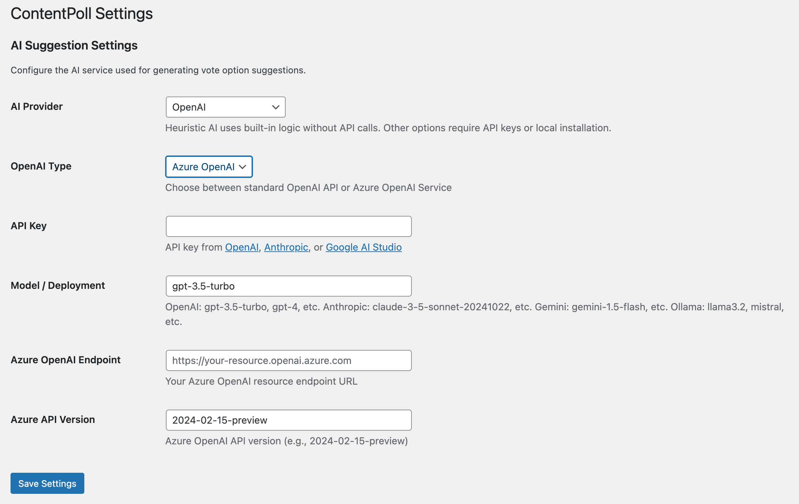
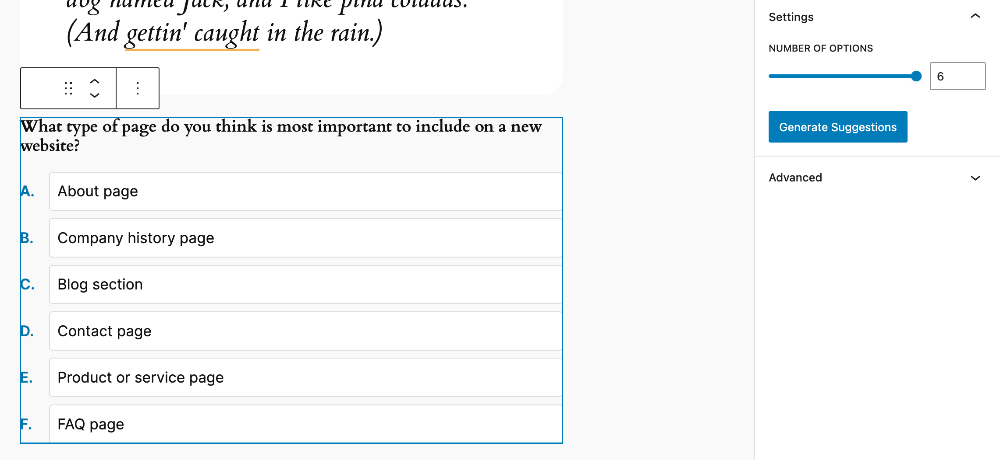
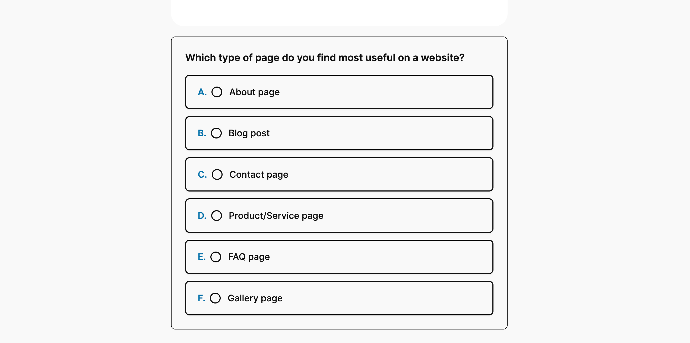
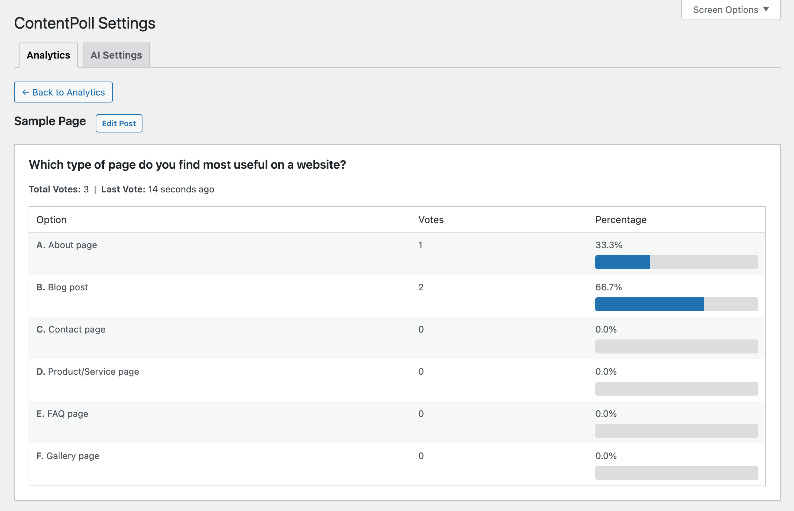

# ContentPoll AI

**A modern, accessible polling block that lets visitors vote on questions about your content, with beautiful card-style options and optional AI suggestions.**


Engage your audience by asking them to vote on aspects of the page they're reading. AI analyzes your content and suggests relevant polling questions, or create your own. Visitors vote once anonymously, then see real-time results with visual progress bars.

**Perfect for**: Blog posts, product pages, documentation, news articles, tutorials, reviews – any content where you want to gauge reader opinions or preferences.

<div align="center">
  <video src="https://github.com/user-attachments/assets/5981267e-4573-4ac5-ae80-81b7c3f85156" width="100%" />
</div>




[Features](#-features) | [Installation](#-installation) | [Usage](#-usage) | [Design Features](#-design-features) | [Development](#-development) | [Privacy & Security](#-privacy--security) | [REST API](#-rest-api) | [Roadmap](#-roadmap) 

## ✨ Features

### Core Voting
- **Card-Style Interface**: Modern, clickable option cards with radio button indicators (no traditional buttons)
- **Ordered Options**: Automatic A, B, C, D labeling for clarity
- **Anonymous & Secure**: Cookie-based deduplication with SHA-256 hashing
- **One Vote Per Visitor**: Secure token prevents duplicate voting
- **Visual Results**: Progress bars with percentages and vote counts
- **Theme Adaptive**: Automatically matches your WordPress theme colors
- **Persistent Selection**: Returning voters see their previously selected option checked

### AI-Powered Suggestions (7 Providers)
AI reads your page content and generates contextually relevant poll questions:
- **Heuristic** (Default) - Built-in keyword extraction from your content, no API required. Use it for tests and basic suggestions.
- **OpenAI** - GPT models analyze your content using a multi-step PocketFlow pipeline (topics → poll draft → validation) for structured, topic-aware questions and options.
- **Azure OpenAI** - Enterprise Azure OpenAI Service using the same PocketFlow multi-step flow as OpenAI.
- **Anthropic Claude** - Claude 3.5 Sonnet analyzes content context
- **Google Gemini** - Gemini 1.5 Flash (free tier available)
- **Ollama** - Self-hosted local models process content privately
- **Grok (xAI)** - Real‑time reasoning model from xAI; concise, context-aware poll suggestions

**Example**: On a blog post about photography tips, AI might suggest: "Which photography technique interests you most?" with options like "Composition", "Lighting", "Editing", "Equipment".

### Admin Features
- **Settings Page**: Configure AI provider, API keys, and models at Settings → ContentPoll AI
- **Flexible Options**: Choose 2-6 voting options per block
- **Lock on First Vote**: Options become immutable after the first vote to preserve data integrity
- **Debug Mode**: Test reset functionality when WP_DEBUG is enabled
- **Model Validation**: Real-time API testing when saving AI settings

### Developer-Friendly
- **REST API**: Complete endpoints for voting, results, and suggestions
- **Modern Stack**: Built with @wordpress/scripts, React hooks, and webpack
- **CSP Compliant**: No inline scripts, data attributes for i18n
- **Accessibility**: ARIA labels, keyboard navigation, semantic HTML
- **Internationalization**: Translation-ready with `.pot` file

## 📦 Installation

### Quick Install
1. Download [`content-poll.zip`](https://github.com/soderlind/content-poll/releases/latest/download/content-poll.zip)
2. Upload via  `Plugins → Add New → Upload Plugin`
3. Activate via `WordPress Admin → Plugins`

**Configuration (Optional)**

1. Go to `Settings → ContentPoll AI`
2. Choose an AI provider for suggestions
3. Enter your API key or endpoint details
4. Click Save Settings (plugin tests API connection automatically)

See [AI Provider Integration Guide](https://github.com/soderlind/content-poll/blob/main/docs/AI-PROVIDERS.md) for detailed setup instructions for each AI provider.


**Updates**
   * Plugin [updates are handled automatically](https://github.com/soderlind/wordpress-plugin-github-updater#readme) via GitHub. No need to manually download and install updates.

### Development Install
```bash
# Install via Composer
composer require soderlind/content-poll
# Install dependencies
composer install
npm install

# Build assets
npm run build

# Or watch for changes
npm run start
```

## 🚀 Usage

### Basic Usage
1. **Add Block**: In the editor, insert the "ContentPoll AI" block (display name may appear as ContentPoll) into your post/page
2. **Set Question**: Enter a question about your content (or use AI to generate one)
3. **Configure Options**: Add 2-6 answer options related to your content
4. **Publish**: Visitors reading that page can now vote on your question and see results

### AI Suggestions (Content-Aware)
1. Go to **Settings → ContentPoll AI**
2. Select an AI provider (OpenAI, Anthropic, Gemini, Ollama, Grok, or Azure)
3. Enter your API key/endpoint
4. **Write your post content first** (AI needs content to analyze)
5. Add the ContentPoll AI block
6. Click **Generate Suggestions** - AI reads the page content and suggests a relevant question
7. Review and adjust the AI-generated question and options


### Results Display
After voting, visitors see:
- Their selected option marked with a checkmark
- Vote counts for each option (e.g., "3 votes")
- Visual progress bars showing percentages
- Clean card layout with A, B, C, D labels

## 🎨 Design Features

- **No Buttons**: Uses semantic `<li>` elements styled as interactive cards
- **Radio Indicators**: Visual radio button circles that fill when selected
- **Hover Effects**: Cards lift and shadow on hover with smooth transitions
- **Pointer Cursor**: Clear visual feedback that options are clickable
- **Theme Colors**: Uses WordPress CSS custom properties (`--wp--preset--color--*`)
- **Responsive**: Works beautifully on all screen sizes
- **Box Sizing**: Proper containment prevents overflow issues

### CSS Customization

You can fully restyle the poll via standard CSS. The front‑end markup exposes predictable class names and leverages WordPress design tokens (`--wp--preset--color--*`) plus a custom radius variable (`--wp--custom--border--radius`). Override these in your theme or a custom stylesheet.

Key wrapper & structural classes:
- `.content-poll` – Outer container (padding, border, background, overall radius)
- `.content-poll__question` – Question text
- `.content-poll__options` – List wrapper for interactive options
- `.content-poll__option` – Individual clickable card
- `.content-poll__radio` – Circular selection indicator within each option
- `.content-poll__label` – Option text span inside the card
- `.content-poll__message` – Post‑vote message container
- `.content-poll__results` – Wrapper for results view
- `.content-poll__result-item` – Individual result card
- `.content-poll__result-label` – Flex row containing option label + percentage
- `.content-poll__result-count` – Percentage text (now showing % after changes)
- `.content-poll__result-bar` / `.content-poll__result-fill` – Progress bar track & fill (gradient)
- `.content-poll__results-total` – Total votes summary element (appended dynamically)
- State class: `.content-poll--results-only` – Hides interactive option list after voting

Useful CSS variables (fallbacks shown in code):
- `--wp--preset--color--primary`
- `--wp--preset--color--secondary`
- `--wp--preset--color--contrast`
- `--wp--preset--color--base`
- `--wp--custom--border--radius`

#### Quick Examples

Rounded cards & softer shadow:
```css
.content-poll__option {
  border-radius: 16px;
  box-shadow: 0 4px 20px rgba(0,0,0,0.08);
}
```

Custom gradient for result bar:
```css
.content-poll__result-fill {
  background: linear-gradient(90deg,#667eea,#764ba2);
}
```

Larger percentage emphasis:
```css
.content-poll__result-count {
  font-size: 0.95em;
  font-weight: 600;
  opacity: 1;
}
```

Change option hover behavior:
```css
.content-poll__option:hover {
  transform: scale(1.01);
  box-shadow: 0 6px 18px rgba(0,0,0,0.12);
}
```

Adjust overall corner radius globally:
```css
.content-poll {
  --wp--custom--border--radius: 12px;
}
```

Minimal flat style:
```css
.content-poll__option {
  box-shadow: none;
  border: 1px solid #e0e0e0;
}
.content-poll__option:hover {
  transform: none;
  box-shadow: none;
  background: #f9f9f9;
}
```

Hide total votes (if you prefer only percentages):
```css
.content-poll__results-total { display: none; }
```

#### Accessibility Notes
- Percentages are rendered with an `aria-label` containing both the raw vote count and percentage for screen readers.
- Preserve contrast when changing gradients or text colors.

#### Best Practices
- Prefer overriding variables for broad changes (theme color alignment).
- Keep hover/active transitions <= 0.25s for responsiveness.
- Maintain readable touch targets: keep option padding ≥ 0.75em.
- Test focus outlines after customizations to retain keyboard accessibility.

## 🔧 Development

Start with the [tutorial](./tutorial/#chapters).

### Available Scripts
```bash
npm run build        # Production build (minified)
npm run start        # Development mode with watch
npm test             # Run all tests (JS + PHP linting)
npm run test:js      # Vitest unit tests
npm run lint:js      # ESLint JavaScript files
composer test        # PHPUnit tests
```

### Testing
- **JavaScript**: Vitest for helper functions and logic
- **PHP**: PHPUnit for storage, aggregation, and API validation
- **Linting**: WordPress coding standards via @wordpress/scripts
- **Database Safety**: Tests include safeguards to prevent accidental data loss

**Run Tests Safely**:
```bash
# JavaScript tests (safe - no database changes)
npm test

# PHP tests with production database protection
composer test

# PHP tests with separate test database (recommended)
WP_TESTS_DB_PREFIX=test_ composer test
```

See [tests/README.md](tests/README.md) for detailed testing documentation and database safety configuration.

### Project Structure
```
content-poll/
├── src/
│   ├── block/vote-block/      # Gutenberg block (JS + CSS)
│   └── php/                    # Backend logic
│       ├── Admin/              # Settings page
│       ├── Blocks/             # Block registration
│       ├── REST/               # API endpoints
│       ├── Security/           # Nonce & token handling
│       └── Services/           # Vote storage & AI
├── build/                      # Compiled assets (webpack)
├── tests/                      # PHPUnit tests
├── languages/                  # Translation files
└── docs/                       # Documentation

```

## 🔒 Privacy & Security

### Data Collection
- **Block ID**: UUID for each vote instance
- **Option Index**: Which option was selected (0-5)
- **Hashed Token**: SHA-256 hash of cookie + AUTH_KEY

### What We DON'T Collect
- ❌ IP addresses
- ❌ User agents
- ❌ Email addresses
- ❌ Personal information

### GDPR Compliance
- Anonymous voting only
- No personally identifiable information
- Uninstall script removes all data
- Cookie notice: Site owners should inform users about voting cookies

## 🌐 REST API

### Vote
```
POST /wp-json/content-poll/v1/block/{blockId}/vote
Headers: X-WP-Nonce
Body: { "optionIndex": 0, "postId": 123 }
```

### Results
```
GET /wp-json/content-poll/v1/block/{blockId}/results
Response: {
  "blockId": "...",
  "totalVotes": 42,
  "counts": { "0": 15, "1": 12, "2": 10, "3": 5 },
  "percentages": { "0": 35.71, "1": 28.57, "2": 23.81, "3": 11.90 },
  "userVote": 1  // If user has voted
}
```

### AI Suggestions (Editor Only)
```
GET /wp-json/content-poll/v1/suggest?postId=123
Response: {
  "question": "What aspect interests you most?",
  "options": ["Option A", "Option B", "Option C", "Option D"]
}
```

## 🗺️ Roadmap

- [x] Admin dashboard with vote analytics
- [ ] Export votes to CSV
- [ ] Transient caching for high-traffic sites
- [ ] Custom result templates
- [ ] Vote scheduling (start/end dates)
- [ ] Multiple votes per user (optional)
- [ ] Integration with popular form plugins

## 📄 Copyright and License

ContentPoll AI is copyright 2025 Per Soderlind

ContentPoll AI is free software: you can redistribute it and/or modify it under the terms of the GNU General Public License as published by the Free Software Foundation, either version 2 of the License, or (at your option) any later version.

ContentPoll AI is distributed in the hope that it will be useful, but WITHOUT ANY WARRANTY; without even the implied warranty of MERCHANTABILITY or FITNESS FOR A PARTICULAR PURPOSE. See the GNU General Public License for more details.

You should have received a copy of the GNU Lesser General Public License along with the Extension. If not, see http://www.gnu.org/licenses/.

## 🙏 Credits

Built with modern WordPress tools and best practices. Uses @wordpress/scripts for building, WordPress design system for styling, and follows WordPress coding standards.

PocketFlow-inspired multi-step poll generation flow design is based on ideas and patterns from the PocketFlow project.


