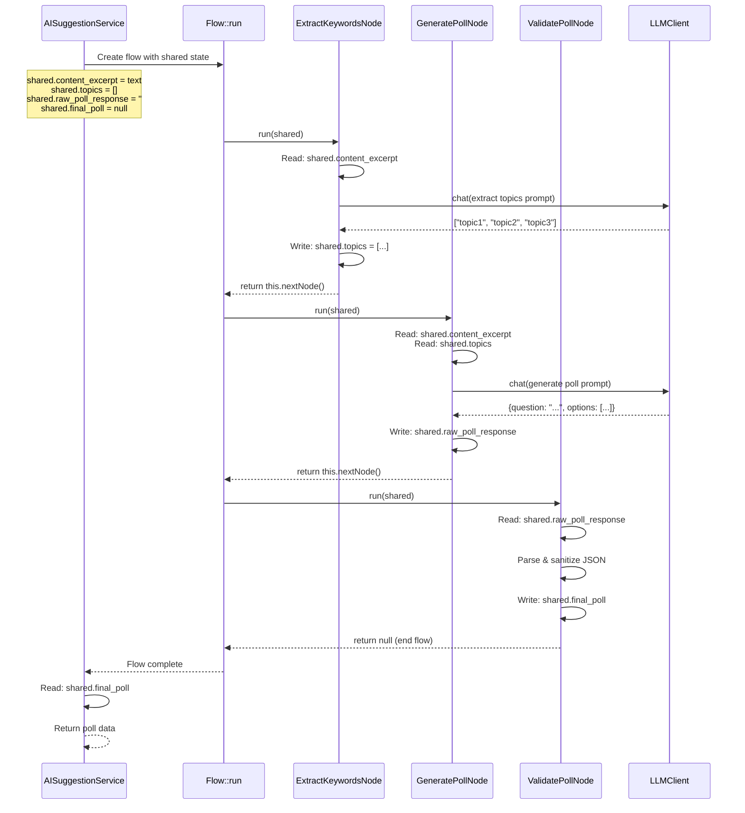

# ContentPoll AI Flow Architecture

The Flow/Node pattern in this plugin is a lightweight, PocketFlow-inspired orchestration system for multi-step AI poll
generation. Here's how it works:


## Core Concepts

### 1. **Flow** (`Flow/Flow.php`)
A **Flow** is a simple sequential executor that runs a chain of nodes:

```php
namespace ContentPoll\AI\Flow;

final class Flow {
    public function __construct(
        private NodeInterface $startNode
    ) {}

    public function run(\stdClass $shared): void {
        $current = $this->startNode;

        while ($current !== null) {
            $current = $current->run($shared);
        }
    }
}
```

**Key points:**
- Takes a starting node in constructor
- Calls `run()` on each node sequentially
- Each node returns the next node (or `null` to stop)
- Uses a shared `stdClass` object to pass state between nodes

### 2. **NodeInterface** (`Flow/NodeInterface.php`)
Defines the contract all nodes must implement:

```php
namespace ContentPoll\AI\Flow;

interface NodeInterface {
    public function run(\stdClass $shared): ?NodeInterface;
}
```

**Contract:**
- `run($shared)`: Execute node logic, mutate shared state, return next node or null

### 3. **AbstractNode** (`Flow/AbstractNode.php`)
A convenience base class that handles node chaining:

```php
namespace ContentPoll\AI\Flow;

abstract class AbstractNode implements NodeInterface {
    private ?NodeInterface $next = null;

    public function next(NodeInterface $node): self {
        $this->next = $node;
        return $this;
    }

    protected function nextNode(): ?NodeInterface {
        return $this->next;
    }
}
```

**Benefits:**
- Child nodes just call `$this->nextNode()` at the end of `run()`
- Supports fluent chaining: `$node1->next($node2)->next($node3)`

## Why Nodes?

Nodes solve several problems in the AI poll generation pipeline:

### 1. **Separation of Concerns**
Each node has one clear responsibility:
- `ExtractKeywordsNode`: content → topics
- `GeneratePollNode`: content + topics → raw poll JSON
- `ValidatePollNode`: raw JSON → validated poll structure

### 2. **Testability**
Each node can be unit-tested independently with mock `LLMClient` and controlled shared state.

### 3. **Error Isolation**
If one node fails, it can:
- Log the error
- Set safe defaults in `$shared`
- Return `$this->nextNode()` to continue gracefully

### 4. **Composability**
Want a different flow? Just wire different nodes:

```php
// Simple 2-step flow (skip keyword extraction)
$generate = new GeneratePollNode($client);
$validate = new ValidatePollNode();
$generate->next($validate);
return new Flow($generate);
```

### 5. **Transparency**
The entire pipeline is explicit and visible in `PollGenerationFlowFactory`:

```php
public static function create(LLMClient $client): Flow {
    $extract  = new ExtractKeywordsNode($client);
    $generate = new GeneratePollNode($client);
    $validate = new ValidatePollNode();

    $extract->next($generate);
    $generate->next($validate);

    return new Flow($extract);
}
```

## How They're Used

### Example: PocketFlow Poll Generation

**1. Factory creates the flow:**
```php
$client = new LLMClient();
$flow = PollGenerationFlowFactory::create($client);
```

**2. Service prepares shared state:**
```php
$shared = (object)[
    'content_excerpt'   => $text,
    'topics'            => [],
    'raw_poll_response' => '',
    'final_poll'        => null,
];
```

**3. Flow executes nodes sequentially:**
```php
$flow->run($shared);
```

**Step-by-step execution:**



**4. Service reads result:**
```php
if (isset($shared->final_poll) && is_array($shared->final_poll)) {
    return $shared->final_poll;
}
return []; // fallback to heuristic
```

## Real Node Example

**`ExtractKeywordsNode.php`** (simplified):

```php
final class ExtractKeywordsNode extends AbstractNode {
    public function __construct(
        private LLMClient $client
    ) {}

    public function run(\stdClass $shared): ?NodeInterface {
        $content = (string)($shared->content_excerpt ?? '');

        if ($content === '') {
            $shared->topics = [];
            return $this->nextNode(); // Skip but continue
        }

        try {
            $raw = $this->client->chat($messages, [
                'temperature' => 0.3,
                'max_tokens'  => 200,
            ]);

            $topics = json_decode($raw, true);
            $shared->topics = is_array($topics) ? $topics : [];
        } catch (\Throwable $e) {
            error_log('ExtractTopics Error: ' . $e->getMessage());
            $shared->topics = []; // Safe default
        }

        return $this->nextNode(); // Always continue
    }
}
```

**Key patterns:**
- ✅ Read from `$shared` (immutable input)
- ✅ Write to `$shared` (mutable output)
- ✅ Handle errors gracefully (don't throw, log + set safe defaults)
- ✅ Return `$this->nextNode()` to continue or `null` to stop

## Benefits Over Alternatives

### vs. Single Monolithic Function
```php
// ❌ Hard to test, hard to modify
function suggest_openai($text) {
    $topics = extract_topics($text);
    $raw = generate_poll($text, $topics);
    return parse_and_validate($raw);
}
```

### vs. Deeply Nested Callbacks
```php
// ❌ Hard to read, hard to debug
$result = extract_topics($text, function($topics) use ($text) {
    return generate_poll($text, $topics, function($raw) {
        return validate($raw);
    });
});
```

### ✅ Flow/Node Pattern
- Clear execution order
- Easy to add/remove/reorder steps
- Each step independently testable
- Graceful error handling at each stage
- Explicit state passing (no hidden side effects)

## Testing Strategy

**Unit test each node:**
```php
public function test_extract_keywords_node() {
    $mockClient = $this->createMock(LLMClient::class);
    $mockClient->expects($this->once())
               ->method('chat')
               ->willReturn('["AI", "OpenAI", "GPT"]');

    $node = new ExtractKeywordsNode($mockClient);
    $shared = (object)['content_excerpt' => 'AI content...'];

    $next = $node->run($shared);

    $this->assertEquals(['AI', 'OpenAI', 'GPT'], $shared->topics);
    $this->assertNull($next); // or check next node type
}
```

**Integration test the flow:**
```php
public function test_full_pocketflow() {
    $client = new LLMClient(); // Real or mock
    $flow = PollGenerationFlowFactory::create($client);
    
    $shared = (object)[
        'content_excerpt' => 'Real article text...',
    ];

    $flow->run($shared);

    $this->assertIsArray($shared->final_poll);
    $this->assertArrayHasKey('question', $shared->final_poll);
    $this->assertArrayHasKey('options', $shared->final_poll);
}
```

## Summary

**Flow** = Simple sequential executor
**Node** = Single-responsibility step with clear inputs/outputs
**Why?** Testability, composability, error isolation, transparency

This pattern keeps the AI pipeline maintainable while allowing future enhancements like:
- Retry logic (wrap nodes)
- Parallel steps (fork nodes)
- Conditional branching (nodes return different next nodes based on state)
- Telemetry/logging (decorator nodes)

All without breaking existing code or tests.