# AI Provider Architecture

This document describes how each AI provider is accessed internally, with code examples and flow diagrams.

## Table of Contents

1. [Overview Architecture](#overview-architecture)
2. [Provider Selection Flow](#provider-selection-flow)
3. [Error Handling & Fallback](#error-handling--fallback)
4. [Individual Providers](#individual-providers)
   - [Heuristic (Default)](#1-heuristic-default)
   - [OpenAI / Azure OpenAI (PocketFlow)](#2-openai--azure-openai-pocketflow)
   - [Anthropic Claude](#3-anthropic-claude)
   - [Google Gemini](#4-google-gemini)
   - [Ollama (Self-Hosted)](#5-ollama-self-hosted)
   - [Grok (xAI)](#6-grok-xai)
   - [Exo (Local Cluster)](#7-exo-local-cluster)

---

## Overview Architecture

The plugin uses a centralized orchestration pattern where all AI suggestion requests flow through a single service class.

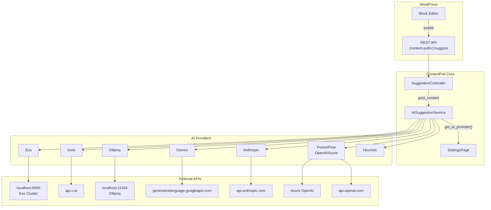

### Key Files

| File | Purpose |
|------|---------|
| `src/php/REST/SuggestionController.php` | REST endpoint handler |
| `src/php/Services/AISuggestionService.php` | Provider orchestration |
| `src/php/Admin/SettingsPage.php` | Configuration resolution |
| `src/php/AI/LLMClient.php` | OpenAI/Azure HTTP client |
| `src/php/AI/PocketFlow/*.php` | Multi-step flow nodes |

---

## Provider Selection Flow

When a suggestion is requested, the service reads the configured provider and dispatches to the appropriate method.

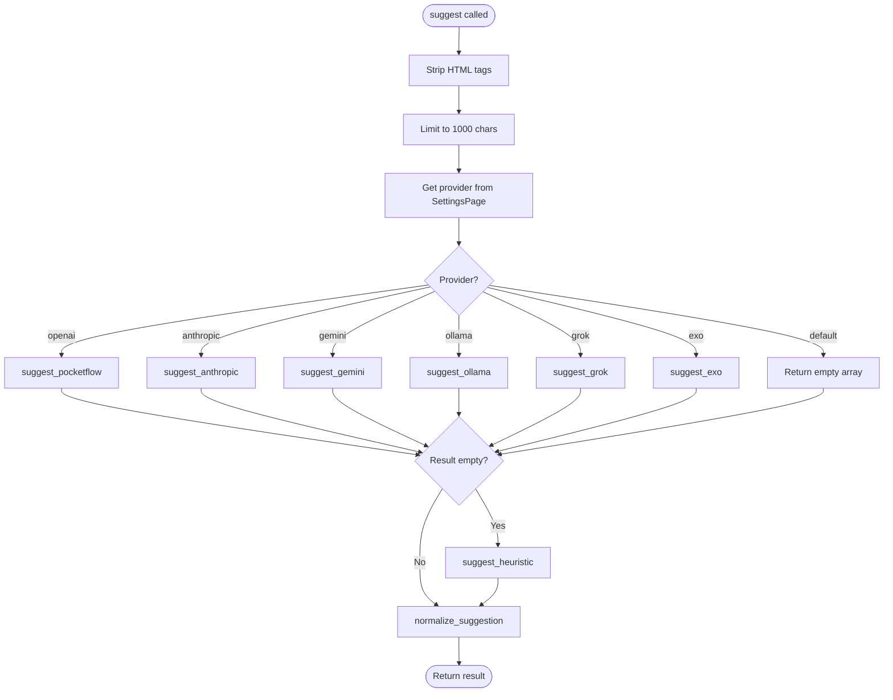

### Code: Provider Dispatch

From `src/php/Services/AISuggestionService.php`:

```php
public function suggest( string $content ): array {
    $provider = SettingsPage::get_ai_provider();
    $text     = strip_tags( $content );
    $text     = mb_substr( $text, 0, 1000 );

    switch ( $provider ) {
        case 'openai':
            $result = $this->suggest_pocketflow( $text );
            break;
        case 'anthropic':
            $result = $this->suggest_anthropic( $text );
            break;
        case 'gemini':
            $result = $this->suggest_gemini( $text );
            break;
        case 'ollama':
            $result = $this->suggest_ollama( $text );
            break;
        case 'grok':
            $result = $this->suggest_grok( $text );
            break;
        case 'exo':
            $result = $this->suggest_exo( $text );
            break;
        default:
            $result = [];
    }

    // Fallback to heuristic if AI fails
    if ( empty( $result ) ) {
        $result = $this->suggest_heuristic( $content );
    }
    return $this->normalize_suggestion( $result, $content );
}
```

---

## Error Handling & Fallback

All providers implement the same error handling pattern: log errors and return empty array to trigger heuristic fallback.

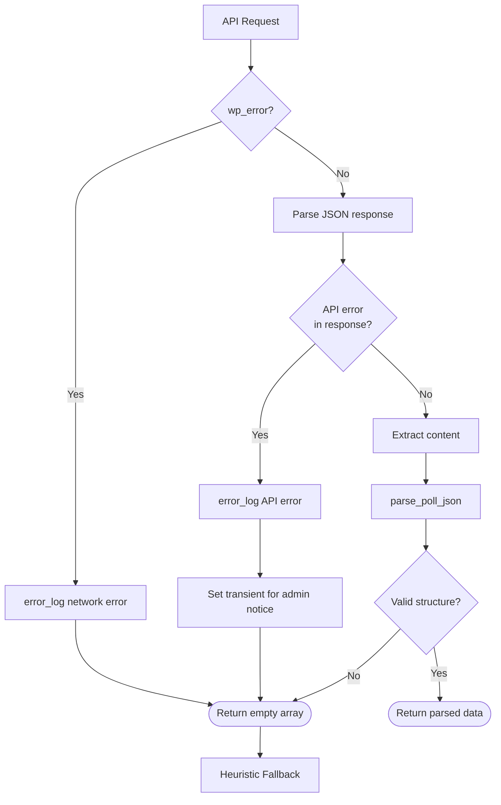

### Code: Error Handling Pattern

```php
if ( is_wp_error( $response ) ) {
    error_log( 'ContentPoll AI Error: ' . $response->get_error_message() );
    return [];
}

$data = json_decode( wp_remote_retrieve_body( $response ), true );

if ( isset( $data['error'] ) ) {
    $error_message = $data['error']['message'] ?? 'Unknown error';
    error_log( 'ContentPoll AI API Error: ' . $error_message );
    
    if ( current_user_can( 'manage_options' ) ) {
        set_transient( 'content_poll_ai_error', $error_message, 300 );
    }
    return [];
}
```

---

## Individual Providers

### 1. Heuristic (Default)

Local keyword extraction with no external API calls. Always succeeds.

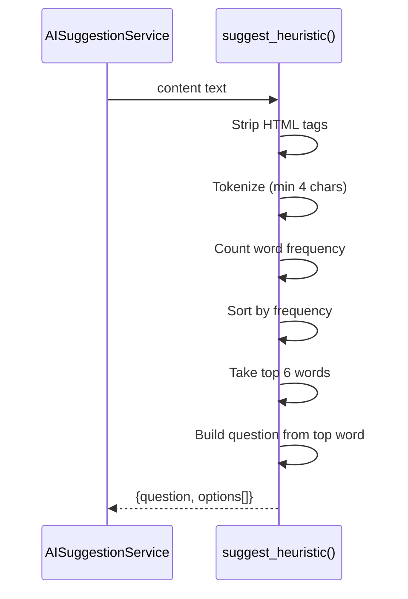

#### Code: Heuristic Implementation

```php
private function suggest_heuristic( string $content ): array {
    $text   = strip_tags( $content );
    $tokens = preg_split( '/[^\p{L}\p{N}]+/u', mb_strtolower( $text ) );
    $freq   = [];
    
    foreach ( $tokens as $t ) {
        if ( $t === '' || mb_strlen( $t ) < 4 ) {
            continue;
        }
        $freq[ $t ] = ( $freq[ $t ] ?? 0 ) + 1;
    }
    
    arsort( $freq );
    $top = array_slice( array_keys( $freq ), 0, 6 );
    
    if ( empty( $top ) ) {
        return [
            'question' => __( 'What is your opinion of this content?', 'content-poll' ),
            'options'  => [ 'Great', 'Informative', 'Neutral', 'Confusing' ],
        ];
    }
    
    $stem     = $top[0];
    $question = sprintf( __( 'Your view on "%s"?', 'content-poll' ), ucfirst( $stem ) );
    $options  = array_map( 'ucfirst', $top );
    
    return [ 'question' => $question, 'options' => $options ];
}
```

---

### 2. OpenAI / Azure OpenAI (PocketFlow)

Multi-step flow using LLMClient for OpenAI-compatible APIs.

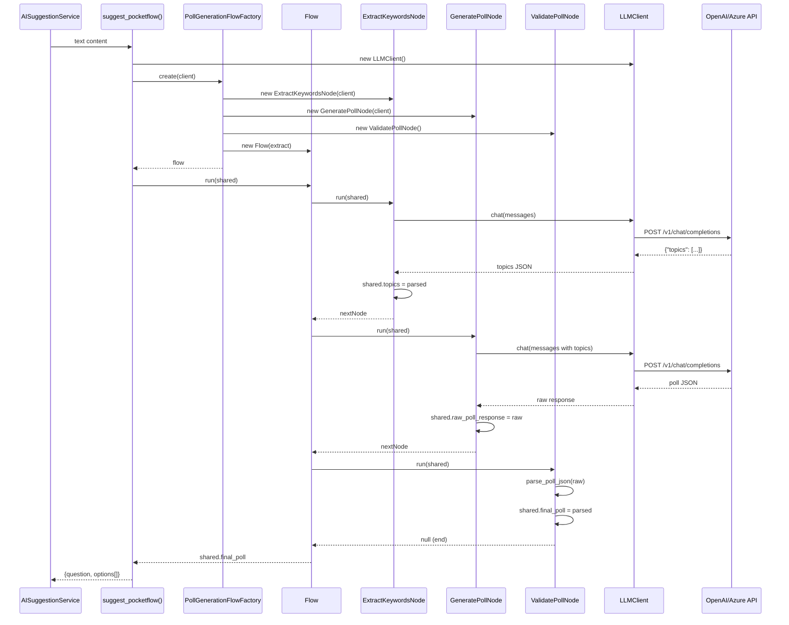

#### Code: LLMClient

```php
// src/php/AI/LLMClient.php
public function chat( array $messages, array $options = [] ): string {
    $type  = SettingsPage::get_openai_type();
    $model = $options['model'] ?? SettingsPage::get_openai_model();
    $key   = SettingsPage::get_openai_key();

    $body = [
        'messages'    => $messages,
        'temperature' => $options['temperature'] ?? 0.7,
        'max_tokens'  => $options['max_tokens'] ?? 200,
    ];

    if ( $type === 'azure' ) {
        $endpoint    = SettingsPage::get_azure_endpoint();
        $api_version = SettingsPage::get_azure_api_version();
        
        $url = rtrim( $endpoint, '/' ) . '/openai/deployments/' 
             . $model . '/chat/completions?api-version=' . $api_version;

        $response = wp_remote_post( $url, [
            'headers' => [
                'Content-Type' => 'application/json',
                'api-key'      => $key,
            ],
            'body'    => wp_json_encode( $body ),
            'timeout' => 10,
        ] );
    } else {
        $body['model'] = $model;

        $response = wp_remote_post( 'https://api.openai.com/v1/chat/completions', [
            'headers' => [
                'Content-Type'  => 'application/json',
                'Authorization' => 'Bearer ' . $key,
            ],
            'body'    => wp_json_encode( $body ),
            'timeout' => 10,
        ] );
    }

    // ... error handling and response parsing
    return $data['choices'][0]['message']['content'];
}
```

#### Request Format (OpenAI)

```json
POST https://api.openai.com/v1/chat/completions
Authorization: Bearer sk-...
Content-Type: application/json

{
    "model": "gpt-3.5-turbo",
    "messages": [
        {"role": "system", "content": "You generate poll questions..."},
        {"role": "user", "content": "Analyze content..."}
    ],
    "temperature": 0.7,
    "max_tokens": 200
}
```

#### Request Format (Azure)

```json
POST https://{resource}.openai.azure.com/openai/deployments/{deployment}/chat/completions?api-version=2024-02-15-preview
api-key: your-azure-key
Content-Type: application/json

{
    "messages": [...],
    "temperature": 0.7,
    "max_tokens": 200
}
```

---

### 3. Anthropic Claude

Direct API call to Anthropic's Messages API.

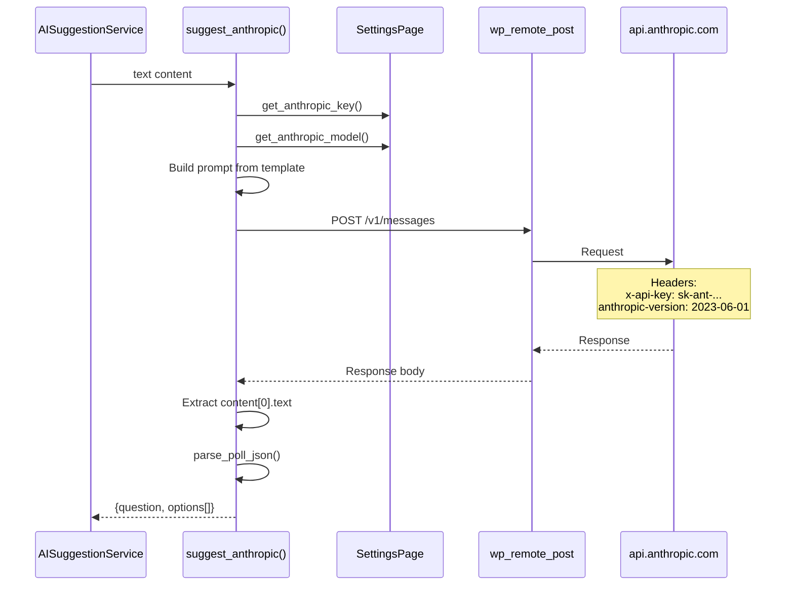

#### Code: Anthropic Implementation

```php
private function suggest_anthropic( string $text ): array {
    $api_key = SettingsPage::get_anthropic_key();
    $model   = SettingsPage::get_anthropic_model();

    if ( empty( $api_key ) || empty( $model ) ) {
        return [];
    }

    $prompt = sprintf( self::PROMPT_TEMPLATE, $text );

    $response = wp_remote_post( 'https://api.anthropic.com/v1/messages', [
        'headers' => [
            'Content-Type'      => 'application/json',
            'x-api-key'         => $api_key,
            'anthropic-version' => '2023-06-01',
        ],
        'body'    => wp_json_encode( [
            'model'      => $model,
            'max_tokens' => 1024,
            'messages'   => [
                [ 'role' => 'user', 'content' => $prompt ],
            ],
        ] ),
        'timeout' => 10,
    ] );

    // ... error handling ...

    $content_text = $data['content'][0]['text'];
    return $this->parse_poll_json( $content_text );
}
```

#### Request Format

```json
POST https://api.anthropic.com/v1/messages
x-api-key: sk-ant-...
anthropic-version: 2023-06-01
Content-Type: application/json

{
    "model": "claude-3-5-sonnet-20241022",
    "max_tokens": 1024,
    "messages": [
        {"role": "user", "content": "You are creating a poll..."}
    ]
}
```

#### Response Format

```json
{
    "content": [
        {
            "type": "text",
            "text": "{\"question\": \"...\", \"options\": [...]}"
        }
    ]
}
```

---

### 4. Google Gemini

API key passed in URL query parameter.

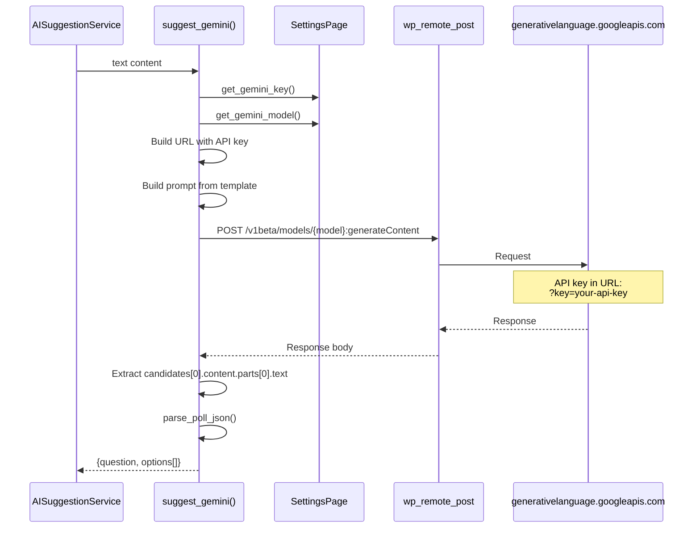

#### Code: Gemini Implementation

```php
private function suggest_gemini( string $text ): array {
    $api_key = SettingsPage::get_gemini_key();
    $model   = SettingsPage::get_gemini_model();

    if ( empty( $api_key ) || empty( $model ) ) {
        return [];
    }

    $prompt = sprintf( self::PROMPT_TEMPLATE, $text );
    $url    = 'https://generativelanguage.googleapis.com/v1beta/models/' 
            . $model . ':generateContent?key=' . $api_key;

    $response = wp_remote_post( $url, [
        'headers' => [ 'Content-Type' => 'application/json' ],
        'body'    => wp_json_encode( [
            'contents' => [
                [
                    'parts' => [
                        [ 'text' => $prompt ],
                    ],
                ],
            ],
        ] ),
        'timeout' => 10,
    ] );

    // ... error handling ...

    $content_text = $data['candidates'][0]['content']['parts'][0]['text'];
    return $this->parse_poll_json( $content_text );
}
```

#### Request Format

```json
POST https://generativelanguage.googleapis.com/v1beta/models/gemini-1.5-flash:generateContent?key=AI...
Content-Type: application/json

{
    "contents": [
        {
            "parts": [
                {"text": "You are creating a poll..."}
            ]
        }
    ]
}
```

#### Response Format

```json
{
    "candidates": [
        {
            "content": {
                "parts": [
                    {"text": "{\"question\": \"...\", \"options\": [...]}"}
                ]
            }
        }
    ]
}
```

---

### 5. Ollama (Self-Hosted)

Local inference with no authentication required.

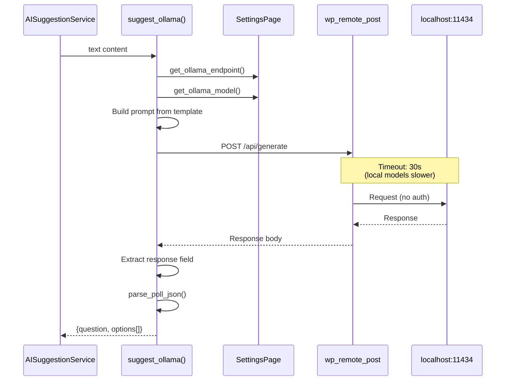

#### Code: Ollama Implementation

```php
private function suggest_ollama( string $text ): array {
    $endpoint = SettingsPage::get_ollama_endpoint();
    $model    = SettingsPage::get_ollama_model();

    if ( empty( $endpoint ) || empty( $model ) ) {
        return [];
    }

    $prompt = sprintf( self::PROMPT_TEMPLATE, $text );
    $url    = rtrim( $endpoint, '/' ) . '/api/generate';

    $response = wp_remote_post( $url, [
        'headers' => [ 'Content-Type' => 'application/json' ],
        'body'    => wp_json_encode( [
            'model'  => $model,
            'prompt' => $prompt,
            'stream' => false,
        ] ),
        'timeout' => 30, // Ollama might be slower
    ] );

    // ... error handling ...

    $content_text = $data['response'];
    return $this->parse_poll_json( $content_text );
}
```

#### Request Format

```json
POST http://localhost:11434/api/generate
Content-Type: application/json

{
    "model": "llama3.2",
    "prompt": "You are creating a poll...",
    "stream": false
}
```

#### Response Format

```json
{
    "model": "llama3.2",
    "response": "{\"question\": \"...\", \"options\": [...]}",
    "done": true
}
```

---

### 6. Grok (xAI)

OpenAI-compatible API from xAI.

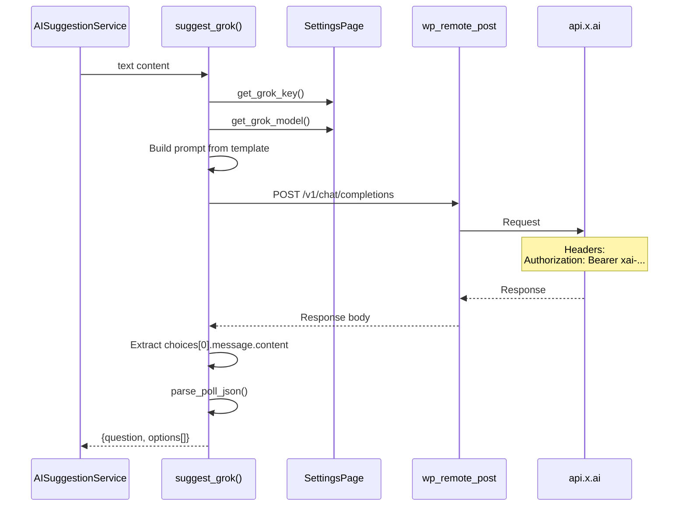

#### Code: Grok Implementation

```php
private function suggest_grok( string $text ): array {
    $api_key = SettingsPage::get_grok_key();
    $model   = SettingsPage::get_grok_model();

    if ( empty( $api_key ) || empty( $model ) ) {
        return [];
    }

    $prompt = sprintf( self::PROMPT_TEMPLATE, $text );

    $response = wp_remote_post( 'https://api.x.ai/v1/chat/completions', [
        'headers' => [
            'Content-Type'  => 'application/json',
            'Authorization' => 'Bearer ' . $api_key,
        ],
        'body'    => wp_json_encode( [
            'model'    => $model,
            'messages' => [
                [ 'role' => 'system', 'content' => 'You generate poll questions...' ],
                [ 'role' => 'user', 'content' => $prompt ],
            ],
            'temperature' => 0.7,
            'max_tokens'  => 200,
        ] ),
        'timeout' => 10,
    ] );

    // ... error handling ...

    $content_text = $data['choices'][0]['message']['content'];
    return $this->parse_poll_json( $content_text );
}
```

#### Request Format

```json
POST https://api.x.ai/v1/chat/completions
Authorization: Bearer xai-...
Content-Type: application/json

{
    "model": "grok-2",
    "messages": [
        {"role": "system", "content": "You generate poll questions..."},
        {"role": "user", "content": "You are creating a poll..."}
    ],
    "temperature": 0.7,
    "max_tokens": 200
}
```

#### Response Format

```json
{
    "choices": [
        {
            "message": {
                "role": "assistant",
                "content": "{\"question\": \"...\", \"options\": [...]}"
            }
        }
    ]
}
```

---

### 7. Exo (Local Cluster)

OpenAI-compatible API with SSE streaming response handling.

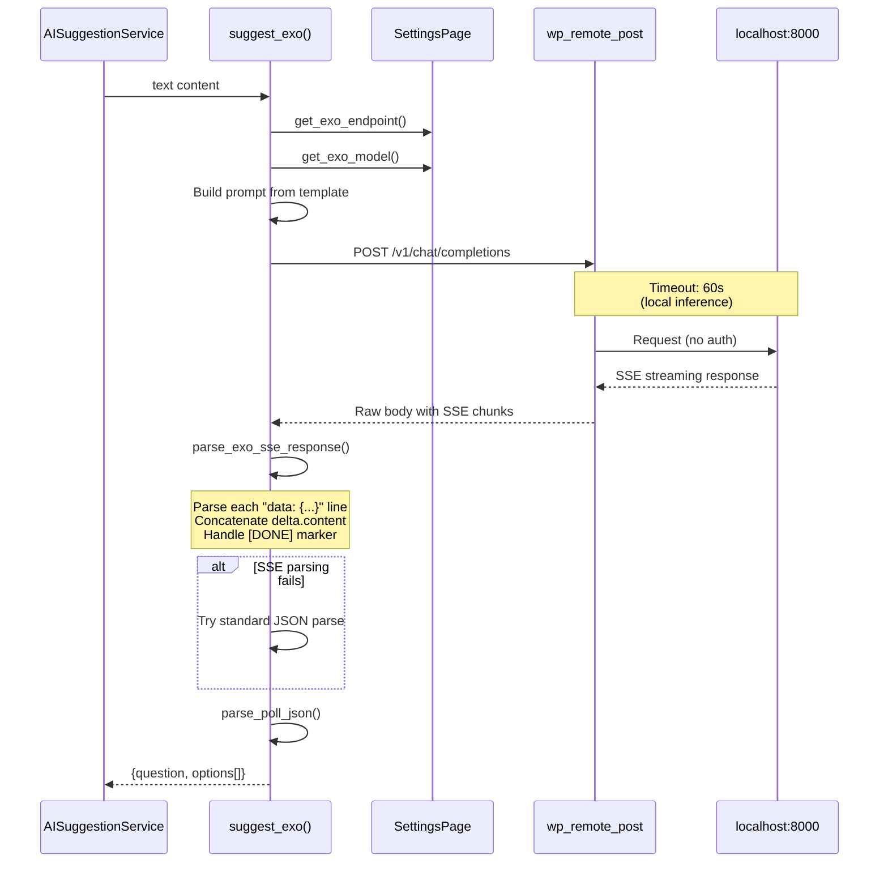

#### Code: Exo Implementation

```php
private function suggest_exo( string $text ): array {
    $endpoint = SettingsPage::get_exo_endpoint();
    $model    = SettingsPage::get_exo_model();

    if ( empty( $endpoint ) || empty( $model ) ) {
        return [];
    }

    $prompt = sprintf( self::PROMPT_TEMPLATE, $text );
    $url    = rtrim( $endpoint, '/' ) . '/v1/chat/completions';

    $response = wp_remote_post( $url, [
        'headers' => [ 'Content-Type' => 'application/json' ],
        'body'    => wp_json_encode( [
            'model'    => $model,
            'messages' => [
                [ 'role' => 'system', 'content' => 'You generate poll questions...' ],
                [ 'role' => 'user', 'content' => $prompt ],
            ],
            'temperature' => 0.7,
            'max_tokens'  => 500,
        ] ),
        'timeout' => 60, // Local models can be slower
    ] );

    // ... error handling ...

    $body = wp_remote_retrieve_body( $response );

    // Exo returns SSE streaming format
    $content_text = $this->parse_exo_sse_response( $body );

    if ( empty( $content_text ) ) {
        // Try standard JSON (non-streaming fallback)
        $data = json_decode( $body, true );
        if ( isset( $data['choices'][0]['message']['content'] ) ) {
            $content_text = $data['choices'][0]['message']['content'];
        }
    }

    return $this->parse_poll_json( $content_text );
}
```

#### Code: SSE Response Parser

```php
private function parse_exo_sse_response( string $body ): string {
    $content = '';
    $lines   = explode( "\n", $body );

    foreach ( $lines as $line ) {
        $line = trim( $line );

        // Skip empty lines and comments
        if ( empty( $line ) || strpos( $line, ':' ) === 0 ) {
            continue;
        }

        // Parse "data: {...}" lines
        if ( strpos( $line, 'data: ' ) === 0 ) {
            $json_str = substr( $line, 6 );

            // Skip [DONE] marker
            if ( $json_str === '[DONE]' ) {
                continue;
            }

            $data = json_decode( $json_str, true );
            if ( ! is_array( $data ) ) {
                continue;
            }

            // Extract delta content (streaming)
            if ( isset( $data['choices'][0]['delta']['content'] ) ) {
                $content .= $data['choices'][0]['delta']['content'];
            }

            // Handle full message format (non-streaming)
            if ( isset( $data['choices'][0]['message']['content'] ) ) {
                $content .= $data['choices'][0]['message']['content'];
            }
        }
    }

    return $content;
}
```

#### Request Format

```json
POST http://localhost:8000/v1/chat/completions
Content-Type: application/json

{
    "model": "llama-3.2-3b",
    "messages": [
        {"role": "system", "content": "You generate poll questions..."},
        {"role": "user", "content": "You are creating a poll..."}
    ],
    "temperature": 0.7,
    "max_tokens": 500
}
```

#### Response Format (SSE Streaming)

```text
data: {"choices":[{"delta":{"role":"assistant"}}]}
data: {"choices":[{"delta":{"content":"{"}}]}
data: {"choices":[{"delta":{"content":"\"question\""}}]}
data: {"choices":[{"delta":{"content":": \"What..."}}]}
...
data: [DONE]
```

#### Exo Settings Endpoints

The plugin includes additional REST endpoints for Exo configuration:

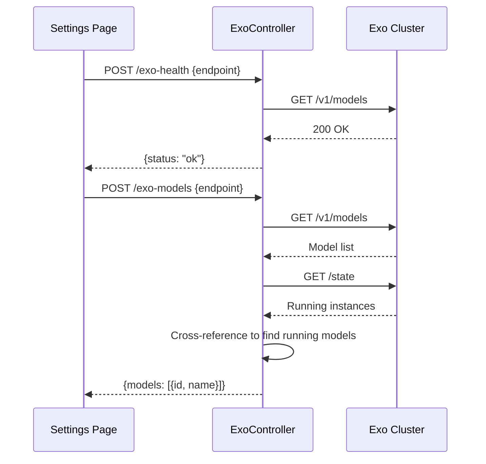

---

## Response Parsing

All providers use a common JSON parser that handles various response formats.

```mermaid
flowchart TD
    Input[Raw AI response] --> Direct{Direct JSON<br>decode?}
    Direct -->|Valid| Check1{Has question<br>& options?}
    Check1 -->|Yes| Sanitize1[Sanitize fields]
    Check1 -->|No| FindBraces
    Direct -->|Invalid| FindBraces
    
    FindBraces[Find first { to last }] --> Extract[Extract substring]
    Extract --> Decode2{JSON decode?}
    Decode2 -->|Valid| Check2{Has question<br>& options?}
    Check2 -->|Yes| Sanitize2[Sanitize fields]
    Check2 -->|No| Regex
    Decode2 -->|Invalid| Regex
    
    Regex[Regex: find all {...}] --> Loop{Try each match}
    Loop -->|Found valid| Sanitize3[Sanitize fields]
    Loop -->|None valid| Empty([Return empty])
    
    Sanitize1 --> Return([Return {question, options}])
    Sanitize2 --> Return
    Sanitize3 --> Return
```

### Code: JSON Parser

```php
private function parse_poll_json( string $raw ): array {
    $raw = trim( $raw );
    
    // 1. Try direct decode
    $direct = json_decode( $raw, true );
    if ( is_array( $direct ) && isset( $direct['question'], $direct['options'] ) ) {
        return [
            'question' => sanitize_text_field( $direct['question'] ),
            'options'  => array_map( 'sanitize_text_field', $direct['options'] ),
        ];
    }
    
    // 2. Find first '{' and last '}'
    $start = strpos( $raw, '{' );
    $end   = strrpos( $raw, '}' );
    if ( $start !== false && $end !== false && $end > $start ) {
        $candidate = substr( $raw, $start, $end - $start + 1 );
        $decoded   = json_decode( $candidate, true );
        if ( is_array( $decoded ) && isset( $decoded['question'], $decoded['options'] ) ) {
            return [
                'question' => sanitize_text_field( $decoded['question'] ),
                'options'  => array_map( 'sanitize_text_field', $decoded['options'] ),
            ];
        }
    }
    
    // 3. Fallback: regex for simple objects
    if ( preg_match_all( '/\{[^{}]*\}/', $raw, $all ) ) {
        foreach ( $all[0] as $fragment ) {
            $decoded = json_decode( $fragment, true );
            if ( is_array( $decoded ) && isset( $decoded['question'], $decoded['options'] ) ) {
                return [
                    'question' => sanitize_text_field( $decoded['question'] ),
                    'options'  => array_map( 'sanitize_text_field', $decoded['options'] ),
                ];
            }
        }
    }
    
    return [];
}
```

---

## See Also

- [AI-PROVIDERS.md](AI-PROVIDERS.md) - Configuration guide for each provider
- [ContentPoll-AI-Flow-Architecture.md](ContentPoll-AI-Flow-Architecture.md) - Detailed PocketFlow architecture
