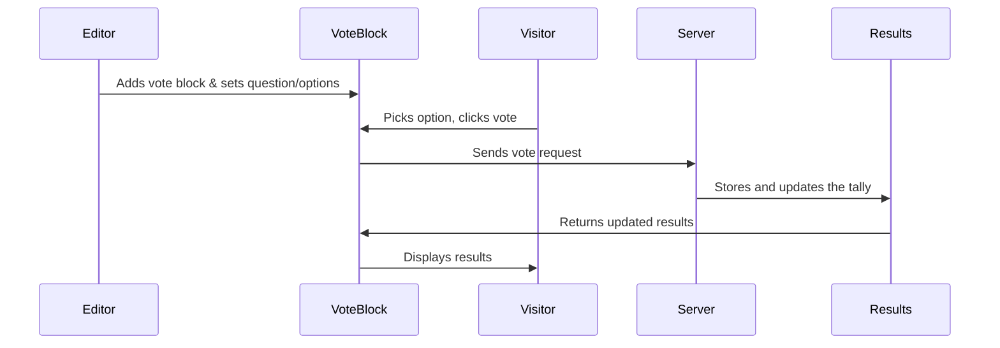

# Chapter 1: Vote Block (Gutenberg Block)

Welcome to the very first chapter of the **content-poll** guide! Here, you’ll learn about the heart of the project: the **Vote Block**, which lets anyone add simple, interactive polls to a WordPress page (using the Gutenberg editor). Don’t worry if this all sounds new—this chapter walks you through everything step-by-step!

---

## Why Use a Vote Block?

Imagine you run a travel blog and want to know your readers’ experiences—like if they’ve ever hiked a famous mountain. You’d love to ask:

> **“Have you visited Reinebringen in Lofoten?”**  
> - A) Yes, every Norwegian should!  
> - B) No, but it’s on my bucket list  
> - C) No, tough hikes aren’t my thing  
> - D) No, afraid of heights—so not for me

Wouldn’t it be cool if visitors could vote on your poll, see instant results, and you’d know, at-a-glance, what your audience thinks?

That’s exactly what the Vote Block does—and you don’t need to know code to use it!

---

## Key Concepts: What Is a Vote Block?

Let’s break it down:

- **Gutenberg Block:** A piece of content you can drag/drop anywhere on your WordPress page or post.
- **Poll/Survey:** A question with 2–6 possible answers; users pick one and vote.
- **Instant Results:** Once a visitor votes, they see all votes (as counts or percentages).

**Analogy:**  
Think of the Vote Block like a *mini ballot box* you can place anywhere on your website. Readers “drop in” their choice, and the platform instantly tallies the community answers!

---

## How Does It Work for Editors and Visitors?

### For Editors  
1. **Add the Vote Block to a page/post using Gutenberg.**
2. **Write your question and 2–6 answer options.**
3. **Publish!** Now visitors can see and vote.

### For Visitors  
1. **See the question and options.**
2. **Pick one answer—vote!**
3. **Get instant results showing the community’s votes.**

---

## Adding a Vote Block (Step-by-Step)

Let’s walk through adding a poll.

### 1. Insert the Block

Open the WordPress editor, click “+” to add a block, search for “Vote Block,” and add it.

**No code needed!**

### 2. Write Your Poll

You’ll see fields for:

- **Question:**  
  ```
  Enter question…             // Example: "Have you visited Reinebringen?"
  ```

- **Options:**  
  ```
  Option 1                    // Example: "Yes, every Norwegian should!"
  Option 2                    // Example: "No, but it’s on my bucket list"
  Option 3                    // Example: "No, tough hikes aren’t my thing"
  Option 4                    // Example: "No, afraid of heights"
  ```

Want more or fewer options? Use the built-in slider!  
You can select **2 to 6 options**.

### 3. Save and Publish

Just hit “Save” or “Publish”—your poll goes live!

---

### Example: What Visitors See

Suppose you published a question and options. On your page, visitors see:

```
Have you visited Reinebringen?
[ ] Yes, every Norwegian should!
[ ] No, but it’s on my bucket list
[ ] No, tough hikes aren’t my thing
[ ] No, afraid of heights
```

When a visitor clicks an option, a message appears:

```
Thank you for voting!
```

And instant results display, like:

```
A. Yes, every Norwegian should!   54%
B. No, but it’s on my bucket list 21%
C. No, tough hikes aren’t my thing 15%
D. No, afraid of heights           10%
74 votes total
```

---

## How Does It Work Internally? (Beginner-Friendly Walkthrough)

Think of the Vote Block as a little voting machine on your page.

### Sequence of Steps (From Adding Block to Viewing Results)

Let’s look at the simple path:



**Explanation:**
- The editor places the block and writes the poll.
- Visitors vote—the block quietly talks to the server to record and update votes.
- Results instantly show on the page!

---

## What Happens When You Add a Vote Block? (A Tiny Peek Under the Hood)

When the editor adds the block:

- The block automatically creates a **unique ID** for your poll (so votes don’t get mixed up across different questions).
- You set the question and answers. When published, the server safely stores them.

**Behind the scenes, a snippet creates the unique poll ID:**

```js
function generateId() {
  return window.crypto.randomUUID(); // Safely create unique ID
}
```

When the block is added, it ensures every poll is unique!

---

When a visitor votes, the block gently handles everything for you:

```js
fetch('/wp-json/content-poll/v1/block/.../vote', {
  method: 'POST',
  body: JSON.stringify({ optionIndex: ..., postId: ... }),
});
```

- The vote is safely sent to the server.  
- After voting, the block fetches new results and shows them!

---

## How About Results?

To fetch and display results:

```js
fetch('/wp-json/content-poll/v1/block/.../results')
  .then(res => res.json())
  .then(data => displayResults(data));
```

- The block asks for updated results after every vote.
- The results are recalculated as counts and percentages.
- Everyone sees the latest tally!

---

## Important Features and Safeguards

- **One Vote Per Visitor:** The block tries its best (with browser tools) to limit each visitor to a single vote, without collecting personal data.
- **Options “Lock” After Votes:** Once your poll gets a vote, you can’t change the options (so previous votes remain meaningful).
- **Multiple Vote Blocks:** You can add several polls to a page—each one tracks votes separately!

---

## What Files Do These Features Live In?

Here’s where to look as you explore deeper:

- **Block Editor (Where you set up your poll):**  
  `src/block/vote-block/index.js`
- **Handling Voting in the Browser:**  
  `src/block/vote-block/vote-submit.js`
- **Server-Side Rendering (HTML for the block on your site):**  
  `src/php/Blocks/VoteBlock.php`

Each file helps make the magic happen!

---

## Summary: What Did You Learn?

- The **Vote Block** lets WordPress editors add polls anywhere—no coding!
- Visitors see the poll, vote, and get instant community results.
- The block uses clever internals to keep votes safe, results fresh, and editing simple.
- Everything runs securely and privately—no personal data needed.

Ready to get even smarter?  
The Vote Block also supports **AI-powered suggestions** for polls—helping editors auto-generate great questions and answer options.

**Let’s explore this in [AI Suggestion System (AISuggestionService & AI/LLMClient)](02_ai_suggestion_system__aisuggestionservice___ai_llmclient__.md)!**

---

**Continue learning: [Chapter 2: AI Suggestion System (AISuggestionService & AI/LLMClient)](02_ai_suggestion_system__aisuggestionservice___ai_llmclient__.md)**

Let’s make your polls even smarter and easier to set up! 🚀

---

Generated by [AI Codebase Knowledge Builder](https://github.com/The-Pocket/Tutorial-Codebase-Knowledge)