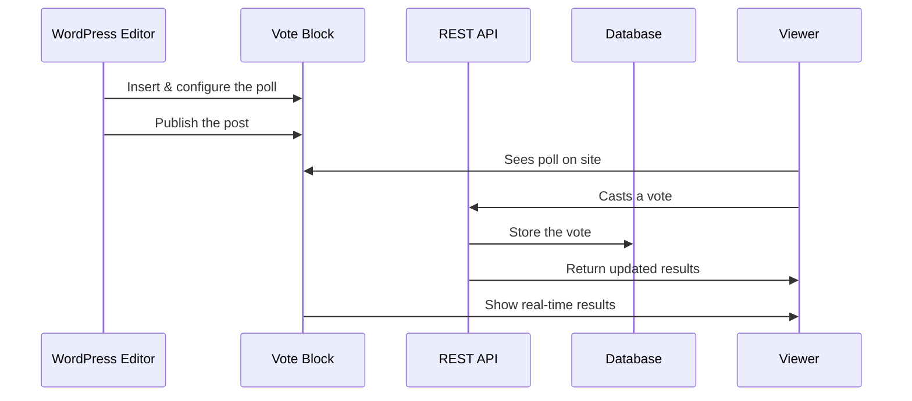

# Chapter 1: Vote Block (Gutenberg Block)

Welcome to your journey with `content-poll`! In this chapter, we’ll explore the heart of the project: the **Vote Block**. This magic block is what brings live, interactive polls to your WordPress site—all with just a few clicks.

---

## Why Would I Use the Vote Block?

Imagine you’re writing a blog post and want to ask your readers:  
**“What's your favorite ice cream flavor?”**  
With the Vote Block, you can drag and drop a poll into your post, let readers vote, and see the results appear instantly!

**Problem Solved:**  
You no longer need a separate plugin or coding skills to run a poll. Just use the block!

---

## What Exactly Is the Vote Block?

Think of the Vote Block as a “poll widget” you can insert anywhere on your site using the WordPress block editor (also called “Gutenberg”).

**Key Features:**

- Lets you ask a question and provide multiple answer choices.
- Lets you write your own poll options — or have AI suggest some for you!
- Keeps poll options locked once voting starts (so things stay fair).
- On your public site, shows an interactive interface for voting.
- Reveals live poll results with fancy progress bars.

---

## Main Pieces of the Vote Block

Let’s break the Vote Block into easy-to-understand parts:

1. **Question:**  
   The main poll question (e.g., "What's your favorite ice cream flavor?").

2. **Options:**  
   The answers voters can pick (e.g., Vanilla, Chocolate, Strawberry).

3. **Poll Controls:**  
   Buttons and settings to adjust the poll.

4. **Live Results:**  
   Progress bars and numbers showing how people voted.

---

## How Do I Use the Vote Block?

### 1. Adding a Vote Block

In the WordPress editor:

- Click the **Add Block** (+) button.
- Search for "**Vote**" and insert the `Vote Block`.

You’ll see an interface like this:

```
[ What’s your question? _____________ ]
[ Option 1: ___________ ]
[ Option 2: ___________ ]
[ + Add More Options   ]
[ Generate Suggestions ]
```

#### Example:

Suppose you want to poll readers on their favorite ice cream:

- Question: `What's your favorite ice cream flavor?`
- Options: `Vanilla`, `Chocolate`, `Strawberry`

Now, your block shows:

```
What's your favorite ice cream flavor?
  [ ] Vanilla
  [ ] Chocolate
  [ ] Strawberry
```

### 2. Customizing the Poll

- Change the number of options (2-6) in the poll settings.
- Click "**Generate Suggestions**" to let AI help with question and options.
- Once votes are in, the poll “locks,” so options can’t be changed.

### 3. What Site Visitors See

On your public site, people see an interactive poll like:

```
What's your favorite ice cream flavor?
(  ) Vanilla
(  ) Chocolate
(  ) Strawberry
[Vote]

(Once people vote, progress bars and percentages appear!)
```

---

## How Does It Work Internally?

Let’s walk through what happens **step-by-step**!

**Sequence Diagram:**  
Here’s a high-level view of what’s going on behind the scenes:



**Simple Workflow Example:**

1. **Insert Block:**  
   You add the block in the editor.

2. **Configure Question & Options:**  
   You type your own, or ask AI for help.

3. **Publish:**  
   The poll goes live in your post.

4. **Users Vote:**  
   Readers click a choice; their vote is sent (secured!) to the server.

5. **See Results:**  
   The poll updates instantly with progress bars showing live votes.

---

## Super-Simplified Code Snippets

Let’s peek at tiny slices of the code (no worries if you’re not a JS wiz!).

### 1. Registering the Block

`src/block/vote-block/index.js`:

```js
import { registerBlockType } from '@wordpress/blocks';
// ...

registerBlockType('content-poll/vote-block', {
  edit: Edit,   // What you see in the editor
  save: () => null // Rendered by PHP (see below)
});
```

**What’s Happening?**  
This tells WordPress a new block exists: your Vote Block!

---

### 2. Showing the Poll in the Editor

```js
function Edit(props) {
  // Show question and option fields
  // Provide a button to generate options
  // Lock the poll when voting starts
}
```

**What’s Happening?**  
This defines how the block looks and behaves while editing.

---

### 3. Rendering on the Public Site

`src/php/Blocks/VoteBlock.php`:

```php
public function render(array $attributes, string $content): string {
  // Build poll HTML: show question and all options as buttons
  // Add data attributes for poll ID and security
  return '<div class="content-poll" ...> ... </div>';
}
```

**What’s Happening?**  
When someone loads the page, PHP generates poll HTML with security in mind. No chance for sneaky hackers!

---

### 4. Handling a Vote (Simplified)

When someone votes, JavaScript sends the choice to the server, which:

- Validates the request.
- Stores the vote.
- Responds with updated vote counts.

---

## Common Questions

**Q: Can I use more than two options?**  
A: Yes! You can pick between 2 and 6 options per poll.

**Q: What happens if I change my mind after people start voting?**  
A: Poll options “lock” to keep things fair. You can make a new poll if needed.

---

## Recap

You now know how the Vote Block works:

- Add a poll to any post or page, **no coding needed**
- Customize questions and options, or get suggestions
- See live results, safely and instantly

Next, you'll discover how the block handles all its buttons, helpers, and interactive logic. Curious? Dive right in:

👉 [Block Editor Front-End Helpers & UI Logic](02_block_editor_front_end_helpers___ui_logic_.md)

---

Generated by [AI Codebase Knowledge Builder](https://github.com/The-Pocket/Tutorial-Codebase-Knowledge)