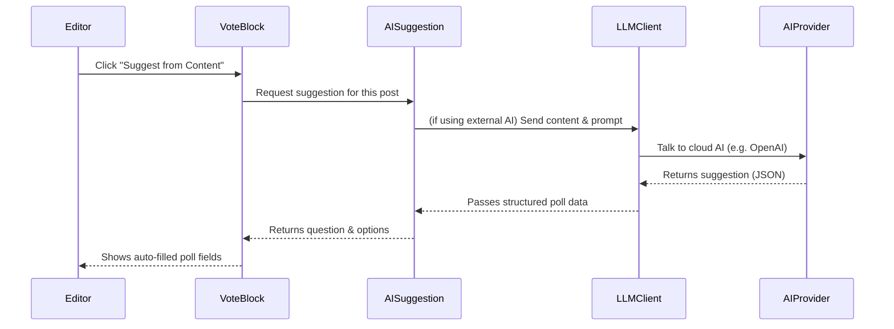

# Chapter 2: AI Suggestion System (AISuggestionService & AI/LLMClient)

*Welcome back!* In [Chapter 1: Vote Block (Gutenberg Block)](01_vote_block__gutenberg_block__.md), you learned how to create simple, interactive polls on your WordPress site—no coding needed!

But sometimes, coming up with a **good poll question and options** can feel tricky. What if something could *help you* brainstorm, saving you time and suggesting great question ideas right from your post's content?

That's exactly what the **AI Suggestion System** does! Let’s discover how it works—and how you can use it.

---

## Why Do We Need an AI Suggestion System?

### Meet Anna

Anna is writing a blog post about eco-friendly travel tips. She wants to add a poll, but doesn’t know:

- What question should she ask?  
- What answer options would make sense?

Instead of staring at a blank box, Anna clicks **“Suggest from Content”**—and instantly gets an AI-powered suggestion like:

> **“Which eco-friendly travel tip do you find most practical?”**  
> - Use a reusable water bottle  
> - Take public transport  
> - Avoid single-use plastics  
> - Offset your carbon footprint

Suddenly, Anna’s poll is ready to go!  
*That’s the magic of the AI Suggestion System.*

---

## What IS the AI Suggestion System?

The AI Suggestion System is like a helpful little *robot co-author*.

- It **reads your page/post** and finds key ideas.
- It **writes a poll question** and 2–6 answer options (in your article language!).
- It can use either a *built-in algorithm* or powerful external AIs like **OpenAI**, **Google Gemini**, **Anthropic Claude**, **Ollama**, or **Grok (xAI)**.

**You control which AI to use**—or use the free built-in mode.

---

## Key Concepts

Let's break down the two main “brains”:

### 1. **AISuggestionService**

Think of this as the “main assistant.”  
- When you ask for a suggestion, it figures out *which* AI to use and manages the process.
- It can use an internal simple engine or connect to big cloud AIs.

### 2. **AI/LLMClient**

This is like a “translator” between your site and cloud AIs (like OpenAI).
- It sends your content and the question template to the AI model.
- It fetches the results and brings them back nicely formatted.

**Analogy:**  
> *AISuggestionService is like a kitchen chef, and LLMClient is the phone the chef uses to call for special ingredients!*

---

## How Do I Use It (As an Editor)?

### Example: Generate Poll Suggestions from Post Content

1. **Write Your Post:**  
   E.g. A travel guide about Norway.

2. **Add a Vote Block** (see [Chapter 1](01_vote_block__gutenberg_block__.md)).

3. **Click “Suggest from Content”**  
   The plugin reads your page, asks your chosen AI for help, and fills in the poll box automatically!

#### Example

Suppose your post starts with:

> “Norway’s Reinebringen is famous for its breathtaking views, but requires a steep, challenging hike...”

You click **Suggest** and get:

- **Question:** *Which aspect of Reinebringen is most appealing to you?*  
  **Options:**  
  - Scenic views  
  - The challenging hike  
  - Its popularity  
  - Accessibility

You can edit these, or use them as-is!

---

## How Does the Suggestion System Pick an AI Provider?

You can pick the “brain” in your plugin’s settings:

- **Heuristic (built-in)** - Free. Analyzes keywords.
- **OpenAI (GPT)** - Paid. Best for advanced suggestions.
- **Anthropic Claude** - Paid. Handles long, complex content.
- **Gemini (Google)** - Has free tier; good all-rounder.
- **Ollama** - Self-hosted, keeps everything private.
- **Grok (xAI)** - Paid, emerging new AI.
- *And more!*

You’ll find an easy dropdown menu and guide in the AI settings.

---

## A Closer Look: What Happens When You Click “Suggest”?

Let’s peek inside, step by step.

**Sequence Diagram:**



**In plain English:**  
- The suggestion service receives your content.
- It checks which AI method is set.
- If a cloud AI is chosen, it sends a special poll prompt and your page’s text to the right model (using LLMClient).
- The AI returns a question and options (in computer-readable format).
- The result is filled into your Vote Block.

---

## Quick Tour: How Does the Code Work?

Let’s look at each piece step-by-step.

### 1. **Calling the Suggestion Service**

The block editor asks for a suggestion like this:

```php
$service = new AISuggestionService();
$suggestion = $service->suggest( $content );
```

**What happens?**
- `$content` is the article’s text.
- `$suggestion` will be an array:  
  `['question' => ..., 'options' => [...]]`

You usually don’t write this code—the block does it for you!

### 2. **How Does It Choose Which AI?**

Simplified, inside the `suggest()` method:

```php
switch ( $provider ) {
  case 'openai':
    $result = $this->suggest_pocketflow( $text );
    break; // ... other cases ...
  default:
    $result = $this->suggest_heuristic( $content );
}
```

**Explanation:**  
- If you set the provider to “OpenAI,” it sends your text to GPT models.
- If not, it uses the built-in “keyword detector” (heuristic).

### 3. **Sending a Request to OpenAI (LLMClient)**

LLMClient handles talking to the remote AI:

```php
$response = wp_remote_post(
  'https://api.openai.com/v1/chat/completions',
  [
    'headers' => [
      'Content-Type'  => 'application/json',
      'Authorization' => 'Bearer ' . $key,
    ],
    'body'    => wp_json_encode($body),
    // ...more setup...
  ]
);
```

**What’s happening?**
- It sends a special instruction (prompt) plus your content.
- Receives a response with the poll question and options (in JSON).

### 4. **Fallback: Built-In Heuristic Keywords if AI Fails**

If cloud AI doesn’t work or you pick the free mode, it uses simple word counting:

```php
$tokens = preg_split('/\W+/', strtolower($text));
$freq = array_count_values($tokens);
arsort($freq);
$top_keywords = array_slice(array_keys($freq), 0, 6);
```

**What’s happening?**
- Counts the most-used long words (keywords) in your text.
- Makes a question using the most common word.
- Uses top words as option choices.

---

## How Can I Configure Which AI Provider Is Used?

**You Choose!**  
Open the plugin’s settings and select your provider under **AI/Suggestion Settings**.

- For OpenAI, Anthropic, Gemini, Grok, etc., enter your API key and pick a model (see [AI-PROVIDERS.md](AI-PROVIDERS.md) for setup).
- For Ollama, point to your local model.
- For built-in heuristic, no setup is needed—works out of the box!

**Pro Tip:**  
If you try a paid AI and run out of credits, the plugin will automatically *fall back* to the free built-in mode, so you always get a suggestion.

---

## Quick Reference: Where Does This Live In the Code?

- **AISuggestionService:**  
  Handles all the logic.  
  *File:* `src/php/Services/AISuggestionService.php`

- **LLMClient:**  
  Talks to cloud AIs (like OpenAI, Azure, etc.).  
  *File:* `src/php/AI/LLMClient.php`

You *never* have to edit these files to use the feature—but now you know where the magic lives!

---

## Summary: What Did You Learn?

- The **AI Suggestion System** helps you quickly create great poll questions and answer options, using either built-in or external AI “brains.”
- You control which AI is used—and it always works, even if cloud AIs are offline.
- Editors like you can simply click **“Suggest from Content”**, and the system does the rest.
- Under the hood, it’s a smart combination of services and “AI drivers”—just like a chef calling for different ingredients based on your choice.

In the next chapter, you'll learn about **PocketFlow Multi-Step AI Flow**—a way to make even *smarter*, multi-part AI

---

Generated by [AI Codebase Knowledge Builder](https://github.com/The-Pocket/Tutorial-Codebase-Knowledge)