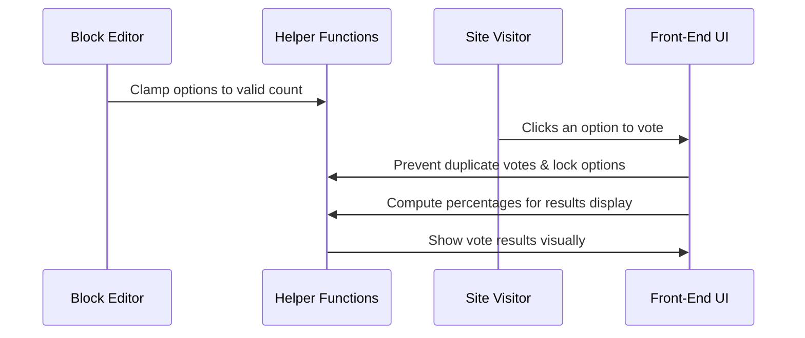

# Chapter 2: Block Editor Front-End Helpers & UI Logic

> _Jumped in from [Vote Block (Gutenberg Block)](01_vote_block__gutenberg_block__.md)? Great! Last time, you learned how to add live polls to your site. Now let’s unpack all the magic tricks that make those polls feel modern, interactive, and easy to use._

---

## Why Do We Need Helpers & UI Logic?

Imagine you set up a poll—"What's your favorite ice cream flavor?"—and 500 people start voting. Nobody wants errors, cheating, or ugly results! The **Block Editor Front-End Helpers & UI Logic** are like the secret backstage helpers making sure everything runs smoothly:

- You can't add too many options—no chaos!
- Voting instantly shows up in slick progress bars.
- Your readers get feedback so they know their vote counted.
- Everything locks once voting starts, so results stay fair.
- Debugging tools help you fix problems if they come up.

---

## Main Use Case: Creating a Seamless Voting Experience

Here's what we're aiming for:

> _"When someone visits your poll, they should be able to vote, see live results, and have controls that feel smooth, secure, and native to WordPress."_

Whether in the editor or on the public site, helpers keep the experience fast and friendly.

---

## Breaking It Down: Key Helper Concepts

Like a team backstage in a theater, each helper has its job. Let's meet them:

### 1. Option Clamping

Prevents you from making a poll with too few or too many choices.

**Analogy:** Like a buffet—too few dishes, nobody’s happy; too many, everyone’s confused!

**Code Example:** What if you want 10 options, but only 2–6 are allowed?

```js
import { clampOptionCount } from './helpers';

const count = clampOptionCount(10); // Output: 6
```

If you ask for 10, you only get 6!

---

### 2. Option Expansion & Trimming

Automatically adds default options or removes extra ones.

**Analogy:** Setting the table for guests—the right number of plates _every time_.

```js
import { expandOrTrimOptions } from './helpers';

const start = ['Vanilla']; // Only one
const result = expandOrTrimOptions(start, 3, 'Option'); // ['Vanilla', 'Option', 'Option']
```

No matter how many guests (options) you choose, it gives you exactly the number allowed!

---

### 3. Computing Vote Percentages

Turns raw vote counts into percentages—for progress bars and user feedback.

```js
import { computePercentages } from './helpers';

const counts = { 0: 2, 1: 1 };
const res = computePercentages(counts);
// res.percentages = { 0: 66.67, 1: 33.33 }
// res.total = 3
```

So you can show:  
"Vanilla: 67%, Chocolate: 33% (3 votes total)"

---

### 4. UI State Logic (Locking, Visual Feedback, and Debug)

Ensures buttons lock _after_ voting, users can't vote twice, and debug tools help admins.

**Analogy:** Like velvet ropes after the show—once the poll closes, it’s hands off!

---

## Using the Helpers: The Step-by-Step User Journey

Let’s see what happens **behind the scenes** when someone interacts with your poll:

### Step-By-Step Example

1. **Setting Poll Options:**  
   - Limited to 2–6 choices (option clamping & expansion).
2. **User Clicks "Vote":**  
   - JS locks poll, marks their choice.
3. **Poll Results Update:**  
   - Instantly shows updated percentages & bars.
4. **Poll Locks:**  
   - No changing options after votes (locking logic).
5. **Debug Controls:**  
   - Admin can reset/test poll in debug mode.

---

**Example Input & Output:**

- **Input:** User tries to add 8 options.
- **Output:** Only 6 options are allowed.

- **Input:** User votes for "Vanilla".
- **Output:** "Thank you for voting! Vanilla now has 67% of votes."

---

## Implementation: How Helpers & UI Logic Work Under the Hood

Let's peek backstage! Here’s an extremely simplified view of what happens:



---

### Minimalist Code Walkthrough

**Option Clamping (See `src/block/vote-block/helpers.js`):**

```js
export const clampOptionCount = (count) =>
    Math.min(6, Math.max(2, count));
```
> _Always gives you a count between 2 and 6, no surprises._

---

**Expanding or Trimming Options:**

```js
export const expandOrTrimOptions = (options, target, defaultLabel = 'Option') => {
    // Ensures right number of options
    // ...implementation...
};
```
> _If you want 4 options but only have 2, it adds 2 more (named "Option"). If you ask for 10, it trims to 6._

---

**Computing Percentages for Results:**

```js
export const computePercentages = (counts) => {
    // Returns { total, percentages }
};
```
> _Turns votes into pretty numbers and bars for the results screen._

---

**Locking Logic Example:**  
See `src/block/vote-block/index.js` and testing in `lock-logic.test.js` for how the poll becomes locked after any votes:

```js
if (locked) {
    // Prevent changes to options
    return;
}
```
> _Once anybody votes, options are frozen, keeping the poll fair._


**Front-End Voting & Result Handling**  
See: `src/block/vote-block/vote-submit.js`

```js
option.addEventListener('click', () => {
    // Send vote, lock options, and show results
});
```
> _After voting, the poll disables further clicks, thanks the user, and updates the results display._

---

## Debug UI Controls (For Admins)

If debug mode is enabled, admins get a "reset" button to test the poll.

```js
resetBtn.addEventListener('click', () => {
    // Resets votes and unlocks options
});
```

---

## How Helpers Fit With the Whole System

These helpers work together with other key parts of the project:

- **Gutenberg Block Editor:** Uses helper functions to keep options valid and poll logic consistent ([Vote Block (Gutenberg Block)](01_vote_block__gutenberg_block__.md)).
- **AI Suggestion Service:** Generates smart poll options (see [AI Suggestion Service & Providers](03_ai_suggestion_service___providers_.md)).
- **REST API Controllers:** Behind the scenes, stores votes and returns results ([REST API Controllers](05_rest_api_controllers_.md)).
- **Security Helpers:** Makes sure votes are safe ([Security Helper (Nonces, Tokenization, and Capability Checks)](06_security_helper__nonces__tokenization__and_capability_checks__.md)).

---

## Recap & Looking Forward

You now know:

- Why helpers & UI logic keep polls safe, fast, and fair.
- How to clamp options, compute results, and lock polls.
- How user interactions are handled seamlessly, with instant feedback.

Next up: learn how polls get _smart_ with AI-powered suggestions!  
👉 [AI Suggestion Service & Providers](03_ai_suggestion_service___providers_.md)

---

_Welcome to the world of modern, interactive polling. Your poll block will never misbehave again!_

---

Generated by [AI Codebase Knowledge Builder](https://github.com/The-Pocket/Tutorial-Codebase-Knowledge)