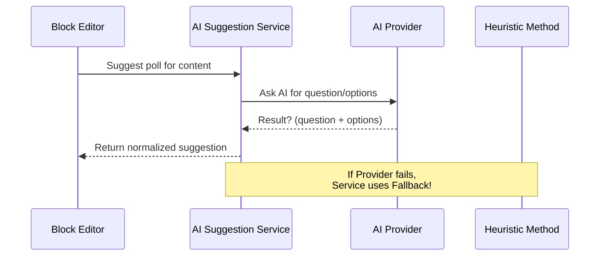

# Chapter 3: AI Suggestion Service & Providers

> _Jumped in from [Block Editor Front-End Helpers & UI Logic](02_block_editor_front_end_helpers___ui_logic_.md)? Awesome! Ready to see how polls get their brains? This chapter is all about the feature that lets your poll block **think for itself**!_

---

## Why Do We Need an AI Suggestion Service?

**Imagine this:**  
You’re writing a post about "Climate Change." Wouldn’t it be magical if, with one click, the poll block could automatically suggest a question like:

> **"What is the main effect of climate change mentioned in this article?"**  
> - Rising temperatures  
> - Decreased rainfall  
> - More snow  
> - Longer winters  

You don’t have to hunt for ideas, translate, or even write the options yourself.

**That’s what the AI Suggestion Service does:**  
It’s your “panel of experts” who read your post, understand the topic, and **generate smart poll questions and answer options** to fit your content. And you get to pick which "expert" (AI provider) you want to use—each with their own strengths and costs.

---

## Key Concepts

Let's break down what all this means:

### 1. **AI Suggestion Service**

- _Reads your post content_
- _Asks an AI model to create a relevant poll question and options_
- _Normalizes the answers so the rest of the poll system can use them easily_
- _Falls back to a simple method if the AI is unavailable_

**Analogy:**  
It's like having an assistant you trust—you hand them your article, and they come back with a perfect quiz question and answer sheet.

### 2. **Providers**

A **Provider** is just the "expert" you want to ask. Each one has a different specialty and cost:
- OpenAI ("GPT-4" celebrity, expensive but really smart!)
- Claude (famous for long articles)
- Gemini (Google's generous, friendly AI)
- Ollama/Exo (runs models on your own computer! Full privacy)
- Heuristic (basic, built-in feature if you want free and fast suggestions)

**You pick which AI provider fits your needs and budget!**

---

## How Do I Use This? (Step-by-Step Example)

Let’s walk through what you’d actually do:

1. **Write your content in WordPress.**

2. **Insert the Vote Block.**  
   _(See [Vote Block (Gutenberg Block)](01_vote_block__gutenberg_block__.md) for basics.)_

3. **Click "Generate Suggestions."**

4. **Choose your AI provider:**  
   In the plugin **Settings**, you’ll see a dropdown to pick your AI provider (or configure your API keys).
   
5. **Watch the question and options fill in!**  
   The poll block will read your content and instantly suggest a question and several options.

**Example:**

Say your content is about "Benefits of Solar Power."

You click "Generate Suggestions" and OpenAI is your provider.

**Result:**

- **Question:** What is a key advantage of solar power discussed in this article?
- **Options:**  
    - Reduces electricity bills  
    - Increases pollution  
    - Requires no sunlight  
    - Lowers property value

---

## Example Code (It’s That Simple!)

You never need to write code, but here’s how the AI magic gets triggered when you click the button:

```js
// When you click "generate suggestions"
await api.suggestPollFromContent(postContent);
```

**Explanation:**  
The block sends your post content to the back-end, where the AI Suggestion Service does all the work!

---

### What Does the Service Return?

Always a structure like:

```json
{
  "question": "What's the main benefit of solar power?",
  "options": ["Reduces bills", "Increases pollution", "No sunlight needed", "Lowers value"]
}
```
And that’s plugged right into your poll!

---

## A Peek Under The Hood: How Does it Work?

Let’s see what really happens after you click:



**In plain English:**  
- The editor asks for suggestions  
- The Service sends content to your chosen Provider  
- If the Provider gives a good result, it’s used  
- If not, a simple keyword-based question is generated (never leaves you empty-handed!)

---

## Internals, Simplified: How It’s Built

There are just a few key parts!

### 1. The Main Service (`AISuggestionService.php`)

This handles the whole process:  
- Figure out which Provider you picked
- Prepare your content for the AI model
- Ask the Provider for a suggestion
- Normalize (fix up) what the Provider returns so the rest of the block is happy
- If anything goes wrong, run the basic free "heuristic" as fallback

**Here’s a super-minimal sketch:**

```php
public function suggest(string $content): array {
    $provider = get_provider();
    $result = ask_provider($provider, $content);
    if (empty($result)) {
        $result = suggest_basic($content); // Fallback
    }
    return normalize($result);
}
```

*This code picks a provider, asks for suggestions, falls back if needed, and always cleans up the results for use.*

---

### 2. The Providers

Each provider is just a different way to ask for suggestions:

- **OpenAI:**  
  ```php
  $ai_response = call_openai_api($content);
  ```
- **Gemini (Google):**  
  ```php
  $ai_response = call_gemini_api($content);
  ```
- **Claude:**  
  ```php
  $ai_response = call_claude_api($content);
  ```
- **Ollama/Exo:**  
  ```php
  $ai_response = call_ollama_api($content);
  ```
- **Heuristic (built-in, free):**  
  ```php
  $output = suggest_keywords($content);
  ```

The service handles all details _so you don’t have to._

---

### 3. Normalizing the Output

Regardless of which AI provider you use, the result is always cleaned up to a simple structure:

```php
[
  'question' => $question,
  'options'  => $options, // always 2–6, never blank
]
```

So your poll logic never breaks or needs special handling.

---

## How to Configure Providers

Want to switch providers? It’s easy!  
Go to the plugin’s **AI Settings** (usually "Content Poll → Settings" in your admin).

You’ll see **all available providers** (OpenAI, Claude, Gemini, Ollama, Exo, etc.).  
Just pick one, enter your API key if needed, and save.

**You can even set these as environment variables or `wp-config.php` constants for extra security.**

_See the [AI Provider Integration Guide](docs/AI-PROVIDERS.md) for step-by-step configuration._

---

## What If the AI Fails?

No worries! The block always falls back to a basic "keyword" method, which:
- Picks main words from your content
- Suggests a simple question like "Your view on [keyword]?"

You'll always get a poll, no matter what.

---

## Advanced: Multi-Step Flows (PocketFlow)

Some providers (like OpenAI with PocketFlow enabled) do a little more “thinking”:
- They first extract main topics from the content
- Then generate a poll question about those topics
- Then double-check they got the format right

All this happens behind the scenes!  
You can learn more about _how these multi-step flows work_ in [Flow/Node Pattern (PocketFlow)](04_flow_node_pattern__pocketflow__.md).

---

## Recap

- The "AI Suggestion Service" is the brains that lets your poll block auto-generate _good questions and options_ for your content.
- You pick the AI "expert" (provider)—OpenAI, Claude, Gemini, Ollama, Exo, or a simple built-in method.
- All the hard parts (API calls, results fixing, fallback) are handled for you.
- Configuration is through the settings page, or (for advanced users!) environment variables.
- Never be stuck for poll ideas again!

---

Ready to see how this block lets you create _chains_ and _flows_ for even smarter suggestions?  
**Onward to:** [Flow/Node Pattern (PocketFlow)](04_flow_node_pattern__pocketflow__.md)

---

---

Generated by [AI Codebase Knowledge Builder](https://github.com/The-Pocket/Tutorial-Codebase-Knowledge)