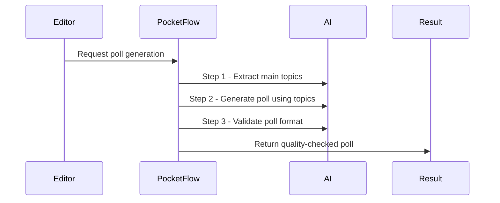

# Chapter 3: PocketFlow Multi-Step AI Flow

Welcome back! In the previous chapter, you learned how the [AI Suggestion System (AISuggestionService & AI/LLMClient)](02_ai_suggestion_system__aisuggestionservice___ai_llmclient__.md) helps generate poll questions and options using AI. But sometimes, asking AI to “do everything in one go” doesn't always give the best results—sometimes you get strange poll options, irrelevant questions, or even text that's not in the right language.

Wouldn’t it be great if we could *guide* the AI, step by step, so it produces even better, more reliable poll suggestions?  
That’s exactly what **PocketFlow Multi-Step AI Flow** does.

---

## Why Do We Need a "Multi-Step AI Flow"?

### A Concrete Example

Imagine you’ve written a blog post about “traveling in Norway.”  
- You want the AI to suggest a poll for your article.
- In one quick shot, the AI might misunderstand, miss the main topics, or create silly options.

Instead, let’s make the AI think in **steps**, like a careful chef:
1. **Extract the main topics** in your article (e.g., “fjords,” “train travel,” “weather”).
2. **Use those topics** to make a more focused poll question and answer options.
3. **Check** the AI’s output to make sure it’s valid and fits the poll format.

This approach improves **quality, relevance, and reliability.**

---

## Key Concepts: How Does PocketFlow Work?

Let’s demystify “multi-step AI flow” by comparing it to a team project:

- **Step 1:** Bob summarizes the main topics of your text.
- **Step 2:** Sue writes a poll question and answer options based on Bob’s topics.
- **Step 3:** Sam checks that Sue’s poll is sensible and well-formatted.

In code, we call each helper a **Node** and link them in order—this creates a **flow**!

### PocketFlow's Three Steps (Nodes)

1. **ExtractKeywordsNode** – “What’s this article about?”
2. **GeneratePollNode** – “Suggest a poll based on those key topics.”
3. **ValidatePollNode** – “Double check: is the poll well-formed? (Correct number of options, valid question, etc.)”

---

## How to Use PocketFlow: Example

You almost *never* have to interact with PocketFlow directly—it works behind the scenes whenever AI poll generation is used! But here’s a simplified example, in case you’re curious:

Suppose you want to generate a poll from an excerpt of your blog post.

### Setting Up the Flow

```php
use ContentPoll\AI\PocketFlow\PollGenerationFlowFactory;
use ContentPoll\AI\LLMClient;

// $client = new LLMClient(...); // set up your AI provider
$flow = PollGenerationFlowFactory::create( $client );
```

> **What happens?**  
> You create a ready-to-run flow of the three steps (Extract → Generate → Validate) using your chosen AI.

### Running the Flow

```php
$shared = (object) [ 'content_excerpt' => 'My trip to Norway was full of fjords and scenic train rides.' ];
$flow->run( $shared );
```

> **What happens?**  
> The flow reads the content, passes it through each step, and updates `$shared` with the final poll.

### Getting the Result

```php
$poll = $shared->final_poll;
// Example: [ 'question' => ..., 'options' => [ ... ] ]
```

> **Result Example:**
>
> ```
> [
>   'question' => 'What aspect of traveling in Norway do you find most exciting?',
>   'options' => [
>     'Exploring fjords',
>     'Taking scenic train rides',
>     'Experiencing local food',
>     'Meeting locals'
>   ]
> ]
> ```
---

## Step-by-Step: What Happens Inside PocketFlow?

Let’s see what happens, from start to finish, when PocketFlow runs:



**Plain English:**  
1. The editor or plugin asks PocketFlow to generate a poll.
2. PocketFlow talks to the AI three times: first for topics, then for the poll, then to check the poll’s structure.
3. The final result is a **clean, relevant poll** suitable for your blog.

---

## Under the Hood: How Does PocketFlow Work?

The code is organized into **nodes** (each handling one step) and a **flow manager**.  
Let’s break it down, piece by piece:

### 1. The "Node" – Each Step in the Flow

**All nodes share the same pattern:**

```php
class MyNode extends AbstractNode {
    public function run($shared) {
        // (do something with $shared)
        return $this->nextNode();
    }
}
```

> Every node takes the current state called `$shared`, does its bit, and passes it to the next node.

---

### 2. Connecting Nodes Into a Flow

**PocketFlow links the steps like a chain:**

```php
$step1->next($step2);
$step2->next($step3);
```

This means:  
- After extracting topics, go to generating the poll.
- After generating, go to validating the poll.

---

### 3. Kicking Off the Flow

The flow manager runs each step in order until done:

```php
$flow = new Flow($firstStep);
$flow->run($shared);
```

- Each step updates `$shared` with its results.
- After all steps, `$shared->final_poll` is ready.

---

### 4. Code Walkthrough of Each Step

Let’s make it easy to follow:

#### a. **Extracting Key Topics**

```php
$topics = $ai->extract_topics($content_excerpt);
// Example result: [ 'fjords', 'train travel', 'weather' ]
```

The AI is asked just to summarize the main subjects.

#### b. **Generating the Poll**

```php
$poll = $ai->generate_poll($content_excerpt, $topics);
// Example result: { question, options }
```

The AI uses your article and those topics to craft a poll.

#### c. **Validating the Poll**

```php
$cleanPoll = validate_poll($poll);
// Ensures: 2-6 options, all strings, question is valid, etc.
```

It trims weird options, fixes counts, and ensures everything is neat.

---

### 5. Where Is This Code?

- **Flow machinery:**  
  `src/php/AI/Flow/Flow.php`  
  `src/php/AI/Flow/AbstractNode.php`
- **PocketFlow steps:**  
  `src/php/AI/PocketFlow/ExtractKeywordsNode.php`  
  `src/php/AI/PocketFlow/GeneratePollNode.php`  
  `src/php/AI/PocketFlow/ValidatePollNode.php`
- **Factory to create the linked-up flow:**  
  `src/php/AI/PocketFlow/PollGenerationFlowFactory.php`

The real magic is in how nodes are chained and how each one focuses on a single job!

---

## Analogy: "The Assembly Line for Polls"

Imagine a poll-making assembly line:

- **Station 1:** Find out what the article is really about (so you don’t get random poll questions).
- **Station 2:** Write a poll that matches those real topics.
- **Station 3:** Inspect the poll—fix any mistakes and polish it up.

Everyone does ONE job, then passes it along—the result is much smarter, more reliable suggestions!

---

## Summary: What Did You Learn?

- **PocketFlow** uses a step-by-step process (“flow of nodes”) to make AI poll suggestions more accurate and reliable.
- Each step (topic extraction, poll creation, validation) is handled separately, so errors are caught and output is higher quality.
- This approach is more robust than “one-shot” AI calls.
- Most of the time, you don’t have to worry—PocketFlow runs automatically when using AI suggestions in your polls.

---

Ready to learn how your polls move through the system (from votes to results)?  
Continue to the next chapter: [REST API Controllers (Vote, Results, Suggestion, Nonce)](04_rest_api_controllers__vote__results__suggestion__nonce__.md)

---

Generated by [AI Codebase Knowledge Builder](https://github.com/The-Pocket/Tutorial-Codebase-Knowledge)