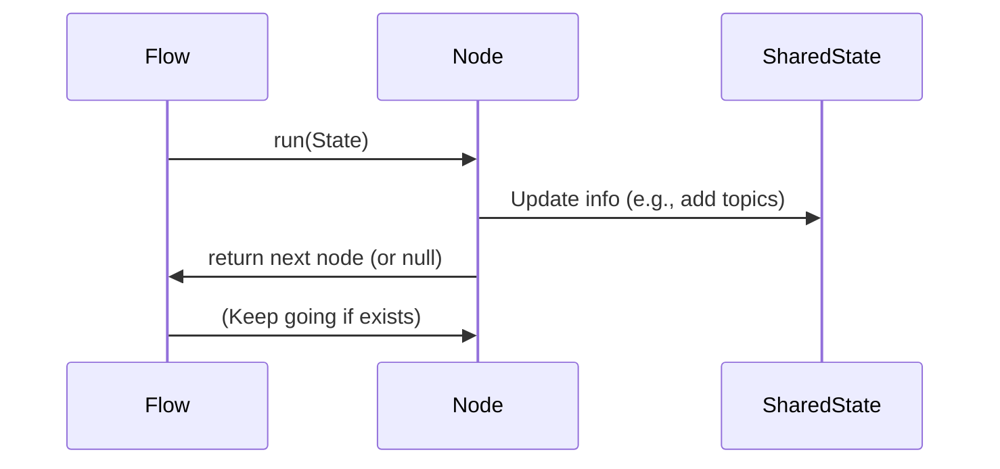

# Chapter 4: Flow/Node Pattern (PocketFlow)

Welcome back! In [AI Suggestion Service & Providers](03_ai_suggestion_service___providers_.md), you discovered how your polls can get AI-suggested questions and options. But what if you want to make those AI workflows more **reliable, testable, and transparent**?  
That's where the **Flow/Node Pattern (PocketFlow)** comes in.

---

## Why Flow/Node? (A Friendly Motivation)

Imagine you build a robot assembly line. Instead of one huge, confusing robot doing *everything*, you have a line of simple robots, each with **one clear job**.  
If a robot breaks, you know exactly where. If you want to improve a step, you can swap out just that robot!

In `content-poll`, **AI poll suggestions work the same way**:
- **Step 1:** "Extract main topics from the article"
- **Step 2:** "Ask AI to generate a poll question and options about those topics"
- **Step 3:** "Check if the poll makes sense and clean it up"

✋ Each **step is called a Node**, and together, the Nodes make a **Flow**—like an assembly line for ideas!

---

## A Real Use Case: Multi-Step Smart Poll Generation

Let’s say you want an even smarter poll creation process:

1. **Extract keywords** from your content.
2. **Generate a poll** based on these keywords.
3. **Validate** the poll (e.g., check if it has a question + 2-6 options).

**If something fails?**  
Each node can set safe defaults or continue gracefully, so your block still works!

---

## Key Concepts — What’s a Flow? What’s a Node?

Let’s break it down:

### 1. **Node**

A **Node** is a mini "robot" that:
- Does one small job (ex: extracting topics)
- Mutates (changes) a shared "state object"
- Knows who its “next neighbor” is (the next node in the chain)

### 2. **Flow**

A **Flow** is the "supervisor":
- Starts at the first node
- Moves down the line, telling each node to do its job
- Passes the shared state from node to node

**Analogy**:  
**Nodes** are like kitchen chefs, each prepping a different part of your meal.  
The **Flow** is the chef's assistant walking the plate from station to station.

---

## How to Use: An Example "Poll Creation Line"

You want:
- To read article content
- Extract topics → Generate poll → Validate poll

Here’s how you’d set it up with PocketFlow:

```php
// Step 1: Build each node (robot/chef)
$extract = new ExtractKeywordsNode($client); // gets topics
$generate = new GeneratePollNode($client);   // makes a poll
$validate = new ValidatePollNode();          // checks poll

// Step 2: Chain them together
$extract->next($generate);
$generate->next($validate);

// Step 3: Start the flow!
$flow = new Flow($extract);
```

**What happens?**  
Your content moves “down the line,” step by step, with the state updated at each station.

---

### Input & Output in Plain Language

- **Input:** Article content (e.g., about "Solar Energy")
- **Output:** A `final_poll` with:
  - A question (e.g., "What is a key advantage of solar power?")
  - 2–6 answer options

---

## Let’s Peek Inside: How Does It Really Work?

**Step-by-step:**

1. **Start with shared state**
   ```php
   $shared = (object)[
     'content_excerpt' => $articleText, // your article!
     // other spots for nodes to fill in
   ];
   ```

2. **Run the flow**
   ```php
   $flow->run($shared);
   ```
   This walks the state through each node.

3. **Each node reads & writes to `$shared`**
   - One adds topics.
   - One adds poll JSON.
   - One parses & validates the poll.
  
4. **Done! Poll sits in `$shared->final_poll`**

---

### Sequence Diagram (Easiest Possible Version)



**Translation:**  
The Flow tells each Node: "Do your part!", handing along the shared state until done.

---

## See It in (Simplified) Code

Let's see how these pieces look—very approachable, we promise.

### The NodeInterface: A Node Must…

```php
interface NodeInterface {
    public function run(\stdClass $shared): ?NodeInterface;
}
```
*Every Node gets the shared state and returns the next Node (or null if done).*

---

### The AbstractNode: Chaining Nodes

```php
abstract class AbstractNode implements NodeInterface {
    private ?NodeInterface $next = null;

    public function next(NodeInterface $node): self {
        $this->next = $node;
        return $this;
    }

    protected function nextNode(): ?NodeInterface {
        return $this->next;
    }
}
```
*This lets you say: `node1->next(node2)->next(node3);` — easy assembly line!*

---

### The Flow: Runs the Nodes One by One

```php
final class Flow {
    public function __construct(private NodeInterface $startNode) {}

    public function run(\stdClass $shared): void {
        $current = $this->startNode;
        while ($current !== null) {
            $current = $current->run($shared);
        }
    }
}
```
*Starts at the first Node, moves down the chain, passing along the shared state object.*

---

### Example Node: ExtractKeywordsNode

```php
final class ExtractKeywordsNode extends AbstractNode {
    public function run(\stdClass $shared): ?NodeInterface {
        // 1. Grab content
        $content = (string)($shared->content_excerpt ?? '');

        // 2. If missing, set empty topics
        if ($content === '') {
            $shared->topics = [];
            return $this->nextNode();
        }

        // 3. Chat with AI to extract topics
        $topics = ['Solar Power', 'Renewable Energy']; // (Imagine AI result)
        $shared->topics = $topics;

        return $this->nextNode();
    }
}
```

*Reads the current state, adds `topics`, then passes control to the next node.*

---

### Example Node: GeneratePollNode

```php
final class GeneratePollNode extends AbstractNode {
    public function run(\stdClass $shared): ?NodeInterface {
        // Use $shared->topics and $shared->content_excerpt
        $raw_json = '{"question":"What is...","options":["A","B"]}'; // (Imagine AI result)
        $shared->raw_poll_response = $raw_json;
        return $this->nextNode();
    }
}
```

*Generates a poll as JSON and puts it in the state.*

---

### Example Node: ValidatePollNode

```php
final class ValidatePollNode extends AbstractNode {
    public function run(\stdClass $shared): ?NodeInterface {
        // Turn raw JSON into an array
        $parsed = json_decode($shared->raw_poll_response, true);
        $shared->final_poll = $parsed;
        return $this->nextNode();
    }
}
```

*Makes sure the poll result is valid and stores it as the "final poll".*

---

### The Factory: Ties It All Together!

```php
public static function create(LLMClient $client): Flow {
    $extract  = new ExtractKeywordsNode($client);
    $generate = new GeneratePollNode($client);
    $validate = new ValidatePollNode();

    $extract->next($generate);
    $generate->next($validate);

    return new Flow($extract);
}
```
*One clean place to define your whole flow!*

---

## Why Is This Great? Recap for Beginners

- **Each Node does ONE job** — making it easy to understand, change, and test.
- **Flow/Node is explicit** — you know every step, and can swap in new logic or skip steps.
- **If a Node fails, the flow doesn’t crash** — it can recover or set safe defaults.
- **Code stays clean and modular** — no tangled functions!

---

## Where to Find the Real Code

Check out these files for real examples:

- Flow logic:  
  - `src/php/AI/Flow/Flow.php`
  - `src/php/AI/Flow/AbstractNode.php`
  - `src/php/AI/Flow/NodeInterface.php`
- Sample PocketFlow nodes:  
  - `src/php/AI/PocketFlow/ExtractKeywordsNode.php`
  - `src/php/AI/PocketFlow/GeneratePollNode.php`
  - `src/php/AI/PocketFlow/ValidatePollNode.php`
  - `src/php/AI/PocketFlow/PollGenerationFlowFactory.php`

---

## Wrap-Up & What's Next?

With the Flow/Node pattern, your AI-powered polls are smarter, safer, and much easier to test or upgrade. You now understand a key architecture behind all the "magic"!

**Next up:** Learn how requests from

---

Generated by [AI Codebase Knowledge Builder](https://github.com/The-Pocket/Tutorial-Codebase-Knowledge)