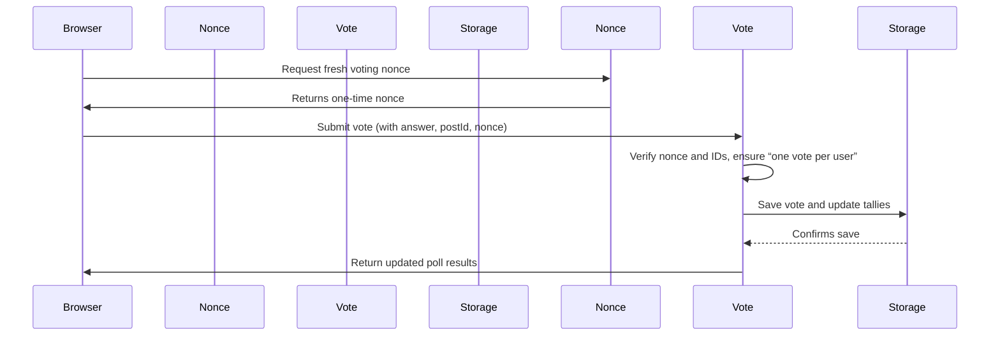

# Chapter 4: REST API Controllers (Vote, Results, Suggestion, Nonce)

Welcome back! In [Chapter 3: PocketFlow Multi-Step AI Flow](03_pocketflow_multi_step_ai_flow_.md), you learned how the plugin uses step-by-step AI flows to generate better poll suggestions for your content. Now, let’s switch gears and see **how data actually moves** between your site visitor’s browser, the WordPress backend, and the database whenever someone interacts with a poll.

This is where REST API Controllers come in! They’re like trusted mail carriers—making sure votes, results, and AI suggestions are safely sent and received between the website’s frontend and backend.

---

## The Motivation: Why REST API Controllers?

**Problem:**  
How do we securely record votes, show up-to-date results, and let editors get AI-powered poll suggestions—all from your browser, without full page reloads?

**Typical use case:**  
- A voter selects their answer on your poll and clicks “Vote.”
- The result instantly appears.
- An editor clicks “Suggest from Content” for poll options—AI answers back, live.
- All of this must be safe, fast, and require no reloads for users or editors!

**REST API Controllers** make this possible. They:
- Receive messages (like “please submit a vote!”) from the front-end.
- Do security checks (like verifying the request really came from your site, not a spammer!).
- Pass information to internal services for recording votes, fetching results, and more.
- Return the results back to the browser in a simple, secure format.

---

## Key Concepts: The Four REST API Controllers

Let’s break down the four types, each with its own job (like different mail routes):

1. **VoteController** – Handles vote submissions.
2. **ResultsController** – Returns up-to-date vote results.
3. **SuggestionController** – Provides AI-generated poll suggestions to editors.
4. **NonceController** – Generates special “voting tickets” (nonces) for safe voting.

Here’s a beginner-friendly view of each!

---

### 1. VoteController: Submitting a Vote

**Analogy:**  
Think of this as the “ballot box slot.” When a visitor presses "Vote," their choice (securely) travels to VoteController for recording.

#### Example: Voting

1. Visitor picks an answer.
2. The block sends a secure vote request:
    ```js
    // Sent by frontend JavaScript
    fetch('/wp-json/content-poll/v1/block/12345/vote', {
      method: 'POST',
      headers: { 'X-WP-Nonce': 'abcdef' },
      body: JSON.stringify({ optionIndex: 2, postId: 99 })
    });
    ```
3. The server checks:
   - Is the special “nonce” correct? (prevents vote spam/hacks)
   - Is the vote valid? (right poll ID, one vote per user)
   - Stores the vote and returns updated results.

**Result:**  
The browser gets an updated tally (including “which option you picked”), and shows fresh results right away.

---

### 2. ResultsController: Fetching Poll Results

**Analogy:**  
Think of this as the “results board”—anyone can peek to see which poll options are most popular.

#### Example: Getting Results

1. Visitor (or the block) wants to see current poll stats.
2. The browser asks the API:
    ```js
    fetch('/wp-json/content-poll/v1/block/12345/results')
      .then(res => res.json())
      .then(data => /* update results on screen */);
    ```
3. The server sends back:
    ```json
    {
      "totalVotes": 42,
      "counts": [20, 15, 7],
      "percentages": [47.6, 35.7, 16.7],
      "userVote": 1 // (optional - which answer this visitor picked)
    }
    ```
**Result:**  
Everyone sees live, up-to-date results—no reload needed.

---

### 3. SuggestionController: Getting AI Suggestions

**Analogy:**  
This is like asking a smart robot for help writing your poll question and options, *but only editors* are allowed to use this!

#### Example: Suggestion Request

1. The editor clicks “Suggest from Content” in the poll block.
2. The request is sent:
    ```js
    fetch('/wp-json/content-poll/v1/suggest?postId=99')
      .then(res => res.json())
      .then(data => /* fill in poll fields with suggestion */);
    ```
3. The server checks: “Is this user allowed to edit posts?”
4. If yes, it runs the AI suggestion system and replies:
    ```json
    {
      "question": "Which eco-friendly travel tip do you find most practical?",
      "options": [
        "Use a reusable water bottle",
        "Take public transport",
        "Avoid single-use plastics",
        "Offset your carbon footprint"
      ]
    }
    ```
**Result:**  
Editors get smart, instant help for building polls!

---

### 4. NonceController: Safe Voting “Tickets”

**Analogy:**  
Before you put a slip in the ballot box, you get a secure “ticket” saying you’re allowed to vote now. This stops attackers from voting thousands of times.

#### Example: Getting a Nonce

1. Browser asks for a fresh voting ticket:
    ```js
    fetch('/wp-json/content-poll/v1/nonce')
      .then(res => res.json())
      .then(data => /* use data.nonce for safe voting */);
    ```
2. The server responds:
    ```json
    { "nonce": "randomly-generated-value" }
    ```
3. When you submit a vote, this nonce is sent along (it must match!).

**Result:**  
Votes are accepted *only* from browsers that got a real ticket—blocking bots and CSRF attacks.

---

## How It Works: End-to-End Example (Sending a Vote)

Let’s follow a simple example:  
A visitor votes on a poll. What steps happen under the hood?

### Step-by-Step Walkthrough


**Beginner’s Translation:**  
- The browser gets a secure “ticket” (nonce).
- The visitor votes, the “ticket” is checked, and the vote is safely stored.
- Results are immediately sent back.

---

## Deeper Dive: How Is This Implemented?

Let’s look at the **minimal code** (in PHP) for each controller—just enough to show the flow!  
*(Don’t worry, you won’t need to touch these files to use the feature.)*

### 1. NonceController (`src/php/REST/NonceController.php`)

Creates secure voting nonces:

```php
// Registers a REST endpoint: /nonce
public function get_nonce( $request ) {
    return [ 'nonce' => SecurityHelper::create_nonce() ];
}
```
*Returns a new, random "ticket" for voting requests.*

---

### 2. VoteController (`src/php/REST/VoteController.php`)

Receives, checks, and records votes:

```php
public function handle_vote( $request ) {
    $nonce = $request->get_header( 'X-WP-Nonce' );
    if ( ! SecurityHelper::verify_nonce( $nonce ) ) {
        return $this->error( 'invalid_nonce', 'Nonce validation failed', 403 );
    }
    // Validate poll/block ID, user token, and vote data...
    $result = $service->record_vote( ... );
    return $result;
}
```
*Checks that the vote is legitimate, then stores it and returns updated results.*

---

### 3. ResultsController (`src/php/REST/ResultsController.php`)

Returns poll results:

```php
public function get_results( $request ) {
    $poll_id = $request->get_param( 'pollId' );
    $service = new VoteStorageService();
    $agg     = $service->get_aggregate( $poll_id );
    return $agg;
}
```
*Fetches vote counts and percentages for the poll.*

---

### 4. SuggestionController (`src/php/REST/SuggestionController.php`)

Provides AI-based poll suggestions (for editors):

```php
public function suggest( $request ) {
    $post_id = $request->get_param( 'postId' );
    $post    = get_post( $post_id );
    $service = new AISuggestionService();
    return $service->suggest( $post->post_content ?? '' );
}
```
*Runs the [AI suggestion system](02_ai_suggestion_system__aisuggestionservice___ai_llmclient__.md) and returns poll fields.*

---

## Where Does the Real Work Happen?

- These controllers mainly **check security and handle inbound/outbound requests**.
- The actual voting, vote storage, aggregation, and AI magic happen in linked services like [VoteStorageService](05_vote_storage___aggregation__votestorageservice__.md) and [AISuggestionService](02_ai_suggestion_system__aisuggestionservice___ai_llmclient__.md).

---

## Quick Recap

You

---

Generated by [AI Codebase Knowledge Builder](https://github.com/The-Pocket/Tutorial-Codebase-Knowledge)