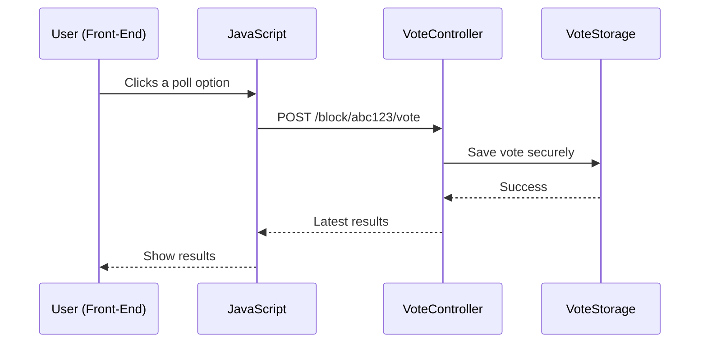

# Chapter 5: REST API Controllers

Welcome back! In [Flow/Node Pattern (PocketFlow)](04_flow_node_pattern__pocketflow__.md), you learned how clever step-by-step flows power AI poll suggestions. In this chapter, we'll switch gears and reveal how different parts of your site (editor, visitors, WordPress admin, even AI helpers) “talk” securely using something called **REST API Controllers**.

---

## Why Do We Need REST API Controllers?

Imagine your website is a busy restaurant:

- The WordPress backend is the kitchen.
- The front-end (your browser, or a friend’s phone) is the dining hall.
- Customers (users or admins) are making requests for dishes—like "cast a vote!", "show poll results!", "suggest a poll!", or "check which AI models are ready!".

But you don’t want customers barging into the kitchen—there needs to be a polite, secure **waiter** carrying _orders_ and _responses_ back and forth.

That “waiter” is the **REST API Controller!** Each waiter (controller) is responsible for *one type of interaction* (like "vote requests" or "AI suggestions"), making communication clear, fast, and safe.

---

### Core Use Case

**Scenario:**  
A reader votes on a poll, and you (the site owner) want to see live results update—without reloading the page!

How do the different pieces talk?  
Through REST API Controllers!

---

## Key Concepts: REST API Controller, Route, and Separation

Let’s break it down so anyone can understand:

### 1. **REST API Controller**
- Like a *waiter*, handles all requests of a **specific kind**.
- Each controller responds _only_ to its own “orders” (voting, result lookup, AI suggestion, etc).
- Keeps everything organized and secure.

### 2. **Route**
- The special “address” waiters listen to—for example,  
  `/content-poll/v1/block/abc123/vote`
- Think of this as a “table number”: the API knows where to deliver each request.

### 3. **Separation and Security**
- Each controller does _one_ thing. This ensures no single point has all the keys!
- Security checks (like “do you have a token?”) are always enforced for sensitive actions.

---

## REST API Controllers in Content-Poll

Each controller is in charge of one kind of task (“dish”):

- **VoteController** — Handles new votes, and resets (for debug).
- **ResultsController** — Returns current poll results.
- **SuggestionController** — Generates poll questions/options with AI (editors only).
- **NonceController** — Issues fresh security tokens (nonces) for safe voting.
- **ExoController** — Lets admins check AI model status for the “Exo” provider.

Let’s see how you’d use these, with a super simple example!

---

### 1. Voting on a Poll

**Your site visitor wants to vote. Here’s the flow:**

1. JavaScript sends a vote to the `/vote` route.
2. The VoteController checks a security nonce.
3. If valid, VoteController records the vote.
4. Returns updated results.

**Minimal Example (What You See in the Browser):**

```js
// Submitting a vote for poll "abc123"
await fetch('/wp-json/content-poll/v1/block/abc123/vote', {
  method: 'POST',
  headers: { 'X-WP-Nonce': nonce },
  body: JSON.stringify({ optionIndex: 1, postId: 456 }),
});
// Returns: { totalVotes: 7, counts: [3,4], percentages: [43,57], userVote: 1 }
```

**Explanation:**  
- Front-end sends data to the correct route ("table number").
- The controller handles **just** voting, keeping things clear.

---

### 2. Fetching Poll Results

After voting, your site can display the latest results (no reload!):

```js
// Get [results] for poll "abc123"
await fetch('/wp-json/content-poll/v1/block/abc123/results')
```

**Returns:**

```json
{
  "totalVotes": 7,
  "counts": [3, 4],
  "percentages": [43, 57],
  "userVote": 1
}
```

---

### 3. Generating AI Suggestions

On the edit screen, an editor can ask for fresh poll ideas (using the SuggestionController):

```js
// Editor requests an AI-generated suggestion for Post 123
await fetch('/wp-json/content-poll/v1/suggest?postId=123')
```

**Returns:**

```json
{
  "question": "What's the main idea?",
  "options": ["Option A", "Option B"]
}
```

---

## How Do Controllers Work Internally?

Let’s walk through a real-life polling scenario:

### Sequence: A User Votes (Step-by-Step)



**In words:**
1. Visitor votes → JS sends request to the VoteController.
2. VoteController checks security, calls VoteStorage to record.
3. Returns results, which are shown to the visitor.

---

## Internals: A Warm (Tiny) Tour Through Actual Controller Code

Let’s peek inside a controller. Each one is very short and to the point!

### Registering a Route

File: `src/php/REST/VoteController.php`

```php
public function register(): void {
  add_action('rest_api_init', function () {
    register_rest_route($this->namespace, '/block/(?P<pollId>[a-zA-Z0-9_-]+)/vote', [
      'methods' => 'POST',
      'callback' => [$this, 'handle_vote'],
    ]);
  });
}
```

**Friendly translation:**  
- When WordPress sets up, tell it:  
  “If someone POSTs to `/vote`, send that here!”

---

### Handling a Vote (The Core Logic)

```php
public function handle_vote($request) {
  // 1. Check nonce for security (CSRF).
  // 2. Validate the poll and option index.
  // 3. Grab/create the user's token.
  // 4. Store the vote using VoteStorageService.
  // 5. Return new results.
}
```
**Notice:**  
- All details are handled _inside_ the vote controller.
- It always double-checks permissions and keeps a clear separation from other actions.

---

### Handling Results

File: `src/php/REST/ResultsController.php`

```php
public function get_results($request) {
  // 1. Figure out correct poll.
  // 2. Get aggregates from storage.
  // 3. Add user's own vote if available.
  // 4. Return results.
}
```
**So simple!**  
Each controller _only_ focuses on “serving” its one dish (here, “results for a poll”).

---

### AI Suggestions Endpoint

File: `src/php/REST/SuggestionController.php`

```php
public function suggest($request) {
  // 1. Make sure user can edit posts.
  // 2. Pick the right post.
  // 3. Use the AI suggestion service.
  // 4. Return question + options.
}
```
**Key:**  
- Only editors/author-type users get access—safe by default.

---

### Nonce Provider for Security

For safe voting (no one forging requests!), you can get a new nonce:

File: `src/php/REST/NonceController.php`

```php
public function get_nonce($request) {
  // Return a fresh security nonce for the client.
  return ['nonce' => SecurityHelper::create_nonce()];
}
```

---

### Exo AI Health Check

Site admins can check which AI models (like Exo) are available:

File: `src/php/REST/ExoController.php`

```php
public function check_health($request) {
  // Ask Exo if it's awake and healthy.
  // Return a friendly status.
}
```

---

## Putting It All Together (Beginner-Friendly Analogy)

**Imagine your website as a restaurant:**

- Each REST API controller is a *dedicated waiter*.
- They take only *one kind of order* (vote, result lookup, AI suggestion, nonce).
- They make sure only the right people at the right tables (routes) get the right dishes (data).
- *No mix-ups, clear boundaries, always secure.*

---

## Where to Find the Real Code

REST API Controllers live in the `src/php/REST/` folder:

- `VoteController.php`
- `ResultsController.php`
- `SuggestionController.php`
- `NonceController.php`
- `ExoController.php`

All are organized for easy exploration!

---

## Recap and What's Next?

You’ve now unlocked a superpower: 
- **Any part of your site** (editor, user’s browser, WP admin, even automated scripts) can interact with polls _safely and efficiently_.
- Each controller is a “waiter” handling just one job, keeping your site neat, secure, and easy to maintain.

**Ready to dig into how security tokens (nonces), anonymized tokens,

---

Generated by [AI Codebase Knowledge Builder](https://github.com/The-Pocket/Tutorial-Codebase-Knowledge)