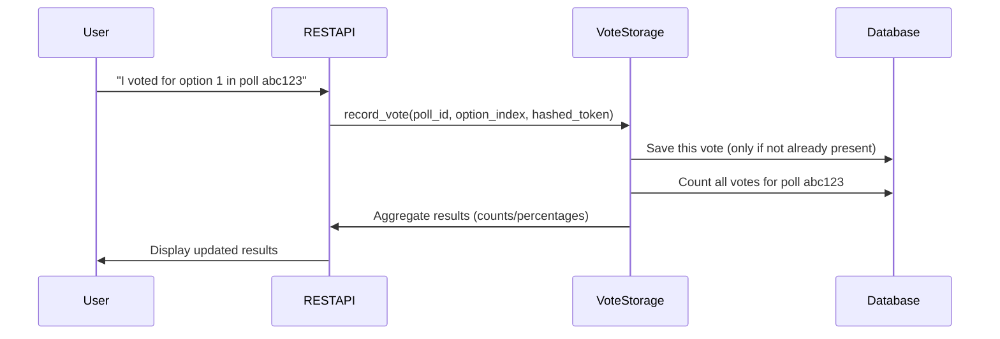

# Chapter 5: Vote Storage & Aggregation (VoteStorageService)

Welcome back!  
In the previous chapter, [REST API Controllers (Vote, Results, Suggestion, Nonce)](04_rest_api_controllers__vote__results__suggestion__nonce__.md), you learned how the plugin safely receives votes and returns results using special endpoints behind the scenes. But how are those votes actually **stored, counted, and protected** to make sure the poll results are always accurate and fair?

Let’s meet the secret hero of voting:  
**Vote Storage & Aggregation** — powered by the `VoteStorageService`.

---

## Why Do We Need Vote Storage & Aggregation?

Imagine you run a poll block on your website asking:

> **What's your favorite way to travel in Norway?**  
> - Train  
> - Hiking  
> - Ferry  
> - Car

Now, hundreds of visitors want to vote. But:

- **How do you remember who already voted?**
- **How do you stop "double voting" and keep it fair?**
- **How do you quickly show up-to-date results — counts and percentages for each option?**

This is where the `VoteStorageService` comes in.  
Think of it as a **secure ballot box** and an **instant tally machine** — storing each vote safely, making sure nobody cheats, and showing totals right away.

---

## What Does VoteStorageService Do?

Let’s break it down with a friendly analogy:

- **Vote Submission**: Like dropping your slip into a locked ballot box.
- **Deduplication**: Checks you don’t sneak in a second slip.
- **Counting & Percentages**: Like the election officials who count votes and announce "Option A: 42 votes (54%)!"
- **Abstraction**: You don't ever touch the database yourself. This service handles all those details for you.

The result?  
Any code (or REST API)—like the ones you saw in [the previous chapter](04_rest_api_controllers__vote__results__suggestion__nonce__.md)—can just say "store this vote" or "give me current poll results", and the VoteStorageService does the rest!

---

## Beginner Example: Using the Service

Suppose someone votes for the *Hiking* option in poll `abc123`.

### Example: How to Record a Vote

```php
// Instantiate the service
$service = new VoteStorageService();

// Record the vote
$result = $service->record_vote( 'abc123', 45, 1, 'hashedtoken123' );
```
**Explanation:**  
- `'abc123'` is the poll ID
- `45` is the post ID (which page the poll is on)
- `1` is the answer option's index (e.g., Hiking if options are [Train, Hiking, Ferry, Car])
- `'hashedtoken123'` is a secure fingerprint for this user (so you only get one vote!)

The `$result` is an array with the **updated counts and percentages** for each option, ready for display.

---

#### Example Output Structure

```php
[
  'blockId'     => 'abc123',
  'totalVotes'  => 108,
  'counts'      => [38, 25, 22, 23],       // votes per option
  'percentages' => [35.2, 23.1, 20.4, 21.3] // percentage per option
]
```

**Explanation:**  
You instantly get the updated stats to show to your voters — no slow recalculations!

---

### Example: Getting Who Voted for Which Option

```php
$userIndex = $service->get_user_vote( 'abc123', 'hashedtoken123' );
```
**Result:**  
`$userIndex` is `1`, meaning this user picked the *Hiking* option.

---

## Key Concepts Explained Simply

Let’s break down the most important ideas:

### 1. **Deduplication — Preventing Double Votes**

Every vote is stored with a special fingerprint (`hashed_token`). The service only allows **one vote per user per poll** — enforced by a "uniqueness" lock in the database. You can’t cast two votes with the same fingerprint.

**Analogy:**  
It's like giving each voter a unique sticker; the ballot box checks: *"Do you already have a sticker for this poll? Sorry, only one!"*

---

### 2. **Aggregation — Fast Counting and Instant Percentages**

The service can instantly add up how many votes each answer has, and calculate what percentage that is out of the total, like an election scoreboard.  
No need for manual math or slow scanning of all the votes.

**Analogy:**  
Imagine an automatic counter ticks up every time a slip is dropped in, and the scoreboard updates in real time!

---

### 3. **Abstraction — Keeping Database Details Hidden**

As an editor, developer, or plugin user, you **never** have to worry about how votes are stored or counted.  
You just ask the service: “Please record this vote!” or “Show me the latest results!” and it hides all technical details.

**Analogy:**  
You don’t care how the locks or tally machines work inside the ballot box — you just want trusted results!

---

## What Happens When a Vote is Recorded? (Step-by-Step)

Let’s walk through the flow, step by step, when someone votes on a poll:



**Translation for Beginners:**  
- The user votes.
- The public API sends the info to VoteStorage.
- VoteStorage saves the vote safely and checks for duplicates.
- It instantly adds up the new totals.
- The user sees live results!

---

## A Peek Under the Hood: How Does the Service Work?

Let’s look at the simple building blocks inside `VoteStorageService`:

### 1. **Recording a Vote**

```php
public function record_vote( $poll_id, $post_id, $option_index, $hashed_token ) {
  // Try to save the vote
  $inserted = $db->insert(...);
  if ( $inserted === false ) {
    // Duplicate! Already voted.
    return [ 'error' => true, 'code' => 'duplicate_vote' ];
  }
  // Return instant results
  return $this->get_aggregate( $poll_id );
}
```
**Explanation:**  
- Tries to write a new vote (only if you haven’t voted already).
- If it's a duplicate, you get a friendly error message.
- Otherwise, you instantly get the latest results.

_Read more about the full code in_:  
`src/php/Services/VoteStorageService.php`

---

### 2. **Counting Votes & Percentages**

```php
public function get_aggregate( $poll_id ) {
  // Ask the database for counts per option
  $rows = $db->get_results(...GROUP BY option_index...);
  // Fill in counts and percentages
  // Return array like [counts => ..., percentages => ...]
}
```
**Explanation:**  
- Counts up how many votes each option got.
- Calculates percentages for each.
- Gives you a ready-to-display array for results.

---

### 3. **Checking a User’s Vote**

```php
public function get_user_vote( $poll_id, $hashed_token ) {
  // Look up which option this user picked before
}
```
**Explanation:**  
- Checks the database to find out which answer, if any, this user already voted for — useful for showing "Your Vote".

---

## Where Is the Data Stored?

Votes are safely kept in a custom database table (with strong locks against double-voting) managed by [`DatabaseManager`](06_database_schema_management__databasemanager__.md).  
You don’t need to worry about table names, indexes, or migrations — VoteStorageService wraps all that complexity!

---

## How Does This Fit Into the Rest of the System?

- **REST API (frontend ↔ backend)** talks to VoteStorageService to save and read votes.
- **Analytics & Admin Dashboard** uses this service to show aggregate statistics.
- **Security** tools use its checks to verify fair voting.

Want to see more about how the database table itself is managed?  
Continue to [Database Schema Management (DatabaseManager)](06_database_schema_management__databasemanager__.md)!

---

## Summary — What Did You Learn?

- **VoteStorageService** is the secure, trusted backend for writing and counting votes.
- It **prevents double voting** and instantly aggregates count and percentage results.
- You can use it with easy helper methods — no need to touch the database directly!
- It’s the central link between user action and accurate, up-to-date poll results.

Ready to uncover how the database itself is set up and upgraded behind the scenes?  
Head to the next chapter: **[Database Schema Management (DatabaseManager)](06_database_schema_management__databasemanager__.md)**

---

**You're doing great so far — polls, AI, voting, results, and now databases. Keep going! 🚀**

---

Generated by [AI Codebase Knowledge Builder](https://github.com/The-Pocket/Tutorial-Codebase-Knowledge)