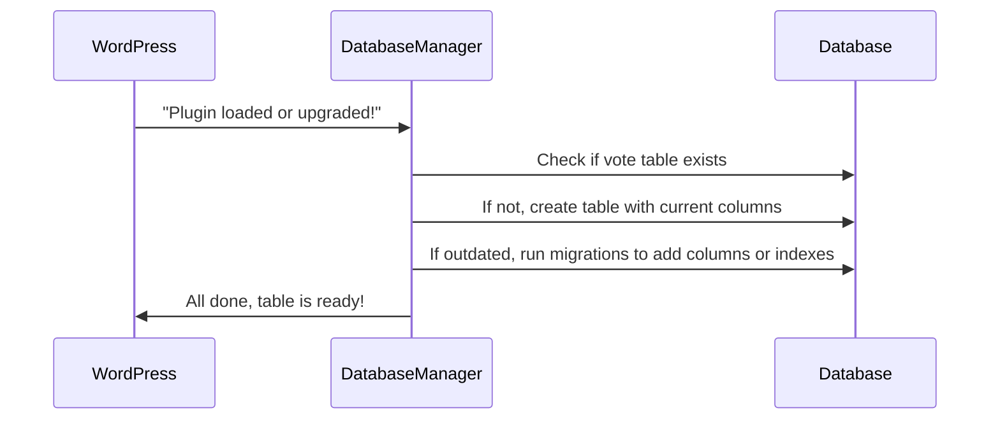

# Chapter 6: Database Schema Management (DatabaseManager)

Welcome back!  
In [Chapter 5: Vote Storage & Aggregation (VoteStorageService)](05_vote_storage___aggregation__votestorageservice__.md), you learned how votes are safely stored and counted. But where exactly **are votes kept**? How do we make sure the vote table is created correctly, doesn’t get corrupted, and upgrades smoothly as the plugin grows?

This is where **Database Schema Management** (using `DatabaseManager`) comes in—it’s the plugin’s “records room manager,” making sure all data stays tidy, safe, and always up-to-date!

---

## Why Do We Need Database Schema Management?

Imagine the plugin’s votes as little paper slips in a locked filing cabinet. Over time:

- The plugin might get upgraded (new features!).
- Old data structures might change (“We used block_id, now we use poll_id!”).
- The filing cabinet (database table) itself might need repairs or expansion.
- We need to make sure votes **aren’t lost, mixed up, or accidentally deleted** during updates.

**DatabaseManager** is like a head archivist:  
- Makes sure the vote table exists, is the correct shape, and never loses any slips during a renovation!
- Handles migrations (switching columns, updating indexes) safely and automatically.

---

## Central Use Case: Safe Table Creation, Upgrade, and Cleanup

Let’s say you install the plugin, run a poll for months, then update to a new version—  
> How do your old votes stay safe... while the new vote format starts working right away?

**Without a records manager**: old votes could be lost, the table might be out of date, or upgrades might crash.  
**With DatabaseManager**:  
- The vote table is built and maintained behind the scenes.
- Migrations (like adding new columns or changing indexes) run safely.
- Nothing is lost—even during big upgrades!

---

## Key Concepts (Explained Simply!)

Let’s break down what DatabaseManager does—step by step:

### 1. **Table Creation**

Creates the vote storage table when the plugin is first used (or if it’s missing).

- Ensures columns for all the needed info (`poll_id`, `option_index`, `hashed_token`, etc.).
- Adds unique locks to prevent double voting.

### 2. **Migrations**

Handles upgrades—adds/changing columns if needed, updates indexes, and moves data safely.

- For example: switches from using `block_id` to using `poll_id`.
- Ensures old data is kept and mapped correctly.

### 3. **Idempotency & Safe Triggers**

Runs only when needed! DatabaseManager checks the current version and triggers changes **only once** per upgrade, protecting against accidental data loss.

### 4. **Cleanup on Uninstall**

Removes the vote table and related plugin options if the plugin is uninstalled, leaving no orphaned data behind.

---

## How Do You Use This Abstraction?

**Good news:** You almost never need to interact with DatabaseManager yourself. It runs automatically!

- On plugin install or upgrade, it **creates and updates the vote table.**
- When you use [VoteStorageService](05_vote_storage___aggregation__votestorageservice__.md), it makes sure the table is ready before any vote is stored.
- On plugin uninstall, it safely removes the vote table.

**Example: Initialize Database**

```php
// Usually called when the plugin loads/upgrades:
ContentPoll\Database\DatabaseManager::instance()->initialize();
```

**What happens?**  
- If table is missing, it’s created.
- If plugin was upgraded, schema migrations run.
- All your existing votes are safe and usable!

---

## Example: What Does the Table Look Like Inside?

Here are the key columns the table manages:

- `poll_id` (the unique poll identifier)
- `option_index` (which answer was picked)
- `hashed_token` (the "fair voting fingerprint")
- `block_id`, `post_id`, `created_at` (for tracking context and timestamp)

**Analogy:**  
The database table is just a clean, electronic spreadsheet for every vote—organized and locked tight!

---

## Beginner-Friendly Internal Walkthrough

Let’s see what happens, step-by-step, when DatabaseManager is “in action”:



- WordPress starts up, calls DBManager.
- DBManager checks for and creates/updates the vote table.
- When plugin APIs need to store votes, the table is always ready!

---

## How Does This Work In Code? (Step-by-Step)

Let’s break down some **simple code** for each important bit—no advanced SQL needed!

### 1. **Check if Table Exists**

```php
$table = $wpdb->prefix . 'vote_block_submissions';
$table_exists = $wpdb->get_var(
  $wpdb->prepare('SHOW TABLES LIKE %s', $table)
);
```
*If the table doesn’t exist, it’s time to create it!*

---

### 2. **Create Table If Missing**

```php
$sql = "CREATE TABLE $table (
  id BIGINT UNSIGNED AUTO_INCREMENT,
  poll_id VARCHAR(64) NOT NULL,
  option_index TINYINT UNSIGNED NOT NULL,
  hashed_token CHAR(64) NOT NULL,
  created_at DATETIME NOT NULL,
  PRIMARY KEY (id)
)";
$wpdb->query($sql);
```
*This lays out columns for each vote slip—plus a safe primary key.*

---

### 3. **Run Safe Migrations to Add New Columns/Indexes**

Suppose a new version needs to track `poll_id` instead of `block_id`.

```php
$columns = $wpdb->get_col("SHOW COLUMNS FROM $table LIKE 'poll_id'");
if (empty($columns)) {
  $wpdb->query("ALTER TABLE $table ADD COLUMN poll_id VARCHAR(64) NOT NULL DEFAULT ''");
  // Fill poll_id for existing rows
  $wpdb->query("UPDATE $table SET poll_id = block_id WHERE poll_id = ''");
}
```
*Adds the new column, then fills in values based on the old data—no votes lost!*

---

### 4. **Uninstall Cleanup**

When you remove the plugin, DatabaseManager helps safely delete leftover data.

```php
global $wpdb;
$table = $wpdb->prefix . 'vote_block_submissions';
$wpdb->query("DROP TABLE IF EXISTS $table");
delete_option('content_vote_settings');
```
*The filing cabinet is removed—no traces of plugin data left behind!*

---

## Advanced Safeguards (for Curious Minds)

- **Only runs migrations if new version:** Ensures no repeated triggers (no risk of wiping out votes during edits).
- **Singleton pattern:** Only one manager instance at a time—prevents race conditions.
- **Unit test protections:** Detects when you’re running tests, skips live migrations so test data stays isolated.

Everything is geared for **safety and reliability**—protecting your votes through upgrades and code changes!

---

## Where Does This Code Live?

- **DatabaseManager core:**  
  `src/php/Database/DatabaseManager.php`
- **Plugin uninstall cleanup:**  
  `uninstall.php`

These files work together to keep your vote storage solid and up-to-date—behind the scenes!

---

## How Does This Connect With Other Concepts?

- [VoteStorageService](05_vote_storage___aggregation__votestorageservice__.md) uses DatabaseManager to guarantee the table is ready before saving any votes.
- [REST API Controllers](04_rest_api_controllers__vote__results__suggestion__nonce__.md) rely on the vote table’s shape to securely offer vote, result, and suggestion endpoints.

---

## Summary & Next Steps

**You’ve just learned:**  
- DatabaseManager keeps your plugin’s vote data safe—no matter if you upgrade, edit, or uninstall.
- It builds and upgrades the vote table so all features work instantly.
- All migrations are handled with care—no data lost, no manual work needed!

Next, let’s discover what you can do with these safely stored votes: powerful **analytics, stats, and admin dashboards** for your polls! 🚀

[Chapter 7: Analytics & Admin Dashboard (VoteAnalyticsService & SettingsPage)](07_analytics___admin_dashboard__voteanalyticsservice___settingspage__.md)

Keep going—your data is safe, and the insights are about to get even better!

---

Generated by [AI Codebase Knowledge Builder](https://github.com/The-Pocket/Tutorial-Codebase-Knowledge)