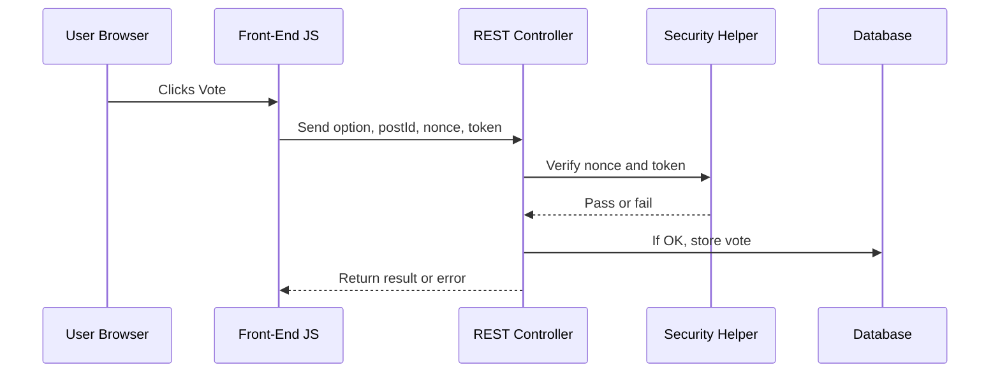

# Chapter 6: Security Helper (Nonces, Tokenization, and Capability Checks)

Welcome back! In [REST API Controllers](05_rest_api_controllers_.md), you learned how different parts of your site send requests for things like voting, fetching poll results, or getting AI-generated poll suggestions. But a big question remains: **How do we make sure these requests are safe, private, and only allowed for the right users?**

That’s where the **Security Helper** comes in! Think of it as the ID-checker and security guard at the entrance to your polling station: **only the right people can do certain things, and every vote is private but can’t be duplicated**.

---

## Why Is Security Important? (Motivation)

**Central Use Case:**  
Imagine someone tries to cheat your poll by submitting lots of fake votes, or a malicious actor tries to trick the AI into suggesting something inappropriate. Or what if they forge votes on behalf of others, or try to see who voted for what?

Without strong security:

- Anyone could flood your poll with fake results.
- Hackers could trick your site into misbehaving.
- Poll results wouldn’t be trusted.
- Voter privacy would be broken.

**The Security Helper makes sure this never happens!**

---

## Key Concepts Explained: Nonces, Tokenization, and Capability Checks

Let’s break down what the Security Helper does using beginner-friendly analogies.

### 1. **Nonces: “Single-Use Secret Passcodes”**

A **nonce** is like a ticket at the door. It’s a *temporary passcode* that lets you prove your action (like voting) is legitimate and intended. It prevents:

- **CSRF attacks** (where a hacker secretly submits requests on your behalf)
- Fake or automated requests

**Nonces expire quickly and are unique to your session.**

---

### 2. **Tokenization: “Anonymous Voter IDs”**

When you vote, you get a **token**—think of it as an anonymous, tamper-proof voter badge stored in a secure cookie. This lets the system:

- Track if *you* have already voted (so you can’t vote twice)
- Keep your real identity private (nobody knows who you are)
- Count only legitimate, unique votes

**It’s like being handed a blank name badge so you can vote, but nobody can tell it’s you!**

---

### 3. **Capability Checks: “Rights to Use Admin Features”**

Some actions are **only for trusted people** (like poll admins or editors) such as resetting votes, viewing detailed analytics, or getting AI suggestions.

**Capability checks** are like checking your staff badge—*only* authorized folks can access these special features.

---

## Solving the Use Case: How the Security Helper Keeps Voting Safe

Let's walk through what happens when someone votes on a poll.

**Step-by-Step Example:**

1. **Get a Nonce**  
   When your front-end loads, WordPress gives your browser a “nonce” passcode, like `a1b2c3d4`.

2. **Send a Vote Request**  
   When you click Vote, the front-end sends your vote **and** the nonce to the server.

   ```js
   fetch('/wp-json/content-poll/v1/block/abc123/vote', {
     method: 'POST',
     headers: { 'X-WP-Nonce': 'a1b2c3d4' },
     body: JSON.stringify({ optionIndex: 1, postId: 456 }),
   });
   ```

   _The nonce is like the guard checking your ticket at the door!_

3. **Backend Checks the Nonce**  
   The Security Helper code confirms:  
   - Is the nonce real?
   - Is it for this action?
   - Has it expired?

4. **Create or Read Your Token**  
   If you don’t already have a “voter token,” Security Helper makes one, puts it in a secure cookie (`content_poll_token`).  
   This ensures:
   - *You* can only vote once.
   - No one can link your token directly to who you are.

5. **Vote Is Counted (If All Checks Pass!)**  
   Only if everything checks out does your vote get stored.

6. **Admin-Only Features?**  
   If an action needs special rights (like AI suggestions or poll reset), Security Helper checks if you have the right “badge.”

---

## What Happens With Bad or Missing Security?

- **If you send an invalid nonce?**  
  > The request is rejected: “Nonce validation failed.”

- **If you tamper with your token?**  
  > The vote does *not* count, and you can’t vote multiple times.

- **If you try an admin action without permission?**  
  > “You do not have permission to do this.”

---

## Simple Code Walkthrough (Inputs & Outputs)

### 1. **Create a Nonce**

```php
SecurityHelper::create_nonce();
// → e.g. 'd8b8fd3c73'
```
_This gives you a unique, time-limited passcode for voting or other actions._

---

### 2. **Verify the Nonce**

```php
SecurityHelper::verify_nonce( $nonce );
// true if it's valid, false if not
```
_Only valid nonces let the action continue._

---

### 3. **Token Cookie Handling (Anonymous Voting)**

```php
// Inside VoteController:
$token = $this->get_or_create_token();
```
- If no token exists, it creates a secure random one and sets it as a cookie.
- If you already voted, the same token is used.
- Nobody except your browser and the server can read this token.

---

### 4. **Capability Check Example (Admins Only)**

```php
current_user_can('edit_posts');
// true if you’re an editor/admin
```
_Only lets certain users access powerful features._

---

## What’s Going on Under the Hood? (Step-by-Step)

Here’s the *journey of a vote* from your browser to the database, with security at each step:



---

## Internal Implementation – A Gentle Code Peek

### A. **Nonce Creation and Verification**  
*(File: `src/php/Security/SecurityHelper.php`)*

```php
class SecurityHelper {
    public static function create_nonce(): string {
        return wp_create_nonce('wp_rest');
    }
    public static function verify_nonce(?string $nonce): bool {
        return (bool) wp_verify_nonce($nonce, 'wp_rest');
    }
}
```
**In plain English:**  
- `create_nonce` asks WordPress to make a unique passcode for REST requests.
- `verify_nonce` checks if a given passcode is valid.

---

### B. **Token Generation (Anonymous, Deduplicated Voting)**
*(See: `VoteController::get_or_create_token()`)*

```php
private function get_or_create_token(): string {
    if (isset($_COOKIE['content_poll_token'])) {
        return sanitize_text_field($_COOKIE['content_poll_token']);
    }
    $token = bin2hex(random_bytes(16));
    setcookie('content_poll_token', $token, [...options...]);
    return $token;
}
```
**In plain English:**  
- If you already have a voter cookie, use it.
- If not, create a random new token and give it to the user as a cookie.
- Always secure: HTTP-only and SameSite.

---

### C. **Hashing for Privacy**

When storing a vote, the token is *hashed* before saving:

```php
$hashed = hash('sha256', $token . AUTH_KEY);
```
**Why?**  
- Nobody can reverse the hash to find your token.
- Even if the database is leaked, nobody can link votes to users.

---

### D. **Capability Checks for Admin Actions**

For features only for admins/editors:

```php
if ( ! current_user_can('edit_posts') ) {
    return $this->error('forbidden', 'Not allowed.', 403);
}
```
**Only staff get through this door!**

---

## Bringing It All Together

- **Every request** goes through the Security Helper, which checks tickets (nonces), badges (capabilities), and anonymous tokens (secure cookies) to ensure privacy and fairness.
- **Votes stay private, but can’t be duplicated.**
- **Admins and regular users are clearly separated.**
- **Even advanced attacks are blocked!**

---

## Recap & What’s Next?

You’ve now seen how the Security Helper forms the **lock, badge check, and privacy curtain** for your polling booth. This ensures live voting, AI-powered features, and admin tools work **safely and fairly every time**.

**Ready to see how your safe, deduplicated votes are actually stored and managed?**  
Continue on to: [Database Manager (Vote Storage & Migrations)](07_database_manager__vote_storage___migrations__.md)

---

---

Generated by [AI Codebase Knowledge Builder](https://github.com/The-Pocket/Tutorial-Codebase-Knowledge)