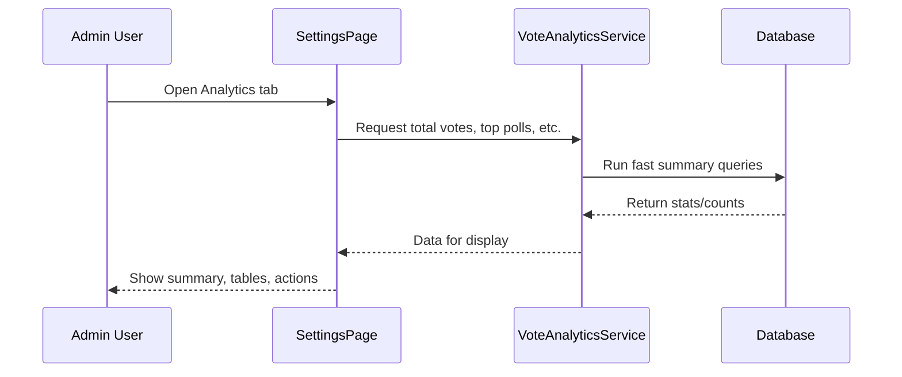

# Chapter 7: Analytics & Admin Dashboard (VoteAnalyticsService & SettingsPage)

Welcome back!  
In [Chapter 6: Database Schema Management (DatabaseManager)](06_database_schema_management__databasemanager__.md), you learned how votes are safely stored and managed behind the scenes. But after collecting all this voting data, you probably want to **see how your polls are performing**, spot trends, and manage settings. That's where analytics and the admin dashboard come in!

This chapter introduces the **Analytics & Admin Dashboard**—your mission control for content-poll. You’ll learn how **VoteAnalyticsService** and **SettingsPage** make it easy to see voting stats, manage your polls, clean up old data, and fine-tune AI settings—with zero code needed.

---

## Why Do I Need Analytics & Admin Dashboard?

Let’s say you’re running a travel website.  
You’ve added polls to a bunch of posts (“What’s your favorite Norwegian hike?” and so on).  
After a few weeks, you want answers like:

- Which poll is the most popular?
- Which post gets the most poll votes?
- Are there any “orphan” polls with votes but no matching post?
- How do I change the AI that suggests poll questions?

**Without analytics**, you’d have to dig in the database or guess—frustrating!  
**With analytics and the admin dashboard**, you can see all this at a glance and manage everything from one place, right inside WordPress.

---

## Central Use Case: Checking Poll Performance

**Use Case:**  
_I want to know “Which of my blog posts has the most voter engagement, and which poll options are winning?”_

The dashboard does this for you with easy-to-read tables and charts!

---

## Key Concepts (Beginner-Friendly Explanations)

Let’s break down the two key parts:

### 1. **VoteAnalyticsService**
- This is the “data scientist” for your polls.
- It tallies votes, finds top polls, calculates averages, and even finds orphaned data.
- Think of it as an **automatic poll analyzer** that crunches the numbers for you behind the scenes.

### 2. **SettingsPage**
- This is the **admin interface** (WordPress settings tab) where you see the stats and tweak settings.
- You can find it under **Settings → ContentPoll AI** in your WP dashboard.
- Think of it as your **control panel**: see stats, manage old polls, clean up, and configure AI.

---

## Using the Admin Dashboard: The Basics

**How do I use these features as a site admin?**

- Go to **Settings → ContentPoll AI** in your WordPress dashboard.
- Two tabs:  
  - **Analytics** (see poll stats & manage data)
  - **AI Settings** (choose your AI provider and keys)

### Analytics Tab

Here’s what you’ll see:

- **Summary Cards:**  
  - Total Votes  
  - Total Polls  
  - Average Votes Per Poll
- **List of Posts with Polls:**  
  - Shows post titles, number of polls, total votes, last activity, and “View Details” links.
- **Top Polls:**  
  - Which polls/posts have the most votes.
- **Orphan Poll Data:**  
  - Vote records not tied to any current poll (offers cleanup options).

### AI Settings Tab

- Pick your **AI provider** (built-in, OpenAI, Anthropic, Gemini, Ollama, Grok).
- Enter API keys and models (if needed).
- Test your connection—errors show up if your config is wrong.

---

## Example: What Does Analytics Look Like in Action?

**Suppose you have three blog posts, each with a poll. Here’s a simple journey:**

1. **View all posts with polls:**  
   You'll see a table like:

   | Post Title           | Polls | Total Votes | Last Activity    | Actions      |
   |----------------------|-------|-------------|------------------|--------------|
   | Norway in Summer     |   2   |    145      | 5 hours ago      | [View Details] |
   | Best Hiking Spots    |   1   |     87      | 2 days ago       | [View Details] |
   | City or Nature?      |   2   |     53      | 4 days ago       | [View Details] |
   
2. **Click “View Details” for a post:**  
   This shows each poll/question in the post, the vote breakdown per answer, and when votes came in (plus a mini bar chart).

3. **See Orphan Polls:**  
   If you deleted a poll block from a post, but votes remain in the database, they show up as “Orphan Poll Data” with an option to delete them.

4. **Change AI Settings:**  
   Switch from built-in AI to OpenAI or Gemini, enter your API key, and save. Errors in connection or setup appear right away—no mystery failure!

---

## Small Code Examples: How the Analytics Service Works

Let’s look at how you might use VoteAnalyticsService (in super simple PHP):

#### Get Total Votes

```php
$analytics = new VoteAnalyticsService();
$total = $analytics->get_total_votes();   // e.g., 285
```
*Gets the total number of all poll votes on your site.*

#### Get Top Polls

```php
$top = $analytics->get_top_polls(3);
// Returns info like: [ [poll_id, post_id, total_votes, last_vote], ... ]
```
*Gets your 3 most-voted-on polls.*

#### Find Orphan Polls

```php
$orphans = $analytics->detect_orphan_block_ids();
// Example: [ [ 'poll_id' => 'ab12cd...', 'approx_vote_count' => 30 ], ... ]
```
*Lists poll IDs in your data with no matching poll block.*

#### Delete Votes for an Orphan Poll

```php
$analytics->delete_block_votes('ab12cd...');
// Deletes all votes for that orphan poll
```
*Safely cleans up data for a now-deleted poll.*

---

## What Happens Under the Hood? (Step-by-Step)

Let’s trace what happens when you open the Analytics tab:



**Beginner translation:**  
- You open the analytics page.
- The settings page asks the analytics service for stats.
- The analytics service runs efficient queries on your votes database.
- Results come back instantly—shown on the dashboard!

---

## A Peek at the Internals: Minimal Code Examples

#### 1. Getting Total Votes

File: `src/php/Services/VoteAnalyticsService.php`
```php
public function get_total_votes(): int {
  // Run SQL: SELECT COUNT(*) FROM vote_block_submissions
  return (int) $this->db->get_var("SELECT COUNT(*) FROM {$this->table}");
}
```
*Counts all votes ever collected for polls.*

#### 2. Listing Top Polls

```php
public function get_top_polls($limit = 10): array {
  // Run SQL: GROUP BY poll_id, order by vote count descending
  // Returns poll_id, post_id, total_votes, last_vote
}
```
*Finds top-voted poll blocks in your site.*

#### 3. Finding Orphan Polls

```php
public function detect_orphan_block_ids(): array {
  // Compare poll IDs with blocks in posts vs IDs in the vote table
  // Return poll_ids missing from post content
}
```
*Shows poll data left behind when a poll block is removed from posts.*

#### 4. Showing Vote Breakdown for a Poll (Bar Charts!)

```php
public function get_block_option_breakdown($block_id): array {
  // For a poll: get counts & percentages for each answer option
  // Returns:
  // [ 'counts' => [12, 8, 5], 'percentages' => [48, 32, 20], 'total' => 25 ]
}
```
*Lets the dashboard draw a mini-barchart for each poll.*

---

## Changing AI & Poll Settings via Admin Panel

**No code needed!**  
Simply choose your AI suggestion provider (built-in, OpenAI, Gemini, Anthropic, etc.) and add the required settings on the AI Settings tab.

- The plugin _automatically_ tests your setup and shows errors if your API keys are wrong.
- All changes apply immediately for new poll suggestions.

---

## Cleaning Up: Removing Orphan Poll Data

Did you remove a poll block from a post and want to clear out old data?

- Orphaned polls are clearly listed in the dashboard (with vote counts).
- Click **Delete Data** and confirm to safely purge these records—no risk of harming other polls.

---

## Where Does It All Live? (File Map)

- **VoteAnalyticsService (the “analyzer”):**  
  `src/php/Services/VoteAnalyticsService.php`
- **SettingsPage (admin UI & options):**  
  `src/php/Admin/SettingsPage.php`
- **PollsListTable (pretty tables in admin):**  
  `src/php/Admin/PollsListTable.php`

These are automatically loaded by the plugin—no extra setup required!

---

## Summary: What Did You Learn?

- The **Analytics & Admin

---

Generated by [AI Codebase Knowledge Builder](https://github.com/The-Pocket/Tutorial-Codebase-Knowledge)