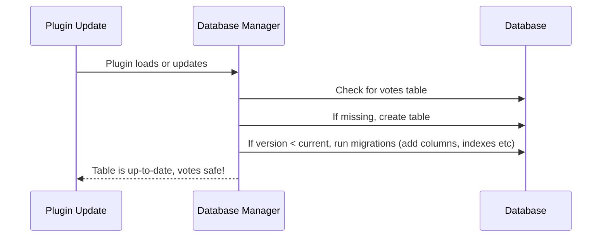

# Chapter 7: Database Manager (Vote Storage & Migrations)

Welcome back! In [Security Helper (Nonces, Tokenization, and Capability Checks)](06_security_helper__nonces__tokenization__and_capability_checks__.md), you learned how every vote in `content-poll` is **secured** and **deduplicated** with privacy in mind. But have you wondered:  
> **Where do all those votes actually *go*? What makes sure they never vanish, even when you update the plugin or WordPress itself?**

That’s where the **Database Manager** comes in.

---

## The Central Use Case: "Safe, Durable Vote Storage That Survives Changes"

Imagine this:

- You run a poll that hundreds of people respond to.
- Later, you update your poll plugin — or WordPress itself gets a big upgrade.
- 💡 **You want every vote to remain safe, accurate, and compatible!**
- **No duplicate votes, no lost data, no surprises after updates.**

**The Database Manager is the invisible vault that guarantees all of this.**

---

## Why Is This So Important?

- **All voting history is precious** — a lost or duplicated vote means lost trust!
- Without careful management, plugin upgrades or server moves *could* wipe your data.
- Beginners don’t want to worry about what a “schema migration” means — but you still want bulletproof reliability behind the scenes!
- **Database errors are the #1 reason polling plugins break when updating.**

---

## Key Concepts Made Simple

Let’s break down how the **Database Manager** keeps your data safe and future-proof:

### 1. **Vote Storage Table**
- A custom database “table” stores every vote forever (like a spreadsheet).
- Each vote gets its own row, recording:  
  - **Which poll** (poll_id)
  - **Which post**
  - **Which option**
  - **Which anonymous voter** (never their name — just a private token)
  - **When** they voted
- The table is created **once** (if it’s missing), and then checked for upgrades automatically.

---

### 2. **Schema Versioning—"Database Blueprints"**
- As the plugin gets new features, the table’s “blueprint” (schema) needs to change: maybe add a new column, or optimize some queries.
- The Database Manager **tracks a version number** so it always knows:  
  - If the table is up to date
  - When and how it should upgrade

---

### 3. **Migrations—"Upgrade Paths"**
- A *migration* is like a recipe for changing the structure *without* losing old data.
- Migrations are run **automatically**, not just on install but any time the plugin updates and needs a new schema.
- This ensures **backwards compatibility** — *old votes* are not lost, new features get the data they need.

---

### 4. **Duplicate Prevention—"One Voter, One Vote"**
- The table uses a **unique constraint** so no single user/token can vote twice in the same poll.  
- If someone tries to double-vote, only their *first* vote is recorded!

---

## How Does This All Fit Together?

**You don’t need to do anything manually.**  
When the plugin loads, the Database Manager checks:

1. Does the votes table exist?  
   - If not, create it!

2. Is the table’s schema up to date?  
   - If not, run necessary migrations to upgrade, *without* erasing data.

3. Are unique constraints in place?  
   - Always enforces anti-duplicate logic.

---

## Step-By-Step: What Happens When a Vote is Made?

Let’s trace the journey:

1. **User votes** on your site.
2. [Security Helper](06_security_helper__nonces__tokenization__and_capability_checks__.md) ensures it’s a valid, unique, anonymous vote.
3. [REST API Controllers](05_rest_api_controllers_.md) receive the vote request.
4. **Database Manager** ensures the table/storage is ready and safe.
5. Vote data is written into the database **once**.
6. Even after plugin updates, **all votes remain healthy and uncorrupted**.

---

## Example: Minimal Code for Saving a Vote

When a vote comes in, it’s stored in your special table:

```php
// In VoteStorageService::record_vote(...)
$db->insert(
  $this->table,
  [ 'poll_id' => $pollId, /*...other fields...*/ ],
  [ '%s', /*...formats...*/ ]
);
```

**Explanation:**  
Every vote gets its own row, and thanks to the **unique constraint** (on poll + voter), duplicates are prevented.

---

### Getting All Votes for a Poll

```php
// In VoteStorageService::get_aggregate(...)
$rows = $db->get_results(
  $db->prepare("SELECT option_index, COUNT(*) FROM {$this->table} WHERE poll_id=%s GROUP BY option_index", $pollId)
);
```

**Explanation:**  
All votes for a poll can be counted and results shown instantly — no lost records!

---

### Ensuring Schema Is Up-To-Date (Automatic!)

```php
// In DatabaseManager::initialize()
if (version_compare($current_ver, self::DB_VERSION, '<')) {
  $this->ensure_table_exists();
  $this->run_migrations($current_ver);
  update_option(self::DB_VERSION_OPTION, self::DB_VERSION, false);
}
```

**Explanation:**  
Every time the plugin loads, it double-checks:  
- Is the *table* ready?  
- Are we using the correct “blueprint” version?  
- If not, run the upgrade logic ONLY as needed (never erases your votes!).

---

### Preventing Duplicate Votes

```php
// Table has UNIQUE constraint: (poll_id, hashed_token)
"ALTER TABLE vote_block_submissions ADD UNIQUE KEY uniq_poll_token (poll_id, hashed_token)"
```

**Explanation:**  
Even if someone tries to stuff the ballot, only their *first* vote counts.

---

## What Happens During a Plugin Update?

A plugin upgrade may add new features, or need more info for votes.  
**The Database Manager automatically “migrates”** (upgrades) your table:



This means *you* never lose data even as things change!

---

## Take a Quick Look Under the Hood

**Table Schema Overview (for reference only):**

Each vote is stored with:

- `id` (unique row id)
- `poll_id` (unique poll identifier)
- `post_id` (which post/page)
- `option_index` (which option selected, 0–5)
- `hashed_token` (anonymous voter tracking)
- `created_at` (when voted)

**All of this is created/updated automatically.**

---

### Migrations: "Upgrade Recipes" (Simplified)

Suppose you started on v1.0.0 and the plugin is upgrading to v1.1.0  
A migration recipe might:

1. Add a new `poll_id` column (if it didn’t exist).
2. Create a new unique key on `poll_id` + `hashed_token`.
3. Backfill `poll_id` from old data so nothing is lost.

This way, even legacy data is kept safe and usable.

---

## Typical Questions Beginners Ask

**Q: Do I need to run SQL or manage the database to use this plugin?**  
A: Nope! The Database Manager does *everything* for you, behind the scenes.

**Q: What if my host upgrades WordPress or PHP?**  
A: No problem—your data remains safe and the plugin will adjust automatically.

**Q: Can I lose votes if the plugin updates?**  
A: Never! All data is migrated safely. Even the uninstall script only erases data if you *fully* uninstall.

---

## Where Is The Code?

A few key places (**for the curious!**):

- Database creation & migration:  
  - `src/php/Database/DatabaseManager.php`
- Vote save/retrieval:  
  - `src/php/Services/VoteStorageService.php`
- Analytics & summary/cleanup:  
  - `src/php/Services/VoteAnalyticsService.php`
- Uninstall data cleanup:  
  - `uninstall.php`

---

## Recap and Looking Ahead

**You’ve now learned:**

- How all votes are **stored securely, forever** — no matter how your site or plugin evolves
- How migrations/upgrades work to keep your data compatible and safe
- That you *never* have to worry about duplicates, lost votes, or forward compatibility

**Next up:** Learn how you can *see* and *analyze* all this voting data, including summaries and finding unused/orphaned vote data!  
Continue to: [Admin Settings Page & Analytics](08_admin_settings_page___analytics_.md)

---

You’ve now unlocked the secrets of the data “vault” behind every poll — the reason your results are always accurate, safe, and ready to grow with your site. 🗝️

---

Generated by [AI Codebase Knowledge Builder](https://github.com/The-Pocket/Tutorial-Codebase-Knowledge)