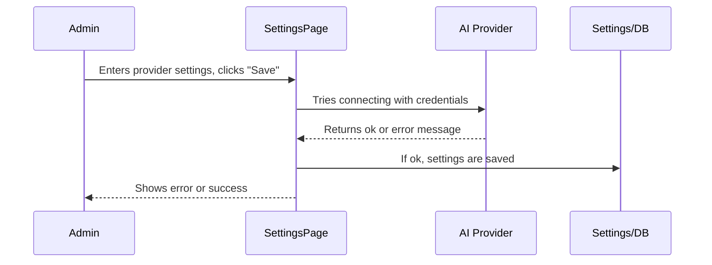
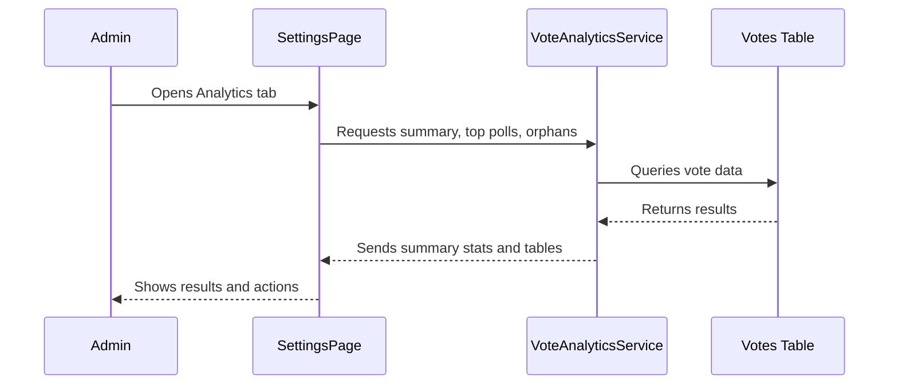

# Chapter 8: Admin Settings Page & Analytics

_Welcome back! In [Database Manager (Vote Storage & Migrations)](07_database_manager__vote_storage___migrations__.md), you discovered how every vote is safely stored and survives plugin updates. Now, let's see how you can **oversee, configure, and analyze** your Content Polls from an **Admin Settings Page**—your very own “control panel” for every poll and all the AI smarts._

---

## Why You Need an Admin Settings Page & Analytics

Imagine this scenario:

> **You’re a site owner running interactive polls.**
> - You want to **see how polls are doing** (Which posts are popular? Which polls need attention?).
> - You want to **choose which AI provider** (OpenAI, Gemini, Ollama, etc.) generates your poll suggestions.
> - You need to **keep your API keys safe** and test AI connections.
> - You want to **find orphan poll data** (old votes with no poll) and clean up.
> - And you want to do all this *without any coding*.

This is exactly what the **Admin Settings Page & Analytics** offers—a simple, safe, and powerful dashboard to configure and track all the plugin’s features.

---

## Key Concepts

Let’s break down everything you get—one simple piece at a time.

### 1. **Settings Page**  
A central page in your WordPress admin (found under "Settings → ContentPoll AI") where you:
- Choose your AI provider for suggestions
- Enter and validate credentials (like API keys)
- Select models (e.g., for OpenAI, Gemini, Exo/Ollama)
- Connect to local or cloud AI services
- Lock down options using environment variables for extra security

### 2. **Analytics Tab**  
A visual dashboard showing:
- Total votes, total polls, and averages
- A sortable table of all posts with polls and vote counts
- Drilldowns to see breakdowns for each poll’s options
- “Orphan Data” finder to keep your site clean (finds votes for deleted polls)

### 3. **Deployment Safety & UX Helpers**
- Smart logic that disables fields set from the server or your code (so nobody messes up production settings)
- Client-side testers for credentials/AI connections (so you know things will work!)
- Friendly warnings and descriptions

---

## How to Use the Admin Settings Page

Let’s walk through basic usage, with mini examples so you can follow along.

### 1. **Accessing the Panel**

Go to your WordPress Dashboard → Settings → **ContentPoll AI**

You’ll see two main tabs:
- **Analytics** (see performance / clean up)
- **AI Settings** (configure providers & API keys)


### 2. **Configuring an AI Provider**

Suppose you want to use OpenAI for poll suggestions.

1. Go to the **AI Settings** tab.
2. **Choose your provider:**  
   Select “OpenAI” from the AI Provider dropdown.
3. **Enter your API key:**  
   Paste your OpenAI API Key when prompted.
4. **Choose your model:**  
   Type or select the model name (like `gpt-3.5-turbo`).
5. **Validate:**  
   When you save settings, ContentPoll will check if your credentials are valid and warn you if something is wrong.

**Example: Minimal OpenAI Fields**

```plaintext
[AI Provider ▼ OpenAI]
[API Key   ______________________ ]
[Model     gpt-3.5-turbo        ]
```
When you save, you'll see a warning if your credentials or connection fail.

---

### 3. **Switching or Locking Providers (Safe Deployments!)**

Sometimes, you want to lock your configuration (e.g., in production), using environment variables or `wp-config.php`.

- If a value is set in your code, the input field is disabled.
- The page shows an info message:  
  `(Set via environment variable)` or `(Set via wp-config.php constant)`

**Example: Disabled input**

```plaintext
[API Key   ************** ] (Set via environment variable)
```

---

### 4. **Analytics: Tracking Your Polls**

Switch to the **Analytics** tab to see live stats.

- **Summary Cards** show:
  - Total Votes
  - Total Polls
  - Average Votes/Poll

- **Posts with Polls Table**:
  - Each row: Post Title | Polls | Total Votes | Last Activity | [View Details]

**Example Row**

| Post Title         | Polls | Total Votes | Last Activity | Actions        |
|--------------------|-------|-------------|---------------|----------------|
| "Best Pizza Toppings" |   2   |      134     | 2 hours ago   | View Details   |

---

### 5. **Drilling Down: Post Details & Poll Breakdowns**

Click “View Details” to see the full poll breakdown for a post:

- Each poll in the post shows:
  - The question
  - Option-by-option results (votes and %)
  - Last vote time

**Example Poll Breakdown Table**

| Option  | Votes | Percentage |
|---------|-------|------------|
| Cheese  | 74    | 55.2%      |
| Pepperoni | 60  | 44.8%      |

---

### 6. **Orphan Data Detection and Cleanup**

What if there are votes for a poll that’s no longer in any post?  
(You may have deleted a poll block, or reverted a post.)

The dashboard **detects these “orphan” polls** and shows a red warning box like:

```plaintext
Orphan Poll Data (No Matching Blocks)
Poll ID: abcd12... | Approx. Votes: 5 | [Delete Data]
```

- Click **Delete Data** to clean up those old records safely (cannot be undone).

---

## How Does This Work Internally?

Let’s peek at what happens when you use the Settings & Analytics.

### Sequence: Saving & Testing AI Settings



**Plain English:**  
- When you save credentials, the page makes a test connection.
- If it fails, you get a warning and nothing is broken.
- On success, settings are saved and ready to power your polls.

---

### Sequence: Loading Analytics and Viewing Details



---

## Internal Implementation: Simple Code Peeks

### 1. **AI Provider Settings Registration**

_All settings fields and validation are registered for WP’s settings API:_

```php
register_setting($option_group, $option_name, [
    'sanitize_callback' => [ $this, 'sanitize_settings' ],
    // ... default values, etc.
]);
```
**This registers all your options for saving and automatic sanitization.**

---

### 2. **Provider Validation Check**

_On save, the plugin tests your AI credentials and warns you if things don’t work:_

```php
private function validate_ai_configuration(array $settings): void {
    // Try a test request for the selected provider
    $error = $this->test_openai($settings); // or _anthropic, _gemini, etc.
    if ($error) {
        add_settings_error(..., $error, ...);
    }
}
```

**A live test ensures you set up everything right—no guessing!**

---

### 3. **Analytics Table Rendering**

_The analytics page provides detailed tables with sorting and actions:_

```php
$list_table = new PollsListTable($analytics);
$list_table->prepare_items();
$list_table->display();
```
**You get sortable, paginated views—just like WordPress Posts/Users.**

---

### 4. **Orphan Data Detection**

_“Orphan” polls are found with:_

```php
$orphans = $analytics->detect_orphan_block_ids();
```
**A list of poll IDs with votes but no matching block—clearly displayed and safely deletable.**

---

### 5. **Field and Credential Locking**

_If you use an environment variable or constant, the setting is locked and tagged:_

```php
if (defined($config['const']) || getenv($config['env'])) {
    // disable input
}
```
*This avoids accidental breakage on production, and shows a clear message—safer for teams.*

---

## Code Organization for Curiosity

- **Settings UI and handler:**  
  `src/php/Admin/SettingsPage.php`
- **Analytics logic (counts, summaries, orphan detection):**  
  `src/php/Services/VoteAnalyticsService.php`
- **Tables with voting data:**  
  `src/php/Admin/PollsListTable.php`
- **Provider validation (e.g., OpenAI, Gemini):**  
  Functions like `test_openai`, `test_gemini`, etc., in `SettingsPage.php`

---

---

Generated by [AI Codebase Knowledge Builder](https://github.com/The-Pocket/Tutorial-Codebase-Knowledge)