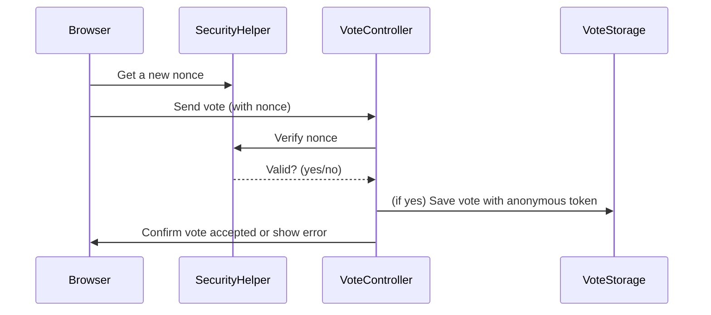

# Chapter 8: Security & Privacy Helper (SecurityHelper)

Welcome back!  
In [Chapter 7: Analytics & Admin Dashboard (VoteAnalyticsService & SettingsPage)](07_analytics___admin_dashboard__voteanalyticsservice___settingspage__.md), you discovered how to view and manage votes using insightful dashboards. But with any interactive feature (like voting), there's always a critical question: **How do we keep things safe, trustworthy, and private?**

That’s where the **Security & Privacy Helper (`SecurityHelper`)** steps in. This chapter will help you understand why security and privacy matter—especially for public polls—and how `SecurityHelper` quietly keeps your votes protected and your users anonymous.

---

## Why Do We Need Security & Privacy in Polls?

Let’s imagine a situation:

> You’re running a poll on your blog:  
> **“Which city is best for a winter trip?”**  
> Suddenly, a bot or a mischievous visitor wants to stuff hundreds of fake votes — or even trick the system by forging requests.

But that’s not all!  
You also want every voter to stay **fully anonymous**, yet make sure each person only votes once (no "double voting", no personal data stored).

**How can you achieve both?**

- Stop fake votes (“forgery” or “CSRF attacks”).
- Let *real* users vote safely—just once!
- Never, ever store anything about their identity.

**Solution:** Use secure tokens called *nonces* and anonymous “fingerprints” (hashed tokens).  
`SecurityHelper` automates all these tasks for you.

---

## Key Concepts: Making Sense of SecurityHelper

Let’s break down what `SecurityHelper` does, one friendly step at a time.

### 1. What is a Nonce?

- **Nonce** means “number used once”.
- In WordPress, a nonce is a special security token—like a secret ticket.
- Without a valid nonce, a vote (or any sensitive action) is instantly blocked!

**Analogy:**  
Think of a nonce as a “one-time pass” you give someone before they enter a secure area. If they don’t have it, the bouncer (your server) stops them at the door.

### 2. How Are Votes Made Anonymous?

- Instead of tracking names, emails, or logins, the plugin generates a **random token** for each browser.
- This token is stored as a secure cookie (but can’t identify the person).
- Before storing it, it's **hashed** (like turning it into a secret code) so even if the database leaked, no one can reverse it to the original.

**Analogy:**  
Imagine giving each voter a secret sticker, but shredding their name before putting it in the box. You only check if the sticker has been used before—not who they are.

### 3. What Does SecurityHelper Actually Do?

- **Creates and checks nonces**: Ensures every voting request comes from a real user who got their pass from your page (not a bot).
- **Centralizes security logic**: One place for all token validation, making code maintenance easier and reducing room for mistakes.
- **Protects user privacy**: Enforces anonymous deduplication—your votes are safe, and users’ privacy is rock solid.

---

## Central Use Case: Preventing Forged or Duplicate Votes—An Example

**Problem**: A visitor tries to submit a vote…  
- Maybe from *your* page (good!).
- Maybe by faking a script, trying to send hundreds of bogus votes (bad!).

**How does SecurityHelper stop the fake ones, and make sure a real voter is counted—just once?**

---

## How to Use SecurityHelper (Real-Life Examples)

Usually, you won’t need to call `SecurityHelper` directly as an admin or editor—it runs behind the scenes. But let’s see how it works in practice.

### Example 1: Generating a Nonce for Safe Requests

When the browser wants to send a vote, it first asks for a safe “ticket” (nonce):

```php
$nonce = SecurityHelper::create_nonce();
```

**What happens?**  
- A nonce is generated just for the current session.
- This nonce is sent with every request (as a header).

#### Example Output

```
$nonce = "f4607c2d9e"; // (Random-looking unique code)
```

### Example 2: Verifying a Nonce Before Accepting a Vote

When a vote is received, the server checks if the nonce is valid before counting the vote:

```php
if ( SecurityHelper::verify_nonce( $nonce_from_req ) ) {
    // Accept the vote!
} else {
    // Block the request—possible forgery!
}
```

**What happens?**  
Only requests with the right nonce get through. Fakes are rejected.

---

## Example Inputs and Outputs: In Action

- **Input:**  
  - User tries to vote.
  - Their request includes a `X-WP-Nonce` header: `f4607c2d9e`
- **SecurityHelper steps in:**  
  - Checks the nonce: valid or not?
- **Output:**  
  - If valid: Vote is processed.
  - If invalid: Error is returned, vote is ignored.

**No personal data is ever checked or stored!**

---

## Step-by-Step: What Happens When Voting

Let’s see the flow “under the hood”:



**In plain English:**
- The browser gets a secret ticket from `SecurityHelper`.
- Sends that ticket with their vote.
- The server checks the ticket (using `SecurityHelper`)—if not valid, nothing happens.
- Only valid, safe, one-per-person votes reach the tally box!

---

## Deeper Dive: What’s Inside SecurityHelper? (Minimal Code & Explanations)

Let’s peek at the actual code (found in  
`src/php/Security/SecurityHelper.php`). It’s nice and short!

### a) Creating a Nonce

```php
public static function create_nonce(): string {
    return wp_create_nonce('wp_rest');
}
```

**Explanation:**  
- Calls WordPress’s secure function to make a “REST API” nonce.

### b) Verifying a Nonce

```php
public static function verify_nonce(?string $nonce): bool {
    if (!$nonce) {
        return false;
    }
    return (bool) wp_verify_nonce($nonce, 'wp_rest');
}
```

**Explanation:**  
- Checks that the nonce sent in the request matches what WordPress expects.
- If not present (or invalid), returns `false`—stopping voting fraud.

---

## How Does SecurityHelper Help with Privacy?  

SecurityHelper works together with [VoteStorageService](05_vote_storage___aggregation__votestorageservice__.md) to enforce **anonymous deduplication**—meaning:

- Voters are tracked ONLY by anonymous, hashed tokens stored in cookies.
- Even if someone gets the database, they can never link votes to real people.
- Each anonymous token only works for a single poll and can’t be reused for cheating.

**You get “one person, one vote”—but totally private!**

---

## Why Centralize Security & Privacy Logic?

By putting all nonce and privacy logic into `SecurityHelper`, the plugin:

- **Reduces mistakes** (no copy-paste errors across files).
- **Keeps things up to date** if WordPress security best practices change.
- **Is easy to audit**—all voting safety and privacy lives in one helper.

---

## File Locations: Where Does It Live?

- **Nonce Generation & Verification:**  
  [`src/php/Security/SecurityHelper.php`](src/php/Security/SecurityHelper.php)
- **Usage Example (VoteController):**  
  [`src/php/REST/VoteController.php`](src/php/REST/VoteController.php)

---

## Summary: What Did You Learn?

- `SecurityHelper` is your poll’s friendly “bouncer” and privacy champion—stopping fraud while keeping every voter anonymous.
- It creates and verifies nonces (secret one-time tickets) to block fake requests.
- It makes privacy automatic: no names, no emails, just anonymous, one-time voting tokens.
- All security logic is managed in a single, easy-to-maintain place.

In the next chapter, you’ll discover how to *test* all these systems and utilities in a safe, reliable way.

**Next up:** [Testing Infrastructure and Utilities](09_testing_infrastructure_and_utilities_.md)

---

**You’ve now mastered how security and privacy keep your polls fair and safe—ready to ensure everything works perfectly? Let’s go! 🚦**

---

Generated by [AI Codebase Knowledge Builder](https://github.com/The-Pocket/Tutorial-Codebase-Knowledge)