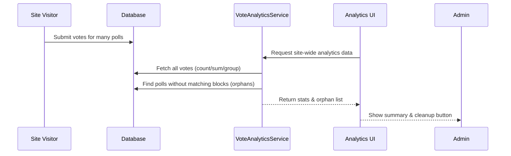

# Chapter 9: Analytics & Orphan Data Detection

> _Previously: You learned how to view and configure your polls with the [Admin Settings Page & Analytics](08_admin_settings_page___analytics_.md). Now, let’s open the “Poll Accountant’s Desk” and peek at one of the most important backstage jobs: **Site-wide analytics and keeping your poll data clean!**_

---

## Why Analytics & Orphan Data Detection Matter

### Central Use Case

Imagine this:

- You’re running polls across many blog posts.
- Some posts are super popular, some barely get any votes.
- Maybe you deleted an old poll block, but votes for it are still piling up hidden in the database.
- As the site admin, **you want to see big-picture stats and keep the database tidy—no stale junk slowing things down!**

Analytics & Orphan Data Detection is your trusty accountant **and** janitor—showing all the numbers, finding hidden clutter, and giving you a “one-click clean up” tool.

---

## Key Concepts

Let’s break the topic into bite-sized, beginner-friendly ideas:

### 1. **Poll Analytics**

- Summarize _all_ the voting data for the site.
- Show totals: How many votes? How many unique polls?
- Give per-post, per-poll, and per-option statistics.
- Enable _sorting_: Find your most active posts or sleepy polls.
- Offer **visual tables and summaries** (not just raw numbers!).

**Analogy:** Like having a dashboard in your car—you can quickly check fuel, speed, or mileage.

---

### 2. **Orphan Data Detection**

- Detect votes that are no longer linked to any poll block on any live post.
- These are called **“orphans”**—historical votes with no parent (the poll block was deleted).
- Orphans waste space and can slow down your site.
- The tool lets you **find, review, and delete orphaned votes safely**.

**Analogy:** Like checking your closet for shoes that don’t fit or have no match—dispose of them for a tidier home!

---

## Solving the Use Case: “Show Me Healthy Data, And Help Me Clean Up”

Let’s see what you, as an admin, are able to do:

### 1. **See Live Analytics**

- Go to **Settings → ContentPoll AI → Analytics Tab**
- Instantly view total votes, number of polls, votes per poll averages.
- Browse a table of all posts with polls:
  - See post title, number of polls, votes, and last activity.
  - Sort by votes, polls, or latest.
- Drill down for any post to see:
  - Each poll’s question
  - Option-by-option vote breakdown

#### _Example Table Row_

| Post Title               | Polls | Total Votes | Last Activity | Actions      |
|--------------------------|-------|-------------|---------------|--------------|
| "Favorite Animal"        |   1   |    200      | 3 days ago    | View Details |

---

### 2. **Find and Clean Orphan Data**

- The Analytics tab highlights “orphan” polls with votes but no post.
- You’ll see a **red warning box** (only if any are found):

```plaintext
Orphan Poll Data (No Matching Blocks)
Poll ID: ab1c2d3e... | Approx. Votes: 15 | [Delete Data]
```

- Click “Delete Data” to erase all votes for that orphan poll (cannot be undone).
- This helps your database stay fast and neat!

---

## Beginner Code Examples: Inputs & Outputs

Here’s some magic (handled for you behind the scenes!)

#### A. Get the Total Vote Count

```php
$total_votes = $analytics->get_total_votes();
// e.g. 453
```
**Result:** Returns the sum of every vote across all polls.

---

#### B. Check for Orphans

```php
$orphans = $analytics->detect_orphan_block_ids();
/* Example output:
[
  [ "poll_id" => "ab1c2d3e...", "approx_vote_count" => 15 ],
  [ "poll_id" => "f2e3d4c5...", "approx_vote_count" => 7 ],
]
*/
```
**Result:** An array of orphan poll IDs and their vote counts.

---

#### C. Delete Orphan Votes

```php
$analytics->delete_block_votes('ab1c2d3e...');
```
**Result:** Deletes **all** vote records for the given (orphan) poll ID.

---

## How Does Analytics & Orphan Detection Work Internally?

Let’s peek inside with a super simple map!

### Step-by-Step: A Vote from Block to Dashboard



**In words:**  
- Votes are stored normally.
- Analytics asks for summaries and looks for poll IDs that are not present in any post content.
- Results (summaries and possible orphans) are shown to admins for action.

---

## Under the Hood: Mini Implementation Tour

Here’s how the engine runs—don’t worry, you don’t have to memorize this!

### 1. **Get Analytics Summaries**
*File: `src/php/Services/VoteAnalyticsService.php`*

```php
public function get_total_votes(): int {
    // ... get all votes across the database
}

public function get_posts_summary(): array {
    // ... for each post with poll blocks, count polls and votes
}
```
**These methods add up votes and organize them for the analytics tables.**

---

### 2. **Find Orphan Votes**

```php
public function detect_orphan_block_ids(): array {
    // 1. Get all poll IDs with votes
    // 2. Scan all published posts for current poll IDs in poll blocks
    // 3. Return any poll IDs with votes but not found in any post block
}
```
**This method finds which votes have “lost” their poll—orphaned—and are safe to delete.**

---

#### How do we scan posts to find which polls are still in use?

- The code reads all post/page content and looks for every poll block by `pollId` or old-style `blockId`.
- It remembers which poll IDs exist in live content.
- Any poll ID **missing** from live blocks, but still in the votes database = **orphan**!

---

### 3. **Delete Orphan Votes**

```php
public function delete_block_votes( string $poll_id ): int {
    // Delete all rows in the votes table with this poll_id
}
```
**One click in the analytics page triggers this cleanup.**

---

### 4. **User Experience: Where in the UI?**

All these operations happen via the Analytics tab in your settings page ([Admin Settings Page & Analytics](08_admin_settings_page___analytics_.md)). This UI is powered by the service above and gives you buttons and tables—no code required!

---

## Visual Recap

**What admins see (simplified):**

- **Total Votes:** 453  
- **Total Polls:** 12  
- **Avg/Poll:** 37.8  
- **Orphan Warnings (if any):**  
    - Poll ab1c2d3e..., 15 votes [Delete Data]

The tables let you see at a glance if your data is healthy or if you need to clean up orphans. No more guessing!

---

## Why Is This So Crucial?

- **Performance & Hygiene:** Orphaned data slows you down and isn’t useful—deleting it means your site runs fast and votes mean what they should.
- **Confidence:** You can always trust your poll data isn’t hiding old junk or skewing analytics.
- **Simplicity:** All of this, with a couple of clicks—no technical skills needed.

---

## Summary & Next Steps

You now know how site-wide analytics and orphan vote cleanup make your polls healthy, easy to manage, and lightning-fast. **Your poll data is never messy, thanks to your built-in poll accountant and janitor!**

Ready to learn how the whole project is kept clean, consistent, and contributor-friendly? Continue to:  
👉 [Project Constitution & Coding Standards](10_project_constitution___coding_standards_.md)

---


---

Generated by [AI Codebase Knowledge Builder](https://github.com/The-Pocket/Tutorial-Codebase-Knowledge)