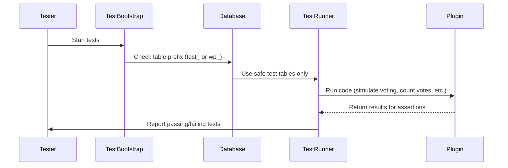

# Chapter 9: Testing Infrastructure and Utilities

_Welcome!_  
In [Chapter 8: Security & Privacy Helper (SecurityHelper)](08_security___privacy_helper__securityhelper__.md), you learned how the plugin keeps votes safe and anonymous using clever security helpers. But how do we **make sure every feature works as intended**—before sharing your polls with the world?  
That’s where **Testing Infrastructure and Utilities** come in!

---

## Why Do We Need Testing Infrastructure?

Imagine you just built a new poll feature.  
- You want to **be sure** it always records votes correctly.
- You want to **double-check** that security, analytics, and AI helpers are working—on every update.
- You want to avoid mistakes or bugs sneaking into your live data.

**Testing infrastructure** is like a _safety playground_:
- It lets you run automated tests (mini-experiments) to check that everything works—without touching your real voters or damaging their results!
- It helps you fix problems before users ever see them.

**Central Use Case:**  
> _“How can I run reliable tests on my plugin, without risking my production poll data?”_

---

## Key Concepts in Simple Terms

Let’s break down the building blocks of the plugin’s testing setup:

### 1. **Test Suite Coverage (What Gets Tested?)**
- **Unit tests:** Check one small piece (like counting votes) at a time.
- **Integration tests:** Check several features working together (e.g., voting and then fetching results).
- **JavaScript tests:** Test how votes are submitted and results displayed in the browser.
- **E2E (End-to-End) tests:** Make sure everything works just like a real person clicking through polls.

### 2. **Helpers and Mocks**
- Helpers are _fake little mini-tools_ that let you pretend you have a database, server, or user—so you can test safely!
- Mocks let tests _pretend_ to store/fetch votes, without real data.

### 3. **Safe Test Environments (“Test Double” Databases)**
- Tests run on a **special test database**, NEVER your live vote data.
- The system uses **table prefixes** (like `test_`, `phpunit_`) to keep test votes separate.

### 4. **Coverage Targets**
- The plugin aims to test **all key features**—to catch mistakes before they happen.
- You can run tests and see what’s been checked (“coverage report”).

---

## How Can I Safely Run Tests Without Harming Real Data?

**Biggest risk:** Accidentally deleting or changing your live votes!  
**Solution:** Testing infrastructure checks your database prefix before doing anything risky.

> If you use a test prefix (like `test_`), you can run tests freely!  
> If you use your live prefix (`wp_`), the tests will NEVER delete your data.

---

## Example: Running Tests the Safe Way

### Step 1: Use Test Database Prefix

In your `wp-config.php`, set up a test prefix:

```php
if ( getenv( 'WP_TESTS_DB_PREFIX' ) ) {
    $table_prefix = getenv( 'WP_TESTS_DB_PREFIX' );
} else {
    $table_prefix = 'wp_';
}
```

**Explanation:**  
- If running tests, it uses a safe test prefix (like `test_`).
- Your live data is untouched!

### Step 2: Run Tests

```bash
WP_TESTS_DB_PREFIX=test_ composer test
```

**Explanation:**  
- This runs all PHP tests using tables like `test_vote_block_submissions`.
- All your production data (`wp_...`) remains totally safe.

---

## Example: What Does a Test Look Like?

#### Testing that Duplicate Votes Are Blocked

File: `tests/php/VoteStorageServiceTest.php`

```php
$service->record_vote('blockX', 55, 1, 'dupToken');
$result = $service->record_vote('blockX', 55, 3, 'dupToken');
$this->assertTrue($result['error']);
```

**Explanation:**  
- First vote goes through.
- Second vote with the same token is rejected—just like in real use!
- Test confirms “one vote per user” really works.

---

#### Testing REST Voting Endpoint

File: `tests/php/RestVoteEndpointTest.php`

```php
$nonce = SecurityHelper::create_nonce();
$req = new WP_REST_Request('POST', '/content-poll/v1/block/blockID/vote');
$req->set_header('X-WP-Nonce', $nonce);
$req->set_param('optionIndex', 0);
$req->set_param('postId', 123);
$response = rest_do_request($req);
```

**Explanation:**  
- The test simulates a real browser vote using a safe nonce.
- Checks that the server processes the vote and returns the correct result.

---

## How Do Helpers & Mocks Work?

#### Example: Fake (In-Memory) Database

File: `VoteStorageServiceTest.php` (stub example)

```php
$db = $this->makeStubDb();
$service = new VoteStorageService($db);
$service->record_vote('poll1', 1, 0, 'tokenA');
```

**Explanation:**  
- `makeStubDb()` creates a pretend database.
- Test can add, check, and count votes _without needing a real database_.

---

## What Happens Internally When You Run a Test?

Let’s walk through the safe testing process:



**In plain English:**
- You start the tests.
- The infrastructure checks if it's safe (using the test database).
- Tests run using only safe tables.
- Results are checked—so you spot any problems _before_ anyone is affected.

---

## Where Do These Test Tools Live?

- **`tests/README.md`**  
  Explains everything about test setup and safety.
- **`tests/php/`**  
  Contains all PHP test files (covering storage, AI, REST API, etc).
- **`run-tests.sh`**  
  Helper script for safe, friendly test running.
- **`composer test`, `npm test`**  
  Commands for running backend/frontend tests.

_For more info, check “TESTING.md” and the individual test files for examples._

---

## Quick Recap: How Does All This Keep Your Site Safe?

- Tests are always run on **safe (separate) databases**.
- **Helpers and stub tools** mean no “accidental data loss.”
- Tests **catch bugs early**—so real users only see features that work!

---

## Summary: What Did You Learn?

- The plugin uses a friendly, comprehensive **testing infrastructure**.
- Tests cover everything: voting, analytics, AI helpers, frontend, backend.
- Helpers and mocks simulate the real world, so tests are quick and risk-free.
- **No risk to your production vote data**—tests always run in a safe playground.
- If you ever modify the plugin code, run the tests to check your work!

---

**Next up:** Ready to learn about project guidelines and contributor rules?  
Continue to [Code Standards & Project Constitution](10_code_standards___project_constitution_.md).

---

🎉 _With testing, you can build and share features with confidence—knowing everything works, and every voter’s data stays safe!_

---

Generated by [AI Codebase Knowledge Builder](https://github.com/The-Pocket/Tutorial-Codebase-Knowledge)