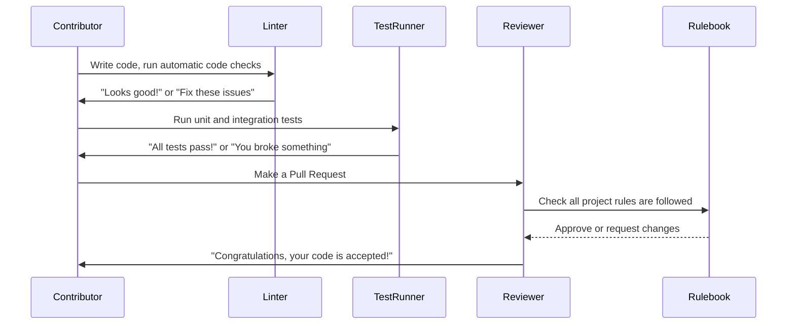

# Chapter 10: Code Standards & Project Constitution

Welcome back!  
In [Chapter 9: Testing Infrastructure and Utilities](09_testing_infrastructure_and_utilities_.md), you learned how the content-poll project stays safely tested, making sure every feature does what it promises—without harming real data. But how do we make sure that **all code in the project is always written the RIGHT way, by everyone, all the time?**  
This is where **Code Standards & the Project Constitution** come in!

---

## Why Do We Need Code Standards & a Project Constitution?

Imagine you’re building a big LEGO city with friends:

- **Everyone wants their part to fit together.**
- **You want buildings to be safe, colorful, and not fall over.**
- **It shouldn’t matter who built each piece—they should all work together, look neat, and play by the same rules!**

For software, this is called **code standards**—and for an open project, a written set of "laws" (the **"Project Constitution"**) that guide every contributor and every change.

**Central Use Case:**  
> "How can anyone (including me!) add new features, fix bugs, or update this plugin, and be confident it will always be secure, easy to read, bug-free, and up-to-date with WordPress best practices?"

---

### What Happens Without Standards?

- One person writes code a certain way... another does something completely different.
- Security gets overlooked.
- Features break when someone makes a change.
- The plugin doesn’t work with new WordPress or PHP versions.
- You get bugs, crashes, or even risk leaking user data!

**With code standards and a project constitution:** Everyone—no matter who or when—codes in a way that’s safe, readable, and future-proof. Mistakes become much, much less likely.

---

## Key Concepts, Explained Simply

Let’s break down what “Code Standards” and the “Project Constitution” mean—using beginner-friendly analogies and examples.

### 1. **Code Standards**

These are coding "style guides" and rules for **how to write code** in this project.  
They include things like:

- How should files be named?
- What should spaces and brackets look like?
- How must security be handled?
- How do you make sure everything is readable and bug-resistant?

**Analogy:**  
> Like agreed spelling and grammar in a book, so everyone in the team writes in the same language.

**Example:**  
All WordPress plugins (including this one) must:
- Escape HTML output (e.g., use `esc_html()`)
- Use translation wrappers for user-visible strings.
- Always check permissions before saving ANYTHING.

---

### 2. **Project Constitution**

A **Project Constitution** is a written "law book" for the whole project. It covers:
- What rules must always be followed? (security, accessibility, code reviews, testing, etc.)
- Who can change rules, and how?
- What happens if someone breaks a rule?

**Analogy:**  
> Like the rules of a club or a country's constitution: "All members must be fair, all new buildings must have doors, and only a group vote can change the rules."

It’s kept in a file you can always find—and it applies to everyone, no matter if you’re an experienced developer or just starting out.

---

### 3. **Benefits for Beginners**

- **You don’t have to guess:** The standards tell you *exactly* how to name files, format code, write tests, etc.
- **Your contributions are always welcome:** As long as you follow the standards, your code will feel right at home!
- **You learn best practices:** Following these rules means you’re writing secure, modern, and efficient code—every time.

---

## Step-By-Step: How This Works in Practice (A Beginner’s Journey)

Let's say you want to fix a typo or add a new poll feature.

1. **You write your change, following the code standards.**  
   (e.g., you escape all output and use proper translation wrappers.)

2. **You run the automatic checks (called "linters" and "tests").**  
   The code is scanned for spacing, security, and much more.
   
3. **If there’s an issue, the tools tell you _what to fix_—automatically.**  
   No need to memorize everything yourself!

4. **You make a Pull Request.**  
   - Another contributor reviews it against the constitution.
   - If it passes, your change is safely added for everyone!

---

### Example: Writing a Secure, Standard-Compliant Button (PHP)

Suppose you want to add a new button:

```php
echo '<button>' . esc_html__( 'Vote Now', 'content-poll' ) . '</button>';
```
**Explanation:**
- `esc_html__()` ensures the string is safe to display *and* translatable.
- `'content-poll'` is the project's text domain—matching the standard.

---

### Example: Enqueuing JavaScript in the Right Way

```php
wp_enqueue_script(
    'cp-vote-block',
    plugins_url( 'assets/vote-block.js', __FILE__ ),
    [ 'wp-element' ],
    '1.0.0',
    true
);
```
**Explanation:**
- Uses the WordPress API, not inline scripts (a security and style requirement).
- Follows the naming conventions set by the standards.

---

## Inside the Project: What’s Checked Automatically?

The project includes tools that **check your code for you**:

- **PHPCS:** Checks PHP code follows WordPress rules (spacing, security, etc.)
- **ESLint:** Checks JavaScript code is neat and modern.
- **Tests:** Make sure your feature doesn’t break anything.

**Where are these rules described?**

- `.github/instructions/wordpress.instructions.md`  
  (Shows coding style, security practices, linting, and more.)
- `.specify/memory/constitution.md`  
  (The Full Project Constitution—*the law of the land!*)

---

## Beginner’s Sequence: How the Constitution Enforces Project Quality

Let’s see what happens when you (or anyone) adds new code:



**Plain English:**  
- You write code.
- The **linters** check for style and must-follow security patterns.
- **Tests** confirm nothing’s broken.
- A reviewer checks your work against the constitution.
- If everything is correct, your code becomes part of the project!

---

## What Gets Checked? (Friendly Highlights)

The standards and constitution ensure:

- **Security:** Nonce and capability for any changing action. Inputs sanitized, outputs escaped.
- **Accessibility:** UIs are keyboard-friendly and screen-reader-safe.
- **Performance:** No heavy code loads where it’s not needed.
- **i18n:** All user text is translatable.
- **Testing:** Every feature has tests; none are skipped.
- **Docs:** Files and functions explain themselves.

*(You can find the full list as checkboxes in the project’s `.specify/memory/constitution.md` file!)*

---

## Where Can You Find the Standards and Constitution?

- **Code Standards:**  
  - `.github/instructions/wordpress.instructions.md`
- **Project Constitution:**  
  - `.specify/memory/constitution.md`

Just peek at these files to learn exactly what *every* piece of the project should look like!

---

## Internal Code Example: How Standards are Applied Automatically

### PHP Code Linting (PHPCS Setup)

```xml
<!-- phpcs.xml -->
<ruleset name="Project WPCS">
  <rule ref="WordPress"/>
  <rule ref="WordPress-Docs"/>
  <config name="testVersion" value="8.1-"/>
</ruleset>
```
**Explanation:**  
- This file tells PHPCS to scan all PHP files using the official WordPress rules.
- Run `composer lint:php` to check your code—errors are explained to you.

---

### JavaScript Linting (ESLint Setup)

```json
{
  "devDependencies": {
    "@wordpress/eslint-plugin": "^x.y.z"
  },
  "scripts": {
    "lint:js": "eslint ."
  }
}
```
**Explanation:**  
- ESLint checks your JS code for modern style and WordPress compatibility.
- Run `npm run lint:js`—all issues are shown along with how to fix them.

---

## What If I Break a Rule?

Don’t worry!  
The tools will *tell you exactly what’s wrong* and how to make it right. If you’re unsure, you can always ask for help or check the [Project Constitution](https://github.com/yourrepo/content-poll/blob/main/.specify/memory/constitution.md).

---

## Summary: What Did You Learn?

- **Code standards** and the **Project Constitution** are like a lawbook and style guide for the whole project.
- They keep every piece of code safe, modern, maintainable, and friendly—for everyone, now and in the future.
- Automatic tools (linters and tests) help *you* follow the rules—you don’t need to memorize!


---

Generated by [AI Codebase Knowledge Builder](https://github.com/The-Pocket/Tutorial-Codebase-Knowledge)