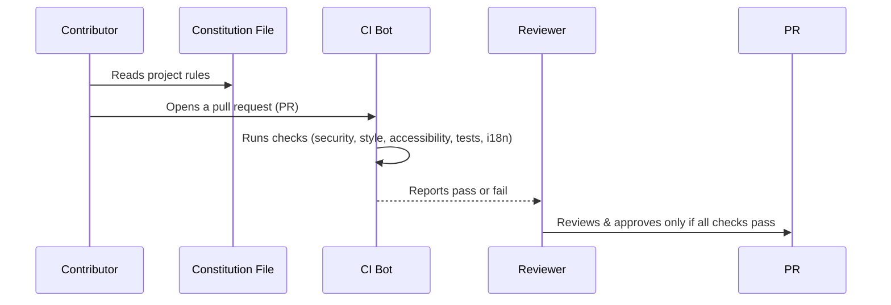

# Chapter 10: Project Constitution & Coding Standards

_Welcome! In [Analytics & Orphan Data Detection](09_analytics___orphan_data_detection_.md), you learned how to keep your site’s poll data healthy and clean. But how do all these great features—block voting, security, AI, admin tools—stay consistently safe, fast, and high quality as the plugin evolves or new contributors join?_

That’s where the **Project Constitution & Coding Standards** come in!  
Think of this as the "Bill of Rights & Responsibilities" for the whole project—a set of living, non-negotiable rules enforced by automation, documentation, and habits. Every feature, every change, every bugfix *must* follow this foundation to keep the project healthy for everyone.

---

## Why Do We Need a Project Constitution?

Let’s start with a concrete scenario:

### **Central Use Case**

Imagine you team up with others to improve Content Poll—maybe you add a new poll result chart, or someone else tweaks the vote storage, or another contributor adds a cool new AI provider.

- How do you ensure nobody accidentally breaks security or lets in a bug?
- How do you guarantee every new poll, feature, and admin tool respects accessibility and privacy?
- What guards against "oops" mistakes that could slow down the site, break translations, or introduce regressions?

**_The Project Constitution is your shield and roadmap—keeping everything high quality and future-proof, no matter who touches the code._**

---

## Key Concepts of the Constitution & Coding Standards

Let's break down what this means—painlessly, and for total beginners!

### 1. **What IS the Constitution, really?**

- **A Living Document:**  
  Not just a list, but a set of rules every contributor (and code change) must follow.
- **Guardrails:**  
  Enforced by "bots" (automation), code checks, team review, and conventions.
- **Covers Everything:**  
  Security, performance, accessibility, internationalization (i18n), data handling, test coverage, coding style, and release process.
- **MUST be versioned and visible:**  
  Stored in `.specify/memory/constitution.md`.

**Analogy:**  
Like airline safety rules: every pilot, mechanic, and designer has to follow the same checklist so every passenger is safe—no exceptions!


---

### 2. **Non-Negotiable Rules ("Guardrails")**

- **Security First:**  
  No unauthorized writing. Every vote/action checks permission AND nonce (a secret code).
- **Performance:**  
  Don't slow down your site!  
  Only load scripts/styles when needed, and database logic is always optimized.
- **Accessibility (A11y):**  
  All UI is keyboard-friendly, labeled, and gives feedback—everyone can participate.
- **i18n (Internationalization):**  
  Every user string is translatable and wraps with WordPress i18n helpers.
- **Testability:**  
  Every feature ships with tests—so bugs are caught before you ever see them.
- **Backward Compatibility & Migrations:**  
  Data never gets broken by upgrades. Old votes migrate automatically, uninstall cleans up.
- **Observability:**  
  Fail smart—errors logged, users get friendly notices, no mysterious crashes.

**_No contributor gets to skip these—they are enforced by code and code checks!_**

---

### 3. **Coding Standards in Practice**

**For PHP:**  
- Follow [WordPress Coding Standards (WPCS)](https://developer.wordpress.org/coding-standards/wordpress-coding-standards/php/)
- Strict typing (`declare(strict_types=1)`), use namespaces/prefixes (no accidental global names)
- Escape output, sanitize input, never trust untrusted data

**For JS/TS:**  
- Use WordPress's ESLint config (`@wordpress/eslint-plugin`)
- Prefer modern syntax, keep code tidy (auto-format with Prettier)
- All strings translatable

**For CSS:**  
- Use logical names and BEM-like class convention  
- Only load CSS where needed

**For Documentation & Commits:**  
- Update README and code docs whenever changes are made.
- Write clear, descriptive commit messages.
- Every public API and filter/action is documented.

**_All of these are checked automatically before code is merged!_**

---

## How Do You Use the Constitution & Coding Standards?

Think of it as a super-simple, repeatable process ANYONE can follow, whether making a tiny fix or a big new feature.

### Example: Adding a New Feature (Say, a New Vote Aggregate Widget)

#### Step 1: **Start with the Constitution**

Every new plan starts with “does this meet our constitution?”  
- Will it be secure (capabilities + nonce)?
- Is it performant? (only loaded on relevant pages)
- Is it accessible? (keyboard, labels, focus)
- Are all user strings translatable?
- Are tests provided?

#### Step 2: **Write Code With Standards**

Use the code checkers built into the project:

```sh
composer phpcs          # checks PHP code style and escaping
npm run lint:js         # checks JS
npm test                # runs automated unit and integration tests
```
**If any check fails, you fix it before merging!**

#### Step 3: **Code Example: Secure, Translatable Voting**

Here’s a *tiny* secure, translatable voting snippet:

```php
// Secure nonce check and permission
if ( ! current_user_can( 'edit_posts' ) || ! wp_verify_nonce( $nonce, 'wp_rest' ) ) {
    return new WP_Error( 'forbidden', __( 'Access denied.', 'content-poll' ), [ 'status' => 403 ] );
}
```
> _This makes sure only allowed users can vote and that the request is real. The error message is also translatable!_

---

### Example: Committing Code

All pull requests must pass the constitution’s checklist!  
- Security: ✅  
- Performance: ✅  
- Accessibility: ✅  
- i18n: ✅  
- Tests: ✅  
- Linting: ✅  
- Docs: ✅

If any item fails, reviewers and bots will block the merge until it's fixed.

---

## How Is This Enforced Internally?

Let’s walk through what happens **automatically** when code is changed.

### Sequence: The Life of a New Code Change



**Translation:**  
- You make your change and submit it
- Bot runs all constitution rules automatically
- If anything fails (security, performance, etc.), the bot blocks the change
- Reviewer ensures nothing sneaks through
- Only when everything passes can it merge!

---

## Internal Code Examples & Locations

- Constitution file:  
  `.specify/memory/constitution.md` (rules live here—visible and versioned)
- GitHub/CI checks:  
  - `.github/workflows/ci.yml` (runs tests, linters, style checks)
- Coding standards configs:  
  - `phpcs.xml` (PHP style)
  - `package.json` (JS style & linting)
- Automation scripts:  
  - `"test"`, `"lint:js"`, `"build"` (see package files)
- Enforced in every feature, every file

---

## Ties to Other Core Parts

Whenever you work with blocks, REST controllers, database, AI, admin pages, or analytics, the constitution guides and enforces **every detail**—for example:
- [Vote Block (Gutenberg Block)](01_vote_block__gutenberg_block__.md): Every string translatable, assets enqueued smartly, block registered in standard way.
- [Security Helper (Nonces, Tokenization, and Capability Checks)](06_security_helper__nonces__tokenization__and_capability_checks__.md): All permission checks done according to constitution rules.
- [Database Manager (Vote Storage & Migrations)](07_database_manager__vote_storage___migrations__.md): Data stored safely, with backward compatibility.
- [REST API Controllers](05_rest_api_controllers_.md): Routes registered with correct permissions and input validation.

**All must follow the same standards to ensure quality!**

---

## Recap & Moving Forward

Congratulations!  
- You now know the *why* and *how* behind the Project Constitution & Coding Standards.
- Every part of Content Poll is guarded by these rules: security, performance, accessibility, i18n, testability, coding style, migration safety, and release management.
- Every feature, every fix, every contributor must play by these rules—so the project stays healthy, fast, and safe for everyone.

Ready to use your new knowledge? Go back and try making your own Content Poll feature or personalizing your site, knowing you have the best guide and guardrails possible.

---
**The journey doesn’t end here—review previous chapters and experiment! Your site, and your code, will always have a strong foundation.**  
---

---

Generated by [AI Codebase Knowledge Builder](https://github.com/The-Pocket/Tutorial-Codebase-Knowledge)