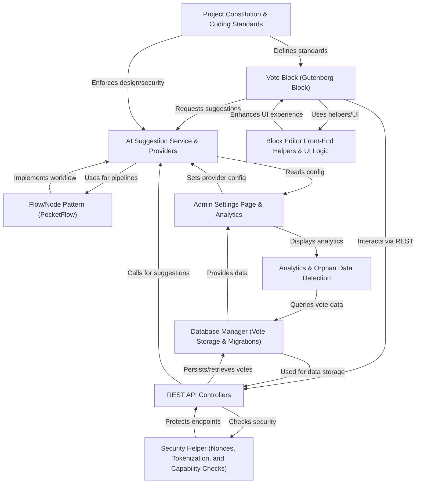

# Tutorial: content-poll

**ContentPoll AI** is a WordPress plugin that lets editors easily insert *interactive voting polls* into posts and pages, helping site visitors share their opinions or answer questions. It features **AI-assisted suggestions** to generate relevant poll questions and options based on your content, supports multiple AI providers (like OpenAI, Gemini, Anthropic, Ollama, Exo), and keeps voting results up-to-date in a visually clear format. 
The plugin comes with robust security, analytics, and admin controls so site owners can manage polls, track performance, and keep user data safe.

**Source Repository:** [https://github.com/soderlind/content-poll](https://github.com/soderlind/content-poll)

## Chapters

1. [Vote Block (Gutenberg Block)
](01_vote_block__gutenberg_block__.md)
2. [Block Editor Front-End Helpers & UI Logic
](02_block_editor_front_end_helpers___ui_logic_.md)
3. [AI Suggestion Service & Providers
](03_ai_suggestion_service___providers_.md)
4. [Flow/Node Pattern (PocketFlow)
](04_flow_node_pattern__pocketflow__.md)
5. [REST API Controllers
](05_rest_api_controllers_.md)
6. [Security Helper (Nonces, Tokenization, and Capability Checks)
](06_security_helper__nonces__tokenization__and_capability_checks__.md)
7. [Database Manager (Vote Storage & Migrations)
](07_database_manager__vote_storage___migrations__.md)
8. [Admin Settings Page & Analytics
](08_admin_settings_page___analytics_.md)
9. [Analytics & Orphan Data Detection
](09_analytics___orphan_data_detection_.md)
10. [Project Constitution & Coding Standards
](10_project_constitution___coding_standards_.md)

---

Generated by [AI Codebase Knowledge Builder](https://github.com/The-Pocket/Tutorial-Codebase-Knowledge)