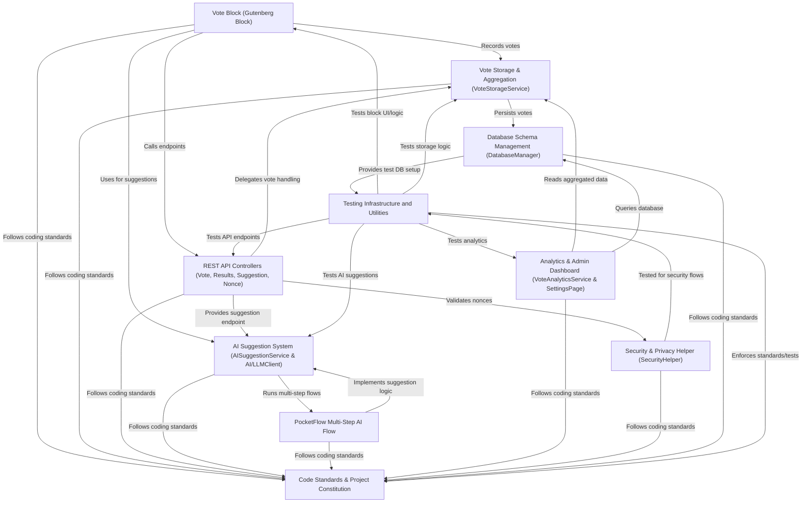

# Tutorial: content-poll

**ContentPoll AI** is a WordPress plugin that lets editors easily add interactive polls to posts and pages.  
Site visitors can vote anonymously—choosing from *custom questions and options*—and instantly view aggregated results.  
Editors can use built-in or *AI-assisted suggestion tools* (supporting providers like OpenAI, Gemini, Anthropic, & more) to generate poll questions and options based on page content.  
Everything is stored securely & privately, with **real-time analytics**, privacy-first vote tracking (no personal data), and a modern Gutenberg block UI.  
The system is built to be *secure, extensible, and testable*, following WordPress coding standards.

**Source Repository:** [https://github.com/soderlind/content-poll](https://github.com/soderlind/content-poll)

## Chapters

1. [Vote Block (Gutenberg Block)
](01_vote_block__gutenberg_block__.md)
2. [AI Suggestion System (AISuggestionService & AI/LLMClient)
](02_ai_suggestion_system__aisuggestionservice___ai_llmclient__.md)
3. [PocketFlow Multi-Step AI Flow
](03_pocketflow_multi_step_ai_flow_.md)
4. [REST API Controllers (Vote, Results, Suggestion, Nonce)
](04_rest_api_controllers__vote__results__suggestion__nonce__.md)
5. [Vote Storage & Aggregation (VoteStorageService)
](05_vote_storage___aggregation__votestorageservice__.md)
6. [Database Schema Management (DatabaseManager)
](06_database_schema_management__databasemanager__.md)
7. [Analytics & Admin Dashboard (VoteAnalyticsService & SettingsPage)
](07_analytics___admin_dashboard__voteanalyticsservice___settingspage__.md)
8. [Security & Privacy Helper (SecurityHelper)
](08_security___privacy_helper__securityhelper__.md)
9. [Testing Infrastructure and Utilities
](09_testing_infrastructure_and_utilities_.md)
10. [Code Standards & Project Constitution
](10_code_standards___project_constitution_.md)

---

Generated by [AI Codebase Knowledge Builder](https://github.com/The-Pocket/Tutorial-Codebase-Knowledge)